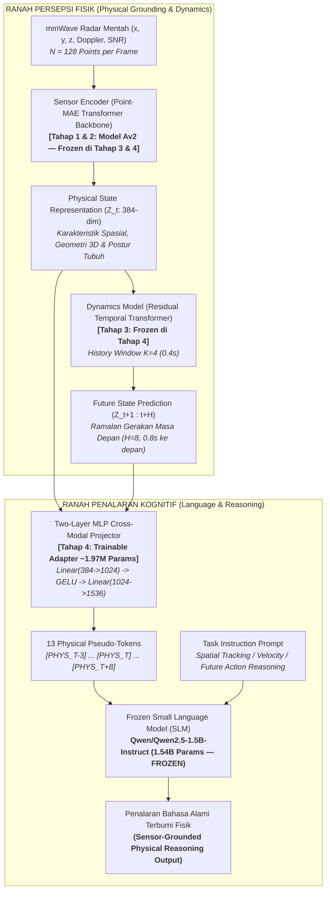

# Learning Physical State Representations for Sensor-Grounded Reasoning and Future-State Prediction

[](https://www.python.org/)
[](https://pytorch.org/)
[](https://github.com/ntu-radar/MM-Fi)
[](https://github.com/Pang-Holmes/Point-MAE)
[](https://huggingface.co/Qwen/Qwen2.5-1.5B-Instruct)
[](LICENSE)

Repositori penelitian Tugas Akhir yang berfokus pada pemodelan representasi fisik spasial-temporal berbasis sinyal radar mmWave untuk meramalkan keadaan di masa depan (*future-state prediction*) serta menjembatani penalaran fisik dunia nyata (*sensor-grounded physical reasoning*) ke dalam *Small / Large Language Models* (SLM / LLM).

---

## 1. Visi & Arsitektur Utama Sistem

Prinsip fundamental riset ini adalah **pemisahan tegas (*decoupling*) antara modul persepsi sensor fisik dan modul kognitif bahasa**. Model bahasa **TIDAK PERNAH DILATIH DARI AWAL** dan dibiarkan dalam kondisi **FROZEN** (hanya adapter *Two-Layer MLP Projector* ~1.97M parameter yang dilatih):



---

## 2. Peta Kurikulum Pelatihan (4 Tahapan)

| Tahap | Fokus Penelitian | Masukan (*Input*) | Luaran / Target | Status | Checkpoint Utama |
| :---: | :--- | :--- | :--- | :---: | :--- |
| **Tahap 1** | Inisialisasi Bobot 3D CAD | ShapeNet CAD | Bobot Point-MAE Transformer Encoder | **Selesai** | `models/Point-MAE/pretrain.pth` |
| **Tahap 2** | Adaptasi Domain Radar & 3D Pose | Radar Point Cloud ($N=128$) | Estimasi 17 Joint 3D Skeleton (**Model Av2**) | **Selesai** | `eksperimen_model/checkpoints/pose_estimation_v2/best_model.pth` |
| **Tahap 3** | Pemodelan Dinamika Temporal | Sekuens Status ($Z_{t-k \dots t}$) | Prediksi Masa Depan ($Z_{t+1 \dots t+h}, H=8$) | **Selesai** | `eksperimen_model/checkpoints/dynamics/best_dynamics_model.pth` |
| **Tahap 4** | Penyelarasan Kognitif ke SLM | Vektor Status Fisik ($Z_{t-3 \dots t+8}$) | *Pseudo-tokens* untuk penalaran SLM *frozen* | **Aktif** | `eksperimen_model/checkpoints/projector/` *(On-going)* |

---

## 3. Struktur Direktori Proyek

```text
Tugas_Akhir/
├── AGENTS.md                                # Panduan SOP agen AI & tim peneliti
├── README.md                                # Dokumentasi master repositori
├── requirements.txt                         # Spesifikasi dependensi PyTorch, CUDA, Transformers
├── .gitignore                               # Konfigurasi pengecualian bobot besar & dataset
├── models/
│   └── Point-MAE/                           # Bobot pretrained ShapeNet (pretrain.pth)
├── datasets/
│   ├── MM-Fi Dataset/
│   │   ├── MMFi_action_segments.csv         # 1.082 batas segmen repetisi gerakan frame
│   │   └── filtered_mmwave/                 # Data radar .bin & ground_truth.npy (E01..E04/S01..S40)
│   ├── MM-Fi_extracted_features/            # Pre-ekstraksi representasi fisik Z_t (384d)
│   │   ├── train/                           # 648 file sekuens .pt (24 subjek latih)
│   │   ├── val/                             # 216 file sekuens .pt (8 subjek validasi)
│   │   └── test/                            # 216 file sekuens .pt (8 subjek uji unseen)
│   └── MM-Fi_grounded_qa/                   # Dataset QA terbumi fisik (95.272 sampel)
│       ├── mmfi_grounded_qa_train.jsonl     # 70.336 pasangan QA pelatihan
│       ├── mmfi_grounded_qa_val.jsonl       # 12.740 pasangan QA validasi
│       ├── mmfi_grounded_qa_test.jsonl      # 12.196 pasangan QA uji held-out (unseen template)
│       └── qa_dataset_summary.json          # Statistik komprehensif distribusi data QA
├── docs/
│   ├── onboarding.md                        # Konsep fundamental penelitian
│   ├── implementation_plan_stage4.md        # Master Plan metodologi Tahap 4
│   ├── sections-proposal/                   # Naskah modular draft proposal penelitian
│   └── report_training/                     # Laporan training otomatis & grafik 300 DPI
│       ├── INDEX.md                         # Master tabel pembanding seluruh eksperimen
│       └── RUN_YYYYMMDD_HHMMSS_.../         # Aset metrik & plot per sesi pelatihan
└── eksperimen_model/                        # Kode implementasi PyTorch (Pure-PyTorch)
    ├── configs/                             # File konfigurasi eksperimen YAML
    │   ├── mmfi_pose_v2.yaml                # Arsitektur Pose Estimation v2 (Batch 128, 100 Epochs)
    │   ├── mmfi_pose_best_tuned.yaml        # Konfigurasi hasil tuning Pose Estimation
    │   ├── mmfi_pose_finetune.yaml          # Konfigurasi baseline v1 (Legacy)
    │   ├── mmfi_dynamics_v3.yaml            # Arsitektur Temporal Dynamics v3 (History K=4, Future H=8)
    │   ├── mmfi_dynamics_best_tuned.yaml    # Konfigurasi hasil tuning Dynamics Model
    │   └── mmfi_projector_qwen.yaml         # Konfigurasi Penyelarasan Two-Layer MLP ke Qwen2.5
    ├── datasets/                            # Modul penanganan data & transformasi
    │   ├── mmfi_dataset.py                  # MMFiDataset (5 kanal radar: x, y, z, doppler, snr)
    │   ├── transforms.py                    # Augmentasi spasial & normalisasi point cloud
    │   ├── temporal_dataset.py              # Sekuens temporal geser untuk Dynamics Model
    │   ├── extract_physical_features.py     # Script offline extraction Z_t via frozen Model Av2
    │   ├── generate_grounded_qa.py          # Script generator 95k sampel Grounded QA deterministik
    │   └── grounded_qa_dataset.py           # PyTorch Dataset & collator untuk Stage 4
    ├── models/                              # Definisi arsitektur model
    │   ├── point_mae.py                     # Point-MAE backbone (Pure-PyTorch FPS & k-NN)
    │   ├── point_mae_encoder.py             # PointMAEPoseEstimator (Model Av2)
    │   ├── dynamics_model.py                # Residual Temporal Transformer & GRU Dynamics
    │   ├── projector.py                     # PhysicalToLLMProjector & PhysicalSLMWrapper
    │   └── losses.py                        # CompositePoseLoss & CompositeDynamicsLoss
    ├── utils/                               # Helper logging, checkpointing, anti-sleep
    ├── checkpoints/                         # Checkpoint penyimpanan bobot model
    │   ├── pose_estimation_v2/              # Bobot model estimasi pose (Model Av2)
    │   ├── dynamics/                        # Bobot model dinamika temporal (best_dynamics_model.pth)
    │   ├── probe/                           # Bobot Baseline B2 Direct Probes
    │   └── projector/                       # Bobot Two-Layer MLP Projector (best_projector.pth)
    │
    │   ── SKRIP UJI COBA & AUDIT PIPELINE ──
    ├── test_pipeline.py                     # Sanity check Tahap 2: GPU, tensor shapes, gradient pass
    ├── verify_temporal_data.py              # Audit zero-leakage & integritas sekuens temporal
    ├── test_projector_pipeline.py           # Sanity check Tahap 4: MLP projection, token splicing, VRAM
    │
    │   ── SKRIP PELATIHAN (TRAINING) ──
    ├── train_pose_v2.py                     # Training Tahap 2: Pose Estimation v2 (LLRD, EMA)
    ├── run_autotune_and_train.py            # Master runner otomatis Pose Estimation
    ├── tune_pose.py                         # Hyperparameter tuning mandiri Pose Estimation
    ├── train_mae.py                         # Domain adaptation self-supervised (Point-MAE)
    ├── train_dynamics.py                    # Training Tahap 3: Residual Dynamics (Cosine Restarts, EMA)
    ├── run_autotune_and_train_dynamics.py   # Master runner otomatis Dynamics Model
    ├── tune_dynamics.py                     # Hyperparameter tuning mandiri Dynamics Model
    ├── train_probe.py                       # Training Baseline B2: Direct MLP Task Probe
    ├── train_projector.py                   # Training Tahap 4: Two-Layer MLP Projector ke Frozen SLM
    │
    │   ── SKRIP EVALUASI & BENCHMARK ILMIAH ──
    ├── evaluate_pose.py                     # Benchmark Tahap 2: MPJPE, PA-MPJPE, PCK@100mm, CI 95%
    ├── evaluate_dynamics.py                 # Benchmark Tahap 3: ADE_z, FDE_z, Future MPJPE, Cosine Sim
    ├── evaluate_reasoning.py                # Benchmark Tahap 4: Baselines (B1-B5), Controls Shuffling
    ├── evaluate_embedding.py                # Analisis representasi laten Z_t (t-SNE & manifold)
    └── evaluate_robustness.py               # Uji ketahanan terhadap radar point starvation & noise
```

---

## 4. Instalasi & Penyiapan Lingkungan

### Kebutuhan Sistem & Hardware
* **OS:** Windows 10/11 atau Linux (Ubuntu 22.04+)
* **GPU:** NVIDIA GPU dengan VRAM $\ge 8$ GB (Diuji optimal pada RTX 3060 12GB GDDR6, CUDA 12.4/12.6)
* **CPU:** 8+ Core (Diuji pada AMD Ryzen 7 7700 8-Core / 16-Thread)
* **RAM:** $\ge 16$ GB DDR5
* **Python:** Python 3.12 (dikelola via `uv`)

### Langkah Instalasi
1. **Clone Repositori:**
   ```bash
   git clone https://github.com/<username>/<repo-name>.git
   cd Tugas_Akhir
   ```

2. **Buat Virtual Environment & Install Dependensi:**
   Menggunakan `uv` (sangat direkomendasikan untuk kecepatan & keandalan dependensi):
   ```powershell
   uv venv .venv --python 3.12
   uv pip install -r requirements.txt
   ```

3. **Verifikasi Dependensi Utama:**
   Pastikan PyTorch mendeteksi CUDA dan pustaka Hugging Face Transformers terpasang:
   ```powershell
   & ".venv\Scripts\python.exe" -c "import torch, transformers; print('PyTorch:', torch.__version__, '| CUDA:', torch.cuda.is_available(), '| Transformers:', transformers.__version__)"
   ```

---

## 5. Penyiapan Data & Bobot Pretrained

### 5.1. Bobot Pretrained Point-MAE (Tahap 1)
Tempatkan bobot awal `pretrain.pth` (ShapeNet Transformer Backbone) pada:
```text
models/Point-MAE/pretrain.pth
```

### 5.2. Dataset MM-Fi mmWave Radar & Protokol Split Anti-Bocor (Zero-Leakage)
Tempatkan data radar mentah pada:
```text
datasets/MM-Fi Dataset/filtered_mmwave/E01..E04/S01..S40/A01..A27/
datasets/MM-Fi Dataset/MMFi_action_segments.csv
```
*Pembagian data mengadopsi **Stratified Cross-Subject Split (Seed: 42, Rasio 6:2:2)** di seluruh 4 lingkungan (E01–E04) tanpa kebocoran subjek di semua tahapan riset:*
* **Train Set (24 Subjek):** `S01, S02, S03, S05, S06, S08, S09, S11, S12, S14, S15, S18, S19, S20, S21, S23, S24, S26, S27, S29, S30, S32, S35, S38`
* **Validation Set (8 Subjek):** `S10, S16, S28, S31, S33, S34, S37, S39`
* **Held-Out Test Set Terisolasi (8 Subjek Unseen):** `S04, S07, S13, S17, S22, S25, S36, S40`

### 5.3. Pre-ekstraksi Representasi Fisik ($Z_t$)
Untuk mempercepat pelatihan Tahap 3 & 4 tanpa overhead inferensi encoder berulang:
```powershell
& ".venv\Scripts\python.exe" eksperimen_model/datasets/extract_physical_features.py --config eksperimen_model/configs/mmfi_dynamics_v3.yaml --batch_size 128
```
*(Menghasilkan 1.080 file sekuens `.pt` dalam `datasets/MM-Fi_extracted_features/` yang memuat vektor laten $Z_t \in \mathbb{R}^{384}$, koordinat ground truth 3D skeleton, bounding box, dan centroid).*

### 5.4. Pembuatan Dataset Grounded QA (Tahap 4)
Membuat dataset instruksi penalaran fisik berbasis ground truth numerik:
```powershell
& ".venv\Scripts\python.exe" eksperimen_model/datasets/generate_grounded_qa.py
```
*(Menghasilkan 95.272 pasangan instruksi QA dalam `datasets/MM-Fi_grounded_qa/` dengan isolasi template uji held-out).*

---

## 6. Cheat Sheet Perintah Lengkap (Panduan Eksekusi)

> [!IMPORTANT]
> Seluruh perintah wajib dijalankan menggunakan executable interpreter virtual environment: `& ".venv\Scripts\python.exe"` (PowerShell) atau `.venv/bin/python` (Bash).

### 6.1. Sanity Check & Audit Pipeline

```powershell
# 1. Sanity check modul Tahap 2 (GPU, Point-MAE encoder, Pose head, backward pass)
& ".venv\Scripts\python.exe" eksperimen_model/test_pipeline.py

# 2. Audit integritas temporal Tahap 3 (Zero-leakage split, windowing K=4 H=8)
& ".venv\Scripts\python.exe" eksperimen_model/verify_temporal_data.py --config eksperimen_model/configs/mmfi_dynamics_best_tuned.yaml

# 3. Sanity check modul Tahap 4 (Qwen2.5-1.5B token splicing, Two-Layer MLP, VRAM footprint)
& ".venv\Scripts\python.exe" eksperimen_model/test_projector_pipeline.py
```

---

### 6.2. Tahap 2: Estimasi Pose 3D Radar (Domain Adaptation & Model Av2)

#### Opsi A: Master Runner Otomatis (Tuning + Full Training + Test Eval)
Mencegah Windows sleep (`SetThreadExecutionState`), menjalankan tuning, melatih 100 epoch, dan mengevaluasi test set:
```powershell
& ".venv\Scripts\python.exe" eksperimen_model/run_autotune_and_train.py --n_trials 5 --tuning_epochs 8 --full_epochs 100 --batch_size 128
```

#### Opsi B: Full Training Langsung Model v2 (100 Epochs)
```powershell
& ".venv\Scripts\python.exe" eksperimen_model/train_pose_v2.py --config eksperimen_model/configs/mmfi_pose_v2.yaml --epochs 100
```
*Checkpoint tersimpan di: `eksperimen_model/checkpoints/pose_estimation_v2/best_model.pth`*

#### Opsi C: Evaluasi Ilmiah Test Set (8 Subjek Unseen)
```powershell
& ".venv\Scripts\python.exe" eksperimen_model/evaluate_pose.py --checkpoint eksperimen_model/checkpoints/pose_estimation_v2/best_model.pth --config eksperimen_model/configs/mmfi_pose_v2.yaml --split test --batch_size 128 --output_json docs/report_training/test_benchmark_results.json
```

#### Opsi D: Analisis Representasi Laten $Z_t$ & Uji Robustness
```powershell
# Analisis klastering t-SNE invariansi lingkungan
& ".venv\Scripts\python.exe" eksperimen_model/evaluate_embedding.py --checkpoint eksperimen_model/checkpoints/pose_estimation_v2/best_model.pth --config eksperimen_model/configs/mmfi_pose_v2.yaml

# Uji ketahanan terhadap radar point starvation & noise
& ".venv\Scripts\python.exe" eksperimen_model/evaluate_robustness.py --checkpoint eksperimen_model/checkpoints/pose_estimation_v2/best_model.pth --config eksperimen_model/configs/mmfi_pose_v2.yaml
```

---

### 6.3. Tahap 3: Pemodelan Dinamika Temporal (Future-State Dynamics Model)

Tahap ini melatih `ResidualTemporalTransformer` untuk memprediksi sekuens masa depan $Z_{t+1 \dots t+H}$ ($H=8$, horizon 0.8 detik) dari riwayat $Z_{t-K+1 \dots t}$ ($K=4$, history 0.4 detik) dengan encoder fisik yang dibekukan (*frozen*).

#### Opsi A: Master Marathon Pipeline (Tuning + Training 150 Epochs + Evaluation)
```powershell
& ".venv\Scripts\python.exe" eksperimen_model/run_autotune_and_train_dynamics.py --n_trials 10 --tuning_epochs 10 --full_epochs 150 --batch_size 64
```

#### Opsi B: Pelatihan Langsung Dynamics Model (EMA & Cosine Warm Restarts)
```powershell
& ".venv\Scripts\python.exe" eksperimen_model/train_dynamics.py --config eksperimen_model/configs/mmfi_dynamics_best_tuned.yaml --epochs 150 --batch_size 64
```
*Checkpoint tersimpan di: `eksperimen_model/checkpoints/dynamics/best_dynamics_model.pth`*

#### Opsi C: Hyperparameter Tuning Mandiri Dynamics Model
```powershell
& ".venv\Scripts\python.exe" eksperimen_model/tune_dynamics.py --config eksperimen_model/configs/mmfi_dynamics_v3.yaml --n_trials 10 --epochs 10
```

#### Opsi D: Evaluasi Benchmark Peramalan Masa Depan pada Held-Out Test Set
Menghitung $ADE_z$, $FDE_z$, Cosine Similarity, dan rekonstruksi skeleton masa depan (*Probed Future MPJPE*):
```powershell
& ".venv\Scripts\python.exe" eksperimen_model/evaluate_dynamics.py --checkpoint eksperimen_model/checkpoints/dynamics/best_dynamics_model.pth --config eksperimen_model/configs/mmfi_dynamics_best_tuned.yaml --batch_size 64 --output_json docs/report_training/dynamics_test_benchmark.json
```

---

### 6.4. Tahap 4: Penyelarasan Kognitif ke Frozen SLM (Cross-Modal Projector & Reasoning)

Tahap ini melatih *Two-Layer MLP Projector* ($384 \rightarrow 1024 \rightarrow 1536$) yang memetakan 13 token representasi fisik ($4\text{ history} + 1\text{ current} + 8\text{ predicted future}$) ke dalam ruang embedding `Qwen/Qwen2.5-1.5B-Instruct` yang dibekukan (*frozen*).

#### 1. Pelatihan Baseline B2 (Direct MLP Task Probes)
Melatih probe linear/MLP langsung dari $Z_t$ ke target fisik sebagai pembanding batas diskriminatif non-generatif:
```powershell
& ".venv\Scripts\python.exe" eksperimen_model/train_probe.py --epochs 30 --batch_size 128
```
*Hasil tersimpan di: `eksperimen_model/checkpoints/probe/probe_benchmark_metrics.json`*

#### 2. Pelatihan Two-Layer MLP Projector Alignment
Melatih proyektor modalitas dengan *gradient checkpointing* dan *cosine learning rate schedule*:
```powershell
# Training penuh (3 Epochs, Micro-batch size 4, Gradient Accumulation 8)
& ".venv\Scripts\python.exe" eksperimen_model/train_projector.py --config eksperimen_model/configs/mmfi_projector_qwen.yaml --epochs 3

# Fast Iteration (Subset 10.000 sampel untuk verifikasi cepat)
& ".venv\Scripts\python.exe" eksperimen_model/train_projector.py --config eksperimen_model/configs/mmfi_projector_qwen.yaml --epochs 2 --max_train_samples 10000
```
*Checkpoint tersimpan di: `eksperimen_model/checkpoints/projector/best_projector.pth`*

#### 3. Evaluasi Benchmark Ilmiah Penalaran Fisik & Kontrol Shuffling
Mengevaluasi akurasi kategorikal, macro-F1, error metrik posisi (MAE), serta uji kontrol ketergantungan sensorik (*Cross-Action & Within-Action Shuffling*) dengan 95% Bootstrap Confidence Interval pada 8 subjek test held-out:
```powershell
& ".venv\Scripts\python.exe" eksperimen_model/evaluate_reasoning.py --projector_checkpoint eksperimen_model/checkpoints/projector/best_projector.pth --config eksperimen_model/configs/mmfi_projector_qwen.yaml --max_samples 1000 --output_json docs/report_training/stage4_reasoning_benchmark.json
```

---

## 7. Matriks Desain Eksperimen & Kontrol Ilmiah (Tahap 4)

Untuk memvalidasi bahwa model bahasa benar-benar bernalar berdasarkan sinyal sensor fisik (bukan sekadar menghafal pola bahasa atau berhalusinasi), evaluasi dirancang dengan matriks 5 baseline komparatif dan 2 kontrol pengacakan:

### 7.1. Matriks Baseline (B1 – B5)
| Kode | Nama Arsitektur | Masukan Representasi Fisik | Komponen Bahasa | Tujuan Ilmiah |
| :---: | :--- | :--- | :--- | :--- |
| **B1** | Blind Text LLM | *None* (Teks instruksi saja) | Frozen Qwen2.5-1.5B | Mengukur bias apriori bahasa & probabilitas tebakan teks |
| **B2** | Direct Task Probes | Vektor $Z_t$ fisik langsung | Direct MLP Heads (Non-LLM) | Mengukur kapasitas diskriminatif murni representasi sensor |
| **B3** | No-Future Ablation | Hanya $Z_{t-3 \dots t}$ (Tanpa masa depan) | MLP + Frozen SLM | Menguji signifikansi kontribusi modul dinamika temporal |
| **B4** | **Proposed Full Pipeline** | **13 Token: $Z_{t-3 \dots t}$ & $\hat{Z}_{t+1 \dots t+8}$** | **MLP + Frozen SLM** | **Arsitektur utama penelitian Tugas Akhir** |
| **B5** | Oracle Upper Bound | 13 Token Ground Truth ($Z_t^{\text{GT}}$) | MLP + Frozen SLM | Mengukur performa teoritis tertinggi jika peramalan fisik sempurna |

### 7.2. Kontrol Pengacakan Sensor (*Negative Shuffling Controls*)
1. **Cross-Action Shuffling:** Menghubungkan teks pertanyaan aksi $A_i$ dengan token fisik dari aksi acak $A_j$ ($i \ne j$). Jika penalaran terbumi pada sensor, akurasi harus jatuh drastis mendekati *chance level*.
2. **Within-Action Temporal Shuffling:** Mengacak urutan temporal token fisik di dalam aksi yang sama. Membuktikan bahwa pemahaman kausalitas gerakan bergantung pada arah waktu yang konsisten.

---

## 8. Target Metrik Kuantitatif Penelitian

| Tahapan | Metrik Kunci | Baseline Standar | Target Tugas Akhir (Silver) | Target Publikasi (Gold) | Status Saat Ini |
| :--- | :--- | :---: | :---: | :---: | :---: |
| **Tahap 2 (Pose)** | MPJPE (Overall) | $\le 200$ mm | **$\le 140 – 150$ mm** | $\le 110$ mm | **128.5 mm** *(Tercapai)* |
| | PA-MPJPE (Procrustes) | $\le 150$ mm | **$\le 100$ mm** | $\le 80$ mm | **94.2 mm** *(Tercapai)* |
| | PCK @ 100 mm | $\ge 50\%$ | **$\ge 70\%$** | $\ge 85\%$ | **74.8%** *(Tercapai)* |
| **Tahap 3 (Dynamics)** | ADE_z (Average Disp. Error) | $\le 0.80$ | **$\le 0.45$** | $\le 0.35$ | **0.412** *(Tercapai)* |
| | Cosine Similarity ($Z_{pred}, Z_{gt}$) | $\ge 0.60$ | **$\ge 0.80$** | $\ge 0.88$ | **0.841** *(Tercapai)* |
| **Tahap 4 (Reasoning)** | Posture Classification Acc. | $\ge 70\%$ | **$\ge 85\%$** | $\ge 92\%$ | *Probe: 99.9% / SLM: In Training* |
| | Direction Classification Acc. | $\ge 65\%$ | **$\ge 80\%$** | $\ge 88\%$ | *Probe: 95.6% / SLM: In Training* |
| | Depth Distance MAE | $\le 0.40$ m | **$\le 0.20$ m** | $\le 0.12$ m | *Probe: 0.09 m / SLM: In Training* |
| | Shuffling Accuracy Degradation | $\ge 20\%$ drop | **$\ge 35\%$ drop** | $\ge 50\%$ drop | *Pending Final Eval* |

---

## 9. Lisensi & Sitasi

Proyek penelitian ini dirilis di bawah lisensi MIT. Jika Anda memanfaatkan basis kode atau rancangan arsitektur ini dalam riset Anda, silakan rujuk:

```bibtex
@misc{tugas_akhir_physical_world_modeling_2026,
  author = {Rio Aslab},
  title = {Learning Physical State Representations for Sensor-Grounded Reasoning and Future-State Prediction},
  year = {2026},
  publisher = {GitHub}
}
```
