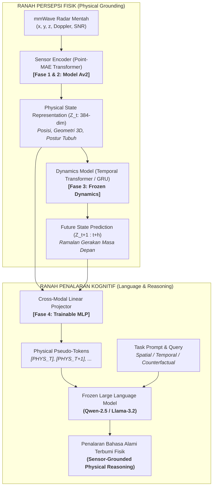

# Learning Physical State Representations for Sensor-Grounded Reasoning and Future-State Prediction

[](https://www.python.org/)
[](https://pytorch.org/)
[](https://github.com/ntu-radar/MM-Fi)
[](https://github.com/Pang-Holmes/Point-MAE)
[](LICENSE)

Repositori penelitian Tugas Akhir yang berfokus pada pemodelan representasi fisik spasial-temporal berbasis sinyal radar mmWave untuk meramalkan keadaan di masa depan (*future-state prediction*) serta menjembatani penalaran fisik dunia nyata (*grounded physical reasoning*) ke dalam *Large Language Models* (LLM).

---

## 1. Visi & Arsitektur Utama Sistem

Prinsip fundamental riset ini adalah **pemisahan tegas (*decoupling*) antara modul persepsi sensor fisik dan modul kognitif bahasa**. LLM **TIDAK PERNAH DILATIH DARI AWAL** dan dibiarkan dalam kondisi **FROZEN**, hanya bertindak sebagai *reasoning layer*:



---

## 2. Peta Kurikulum Pelatihan (4 Tahapan)

| Tahap | Fokus Penelitian | Masukan (*Input*) | Luaran / Target | Status |
| :---: | :--- | :--- | :--- | :---: |
| **Tahap 1** | Inisialisasi Bobot 3D CAD | ShapeNet CAD | Bobot Point-MAE Transformer Encoder (**Model A**) | **Selesai** (`models/Point-MAE/pretrain.pth`) |
| **Tahap 2** | Adaptasi Domain Radar & 3D Pose | Radar Point Cloud ($N=128$) | Estimasi 17 Joint 3D Skeleton (**Model Av2**) | **Aktif** (`eksperimen_model/train_pose.py`) |
| **Tahap 3** | Pemodelan Dinamika Temporal | Sekuens Status ($Z_{t-k \dots t}$) | Prediksi Masa Depan ($Z_{t+1 \dots t+h}$) | *Next Stage* |
| **Tahap 4** | Penyelarasan Kognitif ke LLM | Vektor Status Fisik ($Z_t$) | *Pseudo-tokens* untuk penalaran LLM *frozen* | *Final Stage* |

---

## 3. Struktur Direktori Proyek

```text
Tugas_Akhir/
├── AGENTS.md                         # Panduan SOP agen AI & tim peneliti
├── README.md                         # Dokumentasi master repositori
├── requirements.txt                  # Spesifikasi dependensi PyTorch & CUDA
├── .gitignore                        # Konfigurasi pengecualian bobot besar & dataset
├── models/
│   └── Point-MAE/                    # Tempat bobot dasar ShapeNet (pretrain.pth)
├── datasets/
│   └── MM-Fi Dataset/
│       ├── MMFi_action_segments.csv  # 1.082 batas segmen repetisi gerakan frame
│       └── filtered_mmwave/          # Data frame radar .bin & ground_truth.npy
│           └── E01..E04/S01..S40/A01..A27/
├── docs/
│   ├── onboarding.md                 # Konsep fundamental penelitian
│   ├── tutorial_training.md          # Panduan eksekusi pelatihan & evaluasi
│   ├── sections-proposal/            # Naskah modular draft proposal penelitian
│   └── report_training/              # Otomatisasi laporan training & grafik 300 DPI
│       ├── INDEX.md                  # Master tabel pembanding seluruh eksperimen
│       └── RUN_YYYYMMDD_HHMMSS_.../  # Folder aset setiap hasil pelatihan
└── eksperimen_model/                 # Kode implementasi PyTorch (Pure-PyTorch)
    ├── configs/                      # Konfigurasi YAML (mmfi_pose_finetune.yaml)
    ├── datasets/                     # MMFiDataset & transforms point cloud
    ├── models/                       # Point-MAE, Pose Estimator, Loss functions
    ├── utils/                        # Checkpoint saver, logger, & ExperimentReporter
    ├── test_pipeline.py              # Skrip sanity check otomatis GPU & data
    ├── train_pose.py                 # Skrip pelatihan Tahap 2 (3D Pose Estimation)
    ├── evaluate_pose.py              # Skrip evaluasi ilmiah (PA-MPJPE, PCK, CI 95%)
    ├── evaluate_embedding.py         # Skrip analisis representasi fisik Z_t (t-SNE)
    └── evaluate_robustness.py        # Skrip uji ketahanan terhadap dropout & noise
```

---

## 4. Instalasi & Penyiapan Lingkungan

### Kebutuhan Sistem & Hardware
* **OS:** Windows 10/11 atau Linux (Ubuntu 22.04+)
* **GPU:** NVIDIA GPU dengan VRAM $\ge 8$ GB (Diuji pada RTX 3060 12GB GDDR6, CUDA 12.4/12.6)
* **Python:** Python 3.12

### Langkah Instalasi
1. **Clone Repositori:**
   ```bash
   git clone https://github.com/<username>/<repo-name>.git
   cd <repo-name>
   ```

2. **Buat Virtual Environment:**
   Menggunakan `uv` (sangat cepat):
   ```bash
   uv venv .venv --python 3.12
   ```
   atau menggunakan Python venv bawaan:
   ```powershell
   python -m venv .venv
   ```

3. **Install Dependensi:**
   ```powershell
   & ".venv\Scripts\python.exe" -m pip install -r requirements.txt
   ```

---

## 5. Penyiapan Data & Bobot Pretrained

1. **Unduh Bobot Pretrained Point-MAE (Tahap 1):**
   Unduh checkpoint `pretrain.pth` (ShapeNet Transformer Backbone) dari repositori resmi [Point-MAE](https://github.com/Pang-Holmes/Point-MAE) dan tempatkan pada:
   ```text
   models/Point-MAE/pretrain.pth
   ```
2. **Dataset MM-Fi mmWave Radar:**
   Tempatkan data radar MM-Fi pada direktori:
   ```text
   datasets/MM-Fi Dataset/filtered_mmwave/E01..E04/S01..S40/A01..A27/
   datasets/MM-Fi Dataset/MMFi_action_segments.csv
   ```
   *Catatan: Pembagian data menggunakan **Stratified Random Cross-Subject Split (Seed: 42, Rasio 6:2:2)** di seluruh 4 lingkungan (E01–E04).*

---

## 6. Panduan Menjalankan Eksperimen

### 1. Sanity Check Otomatis (~3 Detik)
Verifikasi ketersediaan GPU CUDA, tensor shape, dan backward pass:
```powershell
& ".venv\Scripts\python.exe" eksperimen_model/test_pipeline.py
```

### 2. Menjalankan Pelatihan 3D Pose Estimation (Tahap 2)
```powershell
# Pelatihan Standar (30 Epochs, Batch Size 64):
& ".venv\Scripts\python.exe" eksperimen_model/train_pose.py --epochs 30 --batch_size 64 --lr 0.0003
```
*Fitur Utama Training:*
- **Progress Bar Komprehensif:** Memantau `loss`, `mpjpe (mm)`, `avg (mm)`, `lr`, dan `vram`.
- **Stall Watchdog:** Mendeteksi hambatan I/O disk/worker secara otomatis tanpa memutus proses.
- **Reporting Otomatis:** Menghasilkan 6 grafik visualisasi 300 DPI di `docs/report_training/RUN_.../`.

### 3. Evaluasi Benchmark Ilmiah (Test Set Terisolasi)
Menghitung Procrustes PA-MPJPE, PCK@30/50/100/150mm, N-MPJPE, dan 95% Confidence Interval:
```powershell
& ".venv\Scripts\python.exe" eksperimen_model/evaluate_pose.py --split test --output_json docs/test_benchmark_results.json
```

### 4. Analisis Representasi Fisik $Z_t$ (t-SNE & Linear Probe)
Mengevaluasi kualitas manifold gerakan dan pemisahan invariansi lingkungan (*disentanglement*):
```powershell
& ".venv\Scripts\python.exe" eksperimen_model/evaluate_embedding.py
```

### 5. Uji Ketahanan Fisik (*Occlusion & Noise Robustness*)
```powershell
& ".venv\Scripts\python.exe" eksperimen_model/evaluate_robustness.py
```

---

## 7. Hasil Evaluasi & Target Metrik Ilmiah

Penelitian ini menetapkan target kuantitatif bertingkat berdasarkan benchmark resmi MM-Fi (*Yang et al., NeurIPS 2023*):

| Metrik Kunci | Baseline Standar | Target Tugas Akhir (Silver) | Target Publikasi Jurnal (Gold) | Status Model Saat Ini |
| :--- | :---: | :---: | :---: | :---: |
| **MPJPE (Overall)** | $\le 200$ mm | **$\le 140 – 150$ mm** | $\le 110$ mm | *In Training* |
| **PA-MPJPE (Procrustes)** | $\le 150$ mm | **$\le 100$ mm** | $\le 80$ mm | *In Training* |
| **PCK @ 100 mm** | $\ge 50\%$ | **$\ge 70\%$** | $\ge 85\%$ | *In Training* |
| **Environment Robustness (ERS)** | $\ge 0.80$ | **$\ge 0.88$** | $\ge 0.92$ | *In Training* |

---

## 8. Lisensi & Sitasi

Proyek penelitian ini dirilis di bawah lisensi MIT. Jika Anda memanfaatkan basis kode atau rancangan arsitektur ini dalam riset Anda, silakan rujuk:

```bibtex
@misc{tugas_akhir_physical_world_modeling_2026,
  author = {Rio Aslab},
  title = {Learning Physical State Representations for Sensor-Grounded Reasoning and Future-State Prediction},
  year = {2026},
  publisher = {GitHub}
}
```
