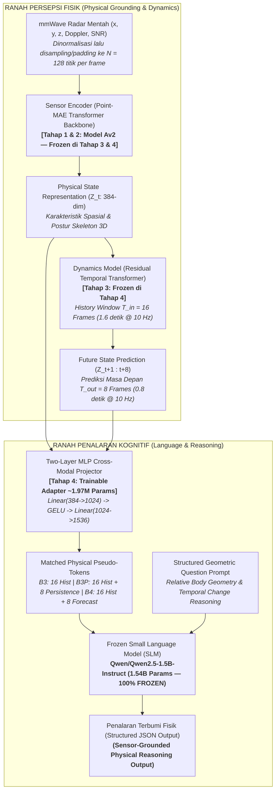

# Learning Physical State Representations for Sensor-Grounded Reasoning and Future-State Prediction

[](https://www.python.org/)
[](https://pytorch.org/)
[](https://github.com/ntu-radar/MM-Fi)
[](https://github.com/Pang-Holmes/Point-MAE)
[](https://huggingface.co/Qwen/Qwen2.5-1.5B-Instruct)

Repositori penelitian Tugas Akhir yang menguji apakah representasi spasial-temporal radar mmWave dapat diselaraskan dengan *frozen Small Language Model* (SLM) untuk melakukan *sensor-grounded physical reasoning* dan prediksi keadaan masa depan. Klaim empiris Tahap 4 masih menunggu training ulang dan evaluasi recovery.

---

## 1. Visi & Arsitektur Utama Sistem

Prinsip fundamental riset ini adalah **pemisahan tegas (*decoupling*) antara modul persepsi sensor fisik dan modul kognitif bahasa**. Model bahasa **tidak dilatih ulang** dan tetap **frozen**. Pada Tahap 4 recovery, hanya *Two-Layer MLP Projector* (~1.97M parameter) yang dilatih untuk memetakan latent fisik ke ruang embedding bahasa:



Dataset dan checkpoint berukuran besar tidak disimpan di checkout ini. Path pada tabel dan perintah adalah lokasi artefak lokal yang harus disiapkan sebelum menjalankan pipeline.

---

## 2. Peta Kurikulum Pelatihan (4 Tahapan)

| Tahap | Fokus Penelitian | Masukan (*Input*) | Luaran / Target | Status | Checkpoint Utama |
| :---: | :--- | :--- | :--- | :---: | :--- |
| **Tahap 1** | Inisialisasi Bobot 3D CAD | ShapeNet CAD | Bobot Point-MAE Transformer Encoder | **Selesai; bobot eksternal** | `models/Point-MAE/pretrain.pth` |
| **Tahap 2** | Adaptasi Domain Radar & 3D Pose | Radar Point Cloud ($N=128$) | Estimasi 17 Joint 3D Skeleton (**Model Av2**) | **Hasil tersedia; checkpoint eksternal** | `eksperimen_model/checkpoints/pose_estimation_v2/model_av2.pth` |
| **Tahap 3** | Pemodelan Dinamika Temporal | Sekuens Status ($Z_{t-15 \dots t}, T_{in}=16$) | Prediksi Masa Depan ($Z_{t+1 \dots t+8}, T_{out}=8$) | **Recovery wajib** | `eksperimen_model/checkpoints/dynamics_stage4_recovery/best_dynamics_model.pth` |
| **Tahap 4** | Penyelarasan Kognitif ke SLM | 16 atau 24 pseudo-token fisik | Penalaran JSON terstruktur dengan SLM *frozen* | **Recovery belum dijalankan** | `eksperimen_model/checkpoints/projector_stage4_recovery/` |

---

## 3. Struktur Direktori Proyek

```text
Tugas_Akhir/
├── AGENTS.md                                # Panduan SOP agen AI & tim peneliti
├── README.md                                # Dokumentasi master repositori
├── requirements.txt                         # Spesifikasi dependensi PyTorch, CUDA, Transformers
├── .gitignore                               # Konfigurasi pengecualian bobot besar & dataset
├── models/
│   └── Point-MAE/                           # Bobot pretrained ShapeNet (pretrain.pth)
├── datasets/
│   ├── MM-Fi Dataset/
│   │   ├── MMFi_action_segments.csv         # CSV rentang segmen repetisi gerakan
│   │   └── filtered_mmwave/                 # Data radar .bin & ground_truth.npy (E01..E04/S01..S40)
│   ├── MM-Fi_features_stage4_recovery/      # Fitur Z_t tervalidasi dengan metadata provenance
│   └── MM-Fi_grounded_qa_stage4_recovery/   # Dataset QA geometri relatif & perubahan temporal
├── docs/
│   ├── onboarding.md                        # Konsep fundamental penelitian
│   ├── stage4_recovery_runbook.md           # Runbook protokol eksekusi pemulihan Tahap 4
│   ├── implementation_plan_stage4_recovery.md # Rencana metodologi ilmiah Tahap 4 (Revisi 2)
│   ├── landasan_ilmiah_horizon_temporal_dan_dinamika_gerak.md # Justifikasi biomekanika T_in=16 & T_out=8
│   ├── laporan_teknis_training_dan_evaluasi_v2.md # Laporan teknis resmi Model Av2 Tahap 2
│   ├── sections-proposal/                   # Naskah modular draft proposal penelitian
│   └── report_training/                     # Laporan training otomatis & grafik metrik
│       ├── INDEX.md                         # Master tabel pembanding seluruh eksperimen
│       ├── test_benchmark_results.json      # Laporan historis evaluasi Tahap 2
│       └── dynamics_benchmark_results.json  # Laporan historis; recovery memakai folder run baru
└── eksperimen_model/                        # Kode implementasi PyTorch (Pure-PyTorch)
    ├── configs/                             # File konfigurasi eksperimen YAML
    │   ├── mmfi_pose_best_tuned.yaml        # Konfigurasi optimal Pose Estimation (Model Av2)
    │   ├── mmfi_dynamics_best_tuned.yaml    # Konfigurasi optimal Dynamics Model (T_in=16, T_out=8)
    │   └── mmfi_projector_qwen.yaml         # Konfigurasi Penyelarasan Two-Layer MLP ke Qwen2.5
    ├── datasets/                            # Modul penanganan data & transformasi
    │   ├── mmfi_dataset.py                  # MMFiDataset (5 kanal radar: x, y, z, doppler, snr)
    │   ├── transforms.py                    # Augmentasi spasial & normalisasi point cloud
    │   ├── extract_physical_features.py     # Script offline feature extraction dengan audit provenance
    │   ├── generate_grounded_qa.py          # Generator deterministik QA geometri relatif
    │   └── grounded_qa_dataset.py           # PyTorch Dataset & collator multi-kondisi (B3/B3P/B4)
    ├── models/                              # Definisi arsitektur model
    │   ├── point_mae.py                     # Point-MAE backbone (Pure-PyTorch FPS & k-NN)
    │   ├── point_mae_encoder.py             # PointMAEPoseEstimator & JointQueryPoseHead (Model Av2)
    │   ├── dynamics_model.py                # Residual Temporal Transformer & GRU Dynamics
    │   ├── projector.py                     # PhysicalToLLMProjector & PhysicalSLMWrapper
    │   └── losses.py                        # CompositePoseLoss & CompositeDynamicsLoss
    ├── utils/                               # Helper logging, checkpointing, anti-sleep
    │
    │   ── SKRIP UJI COBA & AUDIT PIPELINE ──
    ├── test_pipeline.py                     # Sanity check Tahap 2: GPU, tensor shapes, gradient pass
    ├── verify_temporal_data.py              # Audit zero-leakage & integritas sekuens temporal
    ├── test_projector_pipeline.py           # Sanity check Tahap 4: MLP projection, token splicing, VRAM
    │
    │   ── SKRIP PELATIHAN (TRAINING) ──
    ├── train_pose_v2.py                     # Training Tahap 2: Pose Estimation v2 (LLRD, EMA)
    ├── run_autotune_and_train.py            # Master runner otomatis Pose Estimation
    ├── train_dynamics.py                    # Training Tahap 3: Residual Dynamics (Cosine Restarts, EMA)
    ├── run_autotune_and_train_dynamics.py   # Master runner otomatis Dynamics Model
    ├── train_probe.py                       # Training Baseline B2: Direct MLP Task Probe
    ├── train_projector.py                   # Training Tahap 4: Two-Layer MLP Projector (--condition B3/B3P/B4)
    │
    │   ── SKRIP EVALUASI & BENCHMARK ILMIAH ──
    ├── evaluate_pose.py                     # Benchmark Tahap 2: MPJPE, PA-MPJPE, PCK@100mm, CI 95%
    ├── evaluate_dynamics.py                 # Benchmark Tahap 3: latent MSE, cosine similarity, persistence comparison
    └── evaluate_reasoning.py                # Benchmark Tahap 4: B4 vs B3P Paired Delta, Controls Shuffling
```

---

## 4. Instalasi & Penyiapan Lingkungan

### Kebutuhan Sistem & Hardware
* **OS:** Windows 10/11 atau Linux (Ubuntu 22.04+)
* **GPU:** NVIDIA GPU dengan VRAM $\ge 8$ GB (Diuji optimal pada RTX 3060 12GB GDDR6, CUDA 12.4/12.6)
* **CPU:** 8+ Core (Diuji pada AMD Ryzen 7 7700 8-Core / 16-Thread)
* **RAM:** $\ge 16$ GB DDR5
* **Python:** Python 3.12 (dikelola via `uv`)

### Langkah Instalasi
1. **Clone Repositori:**
   ```bash
   git clone https://github.com/<username>/<repo-name>.git
   cd Tugas_Akhir
   ```

2. **Buat Virtual Environment & Install Dependensi:**
   Menggunakan `uv` (sangat direkomendasikan untuk kecepatan & keandalan dependensi):
   ```powershell
   uv venv .venv --python 3.12
   uv pip install -r requirements.txt
   ```

3. **Verifikasi Dependensi Utama:**
   Pastikan PyTorch mendeteksi CUDA dan pustaka Hugging Face Transformers terpasang:
   ```powershell
   & ".venv\Scripts\python.exe" -c "import torch, transformers; print('PyTorch:', torch.__version__, '| CUDA:', torch.cuda.is_available(), '| Transformers:', transformers.__version__)"
   ```

---

## 5. Penyiapan Data & Bobot Pretrained

### 5.1. Bobot Pretrained Point-MAE (Tahap 1)
Tempatkan bobot awal `pretrain.pth` (ShapeNet Transformer Backbone) pada:
```text
models/Point-MAE/pretrain.pth
```

### 5.2. Dataset MM-Fi mmWave Radar & Protokol Split Anti-Bocor (Zero-Leakage)
Tempatkan data radar mentah pada:
```text
datasets/MM-Fi Dataset/filtered_mmwave/E01..E04/S01..S40/A01..A27/
datasets/MM-Fi Dataset/MMFi_action_segments.csv
```
*Pembagian data mengadopsi **Stratified Cross-Subject Split (Seed: 42, Rasio 6:2:2)** di seluruh 4 lingkungan (E01–E04) tanpa kebocoran subjek di semua tahapan riset:*
* **Train Set (24 Subjek):** `S01, S02, S03, S06, S08, S09, S11, S12, S14, S15, S16, S19, S21, S23, S26, S27, S29, S30, S31, S32, S33, S37, S38, S39`
* **Validation Set (8 Subjek):** `S05, S10, S18, S20, S24, S28, S34, S35` *(Proporsional: 2 subjek per environment)*
* **Held-Out Test Set Terisolasi (8 Subjek Unseen):** `S04, S07, S13, S17, S22, S25, S36, S40`

### 5.3. Pre-ekstraksi Representasi Fisik ($Z_t$)
Untuk mempercepat pelatihan Tahap 3 & 4 tanpa beban inferensi encoder berulang, representasi laten diekstraksi secara luring:
```powershell
& ".venv\Scripts\python.exe" eksperimen_model/datasets/extract_physical_features.py --config eksperimen_model/configs/mmfi_dynamics_v3.yaml --output_dir datasets/MM-Fi_features_stage4_recovery --seed 42
```
*(Menghasilkan file sekuens `.pt` yang memuat representasi laten $Z_t \in \mathbb{R}^{384}$, koordinat ground truth 3D skeleton, ID frame asli, dan metadata silsilah provenance).*

### 5.4. Pembuatan Dataset Grounded QA (Tahap 4)
Membuat dataset instruksi penalaran fisik berbasis geometri tubuh relatif terhadap lebar bahu:
```powershell
& ".venv\Scripts\python.exe" eksperimen_model/datasets/generate_grounded_qa.py --features_dir datasets/MM-Fi_features_stage4_recovery --output_dir datasets/MM-Fi_grounded_qa_stage4_recovery --segments_csv "datasets/MM-Fi Dataset/MMFi_action_segments.csv" --raw_dataset_dir "datasets/MM-Fi Dataset/filtered_mmwave" --train_stride 4 --val_stride 8 --test_stride 8 --seed 42
```
*(Menghasilkan pasangan QA terstruktur untuk tugas `current_wrist_separation` dan `future_wrist_separation_change`).*

---

## 6. Cheat Sheet Perintah Lengkap (Panduan Eksekusi)

> [!IMPORTANT]
> Seluruh perintah wajib dijalankan menggunakan executable interpreter virtual environment: `& ".venv\Scripts\python.exe"` (PowerShell) atau `.venv/bin/python` (Bash).

### 6.1. Sanity Check & Audit Pipeline

```powershell
# 1. Sanity check modul Tahap 2 (GPU, Point-MAE encoder, Pose head, backward pass)
& ".venv\Scripts\python.exe" eksperimen_model/test_pipeline.py

# 2. Audit integritas temporal Tahap 3 (Zero-leakage split, windowing T_in=16 T_out=8)
& ".venv\Scripts\python.exe" eksperimen_model/verify_temporal_data.py --config eksperimen_model/configs/mmfi_dynamics_best_tuned.yaml

# 3. Sanity check modul Tahap 4 (Qwen2.5-1.5B token splicing, Two-Layer MLP, VRAM footprint)
& ".venv\Scripts\python.exe" eksperimen_model/test_projector_pipeline.py
```

---

### 6.2. Tahap 2: Estimasi Pose 3D Radar (Domain Adaptation & Model Av2)

#### Opsi A: Master Runner Otomatis (Tuning + Full Training + Test Eval)
Mencegah Windows sleep (`SetThreadExecutionState`), menjalankan tuning, melatih hingga early stopping, dan mengevaluasi test set:
```powershell
& ".venv\Scripts\python.exe" eksperimen_model/run_autotune_and_train.py --n_trials 5 --tuning_epochs 8 --full_epochs 100 --batch_size 128
```

#### Opsi B: Full Training Langsung Model v2 (Konfigurasi Optimal)
```powershell
& ".venv\Scripts\python.exe" eksperimen_model/train_pose_v2.py --config eksperimen_model/configs/mmfi_pose_best_tuned.yaml --epochs 100
```
*Checkpoint tersimpan di: `eksperimen_model/checkpoints/pose_estimation_v2/best_model.pth` dan `model_av2.pth`*

#### Opsi C: Evaluasi Ilmiah Test Set (8 subjek unseen; jumlah frame dibaca dari artefak run)
```powershell
& ".venv\Scripts\python.exe" eksperimen_model/evaluate_pose.py --checkpoint eksperimen_model/checkpoints/pose_estimation_v2/best_model.pth --config eksperimen_model/configs/mmfi_pose_best_tuned.yaml --split test --batch_size 128 --output_json docs/report_training/test_benchmark_results.json
```

---

### 6.3. Tahap 3: Pemodelan Dinamika Temporal (Future-State Dynamics Model)

Tahap ini melatih `ResidualTemporalTransformer` untuk memprediksi sekuens masa depan $Z_{t+1 \dots t+8}$ ($T_{out}=8$, horizon 0.8 detik) dari riwayat $Z_{t-15 \dots t}$ ($T_{in}=16$, history 1.6 detik) pada laju 10 Hz dengan encoder fisik yang dibekukan (*frozen*).

#### Opsi A: Training Dynamics untuk Recovery Tahap 4
```powershell
& ".venv\Scripts\python.exe" eksperimen_model/train_dynamics.py --config eksperimen_model/configs/mmfi_dynamics_best_tuned.yaml --features_dir datasets/MM-Fi_features_stage4_recovery --epochs 150 --batch_size 64 --output_dir eksperimen_model/checkpoints/dynamics_stage4_recovery
```

#### Opsi B: Evaluasi Dynamics pada validation/test
```powershell
& ".venv\Scripts\python.exe" eksperimen_model/evaluate_dynamics.py --config eksperimen_model/configs/mmfi_dynamics_best_tuned.yaml --features_dir datasets/MM-Fi_features_stage4_recovery --checkpoint eksperimen_model/checkpoints/dynamics_stage4_recovery/best_dynamics_model.pth --split val --batch_size 64 --output_dir docs/report_training/stage4_recovery/dynamics_val
```
Checkpoint lama di `eksperimen_model/checkpoints/dynamics/` tidak boleh dipakai untuk B4 tanpa audit lineage. Jalur recovery menghasilkan checkpoint baru dengan hash fitur dan statistik normalisasi.

#### Opsi C: Evaluasi test setelah gerbang validation lulus
```powershell
& ".venv\Scripts\python.exe" eksperimen_model/evaluate_dynamics.py --config eksperimen_model/configs/mmfi_dynamics_best_tuned.yaml --features_dir datasets/MM-Fi_features_stage4_recovery --checkpoint eksperimen_model/checkpoints/dynamics_stage4_recovery/best_dynamics_model.pth --split test --batch_size 64 --output_dir docs/report_training/stage4_recovery/dynamics_test
```

---

### 6.4. Tahap 4: Penyelarasan Kognitif ke Frozen SLM (Cross-Modal Projector & Reasoning)

Tahap ini melatih *Two-Layer MLP Projector* ($384 \rightarrow 1024 \rightarrow 1536$) ke dalam ruang embedding `Qwen/Qwen2.5-1.5B-Instruct` yang dibekukan (*frozen*). Berdasarkan [runbook pemulihan](docs/stage4_recovery_runbook.md), setiap kondisi komparatif dilatih secara independen dengan prompt, seed, dan anggaran optimisasi yang sepadan. B3 memakai 16 token; B3P dan B4 memakai 24 token agar perbandingan primer B4–B3P memiliki panjang input yang sama.

Konfigurasi default berada di `eksperimen_model/configs/mmfi_projector_qwen.yaml`: 5 epoch, `micro_batch_size=2`, dan 8 langkah akumulasi gradien (effective batch 16). Jika VRAM memungkinkan, micro-batch dapat dinaikkan bersama penurunan accumulation steps agar effective batch tetap sama pada semua kondisi.

#### 1. Pelatihan Baseline B2 (Direct Task Probes)
Mengukur kapasitas diskriminatif murni representasi sensor tanpa model bahasa:
```powershell
& ".venv\Scripts\python.exe" eksperimen_model/train_probe.py --qa_dir datasets/MM-Fi_grounded_qa_stage4_recovery --features_dir datasets/MM-Fi_features_stage4_recovery --epochs 30 --batch_size 128 --seed 42 --output_dir eksperimen_model/checkpoints/probe_stage4_recovery
```

#### 2. Pelatihan Two-Layer MLP Projector per Kondisi
Melatih adaptor modalitas untuk masing-masing kondisi pembanding:
```powershell
# B3: History-Only (16 Token Riwayat)
& ".venv\Scripts\python.exe" eksperimen_model/train_projector.py --config eksperimen_model/configs/mmfi_projector_qwen.yaml --condition B3 --output_dir eksperimen_model/checkpoints/projector_stage4_recovery/b3

# B3P: Persistence Baseline (16 Token Riwayat + 8 Token Replikasi Terakhir = 24 Token)
& ".venv\Scripts\python.exe" eksperimen_model/train_projector.py --config eksperimen_model/configs/mmfi_projector_qwen.yaml --condition B3P --output_dir eksperimen_model/checkpoints/projector_stage4_recovery/b3p

# B4: Proposed Forecast (16 Token Riwayat + 8 Token Prediksi Dynamics = 24 Token)
& ".venv\Scripts\python.exe" eksperimen_model/train_projector.py --config eksperimen_model/configs/mmfi_projector_qwen.yaml --condition B4 --output_dir eksperimen_model/checkpoints/projector_stage4_recovery/b4
```

#### 3. Evaluasi Benchmark Ilmiah Penalaran Berpasangan (Paired Comparison)
Mengevaluasi akurasi, Macro-F1, selisih berpasangan B4 − B3P, serta kontrol pengacakan sensor (*Cross-Action & Within-Action Shuffling*) pada 8 subjek test held-out:
```powershell
& ".venv\Scripts\python.exe" eksperimen_model/evaluate_reasoning.py --config eksperimen_model/configs/mmfi_projector_qwen.yaml --features_dir datasets/MM-Fi_features_stage4_recovery --dynamics_checkpoint eksperimen_model/checkpoints/dynamics_stage4_recovery/best_dynamics_model.pth --dynamics_config eksperimen_model/configs/mmfi_dynamics_best_tuned.yaml --checkpoint_b2 eksperimen_model/checkpoints/probe_stage4_recovery/best_probe_model.pth --checkpoint_b3 eksperimen_model/checkpoints/projector_stage4_recovery/b3/best_projector.pth --checkpoint_b3p eksperimen_model/checkpoints/projector_stage4_recovery/b3p/best_projector.pth --checkpoint_b4 eksperimen_model/checkpoints/projector_stage4_recovery/b4/best_projector.pth --output_json docs/report_training/stage4_recovery/reasoning_benchmark.json --output_report docs/report_training/stage4_recovery/reasoning_benchmark.md
```

---

## 7. Matriks Desain Eksperimen & Kontrol Ilmiah (Tahap 4)

Untuk memvalidasi bahwa model bahasa benar-benar bernalar berdasarkan sinyal sensor fisik dan mendapat nilai tambah dari modul dinamika (bukan sekadar menghafal teks atau mengulang status terakhir), evaluasi dirancang dengan matriks 6 baseline komparatif dan 2 kontrol pengacakan:

### 7.1. Matriks Baseline (B0 – B5)
| Kode | Nama Arsitektur | Masukan Representasi Fisik | Komponen Bahasa | Tujuan Ilmiah |
| :---: | :--- | :--- | :--- | :--- |
| **B0** | Prior / Persistence Rule | Kelas mayoritas untuk target saat ini; label `stable` untuk target perubahan masa depan | Rule-Based (Non-LLM) | Menentukan batas bawah kesulitan tugas dan nilai tambah transformasi |
| **B1** | Blind Text LLM | Tidak ada token sensor fisik | Frozen Qwen2.5-1.5B | Mengukur prior bahasa dan tebakan dari teks semata |
| **B2** | Direct Task Probes | Vektor $Z_t$ fisik langsung atau 16 state riwayat | Dua linear heads terpisah | Menguji keterbacaan target dari representasi laten; bukan pembanding kapasitas LLM |
| **B3** | History-Only | 16 Token Riwayat ($Z_{t-15 \dots t}$) | MLP + Frozen SLM | Mengukur performa jika hanya diberi konteks masa lalu tanpa prediksi |
| **B3P** | **Persistence Control** | **24 Token: 16 Riwayat + 8 Replikasi $Z_t$** | **MLP + Frozen SLM** | **Pembanding primer: menyamakan panjang 24 token dengan B4** |
| **B4** | **Proposed Full Pipeline** | **24 Token: 16 Riwayat + 8 Forecast $\hat{Z}$** | **MLP + Frozen SLM** | **Arsitektur utama Tugas Akhir (Transformasi Prediktif Dinamika)** |
| **B5** | Observed Future Diagnostic | 24 Token: 16 Riwayat + 8 Latent Radar Masa Depan | MLP + Frozen SLM | Diagnostik nilai observasi masa depan (bukan batas atas matematis) |

> [!IMPORTANT]
> **Perbandingan Primer:**  
> Evaluasi utama difokuskan pada selisih berpasangan:
> $$\Delta = \text{Macro-F1}_{\text{B4}} - \text{Macro-F1}_{\text{B3P}}$$
> Karena B4 dan B3P menerima panjang token yang identik (24 token) dan konteks riwayat yang sama, selisih positif mendukung klaim bahwa forecast Dynamics membantu target yang diuji di atas baseline persistensi. Ini tidak membuktikan bahwa Dynamics menciptakan informasi sensor baru atau berlaku di luar dataset, tugas, dan horizon yang diuji.

### 7.2. Kontrol Pengacakan Sensor (*Negative Shuffling Controls*)
1. **Cross-Action Shuffling:** Menghubungkan teks pertanyaan aksi $A_i$ dengan token fisik dari aksi acak $A_j$ ($i \ne j$). Menunjukkan kejatuhan performa jika keselarasan sensorik diputus secara kasar.
2. **Within-Action Shuffling:** Memasangkan pertanyaan dengan token dari subjek pembanding yang melakukan gerakan sama tetapi berdimensi tubuh berbeda.

---

## 8. Status Bukti dan Metrik Evaluasi

Angka pada tabel ini memisahkan hasil historis Batch 1 dari metrik recovery yang belum tersedia. Hasil historis tidak boleh dipakai sebagai bukti klaim Stage 4 karena jalur QA, Dynamics, dan evaluasi sebelumnya memiliki masalah validitas yang sedang diperbaiki.

| Tahapan | Metrik Kunci | Target Tugas Akhir (Silver) | Target Publikasi (Gold) | Angka historis Batch 1 / status recovery | Status Ilmiah |
| :--- | :--- | :---: | :---: | :---: | :---: |
| **Tahap 2 (Pose)** | **Overall MPJPE** | **$\le 140 – 150$ mm** | $\le 110$ mm | **197.63 mm** *(laporan Batch 1; Test)* | Hasil historis; tidak menjadi gate Stage 4 |
| | **Procrustes PA-MPJPE** | **$\le 100$ mm** | $\le 80$ mm | **127.28 mm** *(Test Set)* | Rigid Alignment (Delta Translasi: 70.3 mm) |
| | **PCK @ 100 mm** | **$\ge 70\%$** | $\ge 85\%$ | **20.06%** *(PCK @ 150mm: 43.15%)* | 1 dari 5 sendi akurat presisi < 10 cm |
| | **Cross-Env Robustness (ERS)** | **$\ge 0.80$** | $\ge 0.85$ | **0.8587** | Dilaporkan pada Batch 1; bukan validasi recovery Stage 4 |
| **Tahap 3 (Dynamics)** | **Latent MSE / cosine / persistence delta** | Ditentukan sebelum test | Ditentukan sebelum test | **Recovery belum dijalankan** | Evaluasi utama memakai latent forecast dan baseline persistensi; MPJPE lama tidak dipakai sebagai bukti utama |
| **Tahap 4 (Reasoning)** | **Parse Coverage Rate** | **$\ge 90\%$** | $\ge 98\%$ | *In Recovery Phase* | Evaluasi berbasis JSON schema ketat |
| | **Primary Delta ($\text{B4} - \text{B3P}$)** | **$> 0.0$** | $> +0.10$ F1 | *In Recovery Phase* | Menguji keunggulan forecast vs persistensi |
| | **Sensor Shuffling Degradation**| **$\ge 15\%$ drop** | $\ge 30\%$ drop | *In Recovery Phase* | Memvalidasi dependensi sensorik |

### Batas interpretasi

- Hasil pose Batch 1 adalah bukti kualitas checkpoint pose pada split yang dilaporkan, bukan bukti bahwa latent global $Z_t$ menyimpan semua atribut fisik.
- Metrik pose Dynamics lama yang mengulang satu latent ke slot pose head tidak digunakan untuk memvalidasi forecast recovery. Recovery membandingkan latent forecast dengan persistensi pada horizon yang sama.
- Nilai cosine yang menurun terhadap horizon tidak boleh dijelaskan sebagai hukum neurofisiologi tanpa eksperimen biomekanika khusus.
- Klaim sensor-grounded reasoning baru dapat dibuat setelah probe, Dynamics, B3, B3P, B4, dan kontrol pengacakan lulus pada panel test yang sama.

---

## 9. Lisensi & Sitasi

Repositori ini belum menyertakan berkas `LICENSE`. Status lisensi harus ditetapkan sebelum kode atau artefak didistribusikan ulang. Jika Anda memanfaatkan rancangan penelitian ini dalam riset Anda, silakan rujuk:

```bibtex
@misc{tugas_akhir_physical_world_modeling_2026,
  author = {Rio Aslab},
  title = {Learning Physical State Representations for Sensor-Grounded Reasoning and Future-State Prediction},
  year = {2026},
  publisher = {GitHub}
}
```
