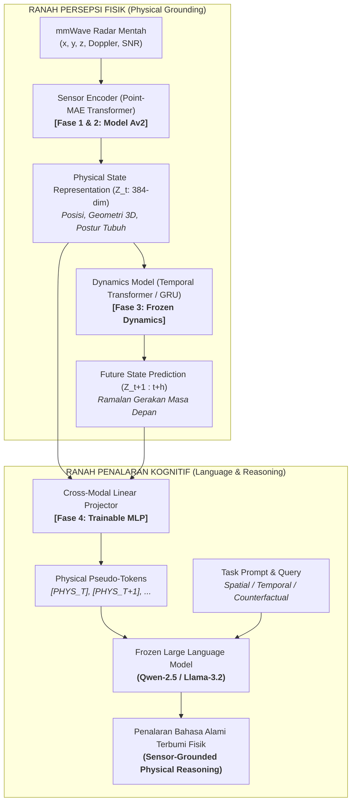

# Learning Physical State Representations for Sensor-Grounded Reasoning and Future-State Prediction

[](https://www.python.org/)
[](https://pytorch.org/)
[](https://github.com/ntu-radar/MM-Fi)
[](https://github.com/Pang-Holmes/Point-MAE)
[](LICENSE)

Repositori penelitian Tugas Akhir yang berfokus pada pemodelan representasi fisik spasial-temporal berbasis sinyal radar mmWave untuk meramalkan keadaan di masa depan (*future-state prediction*) serta menjembatani penalaran fisik dunia nyata (*grounded physical reasoning*) ke dalam *Large Language Models* (LLM).

---

## 1. Visi & Arsitektur Utama Sistem

Prinsip fundamental riset ini adalah **pemisahan tegas (*decoupling*) antara modul persepsi sensor fisik dan modul kognitif bahasa**. LLM **TIDAK PERNAH DILATIH DARI AWAL** dan dibiarkan dalam kondisi **FROZEN**, hanya bertindak sebagai *reasoning layer*:



---

## 2. Peta Kurikulum Pelatihan (4 Tahapan)

| Tahap | Fokus Penelitian | Masukan (*Input*) | Luaran / Target | Status |
| :---: | :--- | :--- | :--- | :---: |
| **Tahap 1** | Inisialisasi Bobot 3D CAD | ShapeNet CAD | Bobot Point-MAE Transformer Encoder (**Model A**) | **Selesai** (`models/Point-MAE/pretrain.pth`) |
| **Tahap 2** | Adaptasi Domain Radar & 3D Pose | Radar Point Cloud ($N=128$) | Estimasi 17 Joint 3D Skeleton (**Model Av2**) | **Aktif** (`eksperimen_model/train_pose.py`) |
| **Tahap 3** | Pemodelan Dinamika Temporal | Sekuens Status ($Z_{t-k \dots t}$) | Prediksi Masa Depan ($Z_{t+1 \dots t+h}$) | *Next Stage* |
| **Tahap 4** | Penyelarasan Kognitif ke LLM | Vektor Status Fisik ($Z_t$) | *Pseudo-tokens* untuk penalaran LLM *frozen* | *Final Stage* |

---

## 3. Struktur Direktori Proyek

```text
Tugas_Akhir/
├── AGENTS.md                         # Panduan SOP agen AI & tim peneliti
├── README.md                         # Dokumentasi master repositori
├── requirements.txt                  # Spesifikasi dependensi PyTorch & CUDA
├── .gitignore                        # Konfigurasi pengecualian bobot besar & dataset
├── models/
│   └── Point-MAE/                    # Tempat bobot dasar ShapeNet (pretrain.pth)
├── datasets/
│   └── MM-Fi Dataset/
│       ├── MMFi_action_segments.csv  # 1.082 batas segmen repetisi gerakan frame
│       └── filtered_mmwave/          # Data frame radar .bin & ground_truth.npy
│           └── E01..E04/S01..S40/A01..A27/
├── docs/
│   ├── onboarding.md                 # Konsep fundamental penelitian
│   ├── tutorial_training.md          # Panduan eksekusi pelatihan & evaluasi
│   ├── sections-proposal/            # Naskah modular draft proposal penelitian
│   └── report_training/              # Otomatisasi laporan training & grafik 300 DPI
│       ├── INDEX.md                  # Master tabel pembanding seluruh eksperimen
│       └── RUN_YYYYMMDD_HHMMSS_.../  # Folder aset setiap hasil pelatihan
└── eksperimen_model/                 # Kode implementasi PyTorch (Pure-PyTorch)
    ├── configs/                      # Konfigurasi eksperimen YAML
    │   ├── mmfi_pose_v2.yaml         # Konfigurasi arsitektur v2 (Batch 128, 100 Epochs)
    │   ├── mmfi_pose_best_tuned.yaml # Konfigurasi hasil pemenang hyperparameter tuning
    │   └── mmfi_pose_finetune.yaml   # Konfigurasi baseline v1 (Legacy)
    ├── datasets/                     # MMFiDataset & transforms (5 kanal radar + augmentasi)
    ├── models/                       # Point-MAE, JointQueryPoseHead, CompositePoseLoss
    ├── utils/                        # Checkpoint, watchdog, reporter & keep_awake
    ├── test_pipeline.py              # Skrip sanity check otomatis GPU & data
    ├── run_autotune_and_train.py     # Master runner: Auto-tune + Full train + Test eval
    ├── tune_pose.py                  # Skrip hyperparameter search otomatis
    ├── train_pose_v2.py              # Skrip training v2 (LLRD, Cosine Annealing, EMA)
    ├── train_pose.py                 # Skrip training baseline v1 (Legacy)
    ├── train_mae.py                  # Skrip domain adaptation self-supervised (Point-MAE)
    ├── evaluate_pose.py              # Evaluasi benchmark ilmiah (PA-MPJPE, PCK, CI 95%)
    ├── evaluate_embedding.py         # Skrip analisis representasi fisik Z_t (t-SNE)
    └── evaluate_robustness.py        # Skrip uji ketahanan terhadap dropout & noise
```

---

## 4. Instalasi & Penyiapan Lingkungan

### Kebutuhan Sistem & Hardware
* **OS:** Windows 10/11 atau Linux (Ubuntu 22.04+)
* **GPU:** NVIDIA GPU dengan VRAM $\ge 8$ GB (Diuji pada RTX 3060 12GB GDDR6, CUDA 12.4/12.6)
* **Python:** Python 3.12

### Langkah Instalasi
1. **Clone Repositori:**
   ```bash
   git clone https://github.com/<username>/<repo-name>.git
   cd <repo-name>
   ```

2. **Buat Virtual Environment:**
   Menggunakan `uv` (sangat cepat):
   ```bash
   uv venv .venv --python 3.12
   ```
   atau menggunakan Python venv bawaan:
   ```powershell
   python -m venv .venv
   ```

3. **Install Dependensi:**
   ```powershell
   & ".venv\Scripts\python.exe" -m pip install -r requirements.txt
   ```

---

## 5. Penyiapan Data & Bobot Pretrained

1. **Unduh Bobot Pretrained Point-MAE (Tahap 1):**
   Unduh checkpoint `pretrain.pth` (ShapeNet Transformer Backbone) dari repositori resmi [Point-MAE](https://github.com/Pang-Holmes/Point-MAE) dan tempatkan pada:
   ```text
   models/Point-MAE/pretrain.pth
   ```
2. **Dataset MM-Fi mmWave Radar:**
   Tempatkan data radar MM-Fi pada direktori:
   ```text
   datasets/MM-Fi Dataset/filtered_mmwave/E01..E04/S01..S40/A01..A27/
   datasets/MM-Fi Dataset/MMFi_action_segments.csv
   ```
   *Catatan: Pembagian data menggunakan **Stratified Random Cross-Subject Split (Seed: 42, Rasio 6:2:2)** di seluruh 4 lingkungan (E01–E04).*
   - **Train Set (24 Subjek):** S01, S02, S03, S05, S06, S08, S09, S11, S12, S14, S15, S18, S19, S20, S21, S23, S24, S26, S27, S29, S30, S32, S35, S38
   - **Validation Set (8 Subjek):** S10, S16, S28, S31, S33, S34, S37, S39
   - **Test Set Terisolasi (8 Subjek Unseen):** S04, S07, S13, S17, S22, S25, S36, S40

---

## 6. Cheat Sheet Perintah Lengkap (Panduan Eksekusi)

> [!IMPORTANT]
> Seluruh perintah di bawah wajib dijalankan menggunakan executable interpreter virtual environment: `& ".venv\Scripts\python.exe"` (PowerShell) atau `.venv/bin/python` (Bash).

### 6.1. Sanity Check Pipeline (~3 Detik)
Selalu jalankan ini sebelum training untuk memverifikasi GPU CUDA, tensor shape, 5 kanal data, dan backward pass:
```powershell
& ".venv\Scripts\python.exe" eksperimen_model/test_pipeline.py
```

---

### 6.2. Perintah Pelatihan (Tahap 2: 3D Pose Estimation)

#### Opsi A: Master Runner Otomatis (Unattended: Tuning + Full Training + Test Eval) — *Sangat Direkomendasikan*
Script ini mencegah Windows tidur (`SetThreadExecutionState`), menjalankan pencarian hyperparameter, mengekspor config terbaik, melatih 100 epoch penuh, lalu langsung mengevaluasi test set:
```powershell
& ".venv\Scripts\python.exe" eksperimen_model/run_autotune_and_train.py --n_trials 5 --tuning_epochs 8 --full_epochs 100 --batch_size 128
```

#### Opsi B: Full Training Langsung Model v2 (100 Epochs, Batch 128)
Jika ingin langsung melatih model arsitektur v2 (Cross-Attention Pose Head, LLRD, Cosine Annealing, Composite Loss):
```powershell
& ".venv\Scripts\python.exe" eksperimen_model/train_pose_v2.py --config eksperimen_model/configs/mmfi_pose_v2.yaml --epochs 100
```
*(Catatan: Checkpoint otomatis tersimpan di `eksperimen_model/checkpoints/pose_estimation_v2/best_model.pth` dan `model_av2.pth`)*

#### Opsi C: Hyperparameter Tuning Mandiri
Mengeksplorasi kombinasi learning rate, weight decay, loss weight, depth decoder, dan dropout:
```powershell
& ".venv\Scripts\python.exe" eksperimen_model/tune_pose.py --n_trials 5 --epochs_per_trial 8 --batch_size 128
```
*(Config pemenang otomatis disimpan di `eksperimen_model/configs/mmfi_pose_best_tuned.yaml`)*

#### Opsi D: Domain Adaptation Self-Supervised (Point-MAE Pretraining)
Melakukan fine-tuning backbone Point-MAE pada domain radar tanpa label:
```powershell
& ".venv\Scripts\python.exe" eksperimen_model/train_mae.py --epochs 20 --batch_size 64
```

#### Opsi E: Training Model v1 Baseline (Legacy)
Untuk keperluan reproduksi atau ablasi model v1 lama:
```powershell
& ".venv\Scripts\python.exe" eksperimen_model/train_pose.py --epochs 30 --batch_size 64 --lr 0.0003
```

---

### 6.3. Testing & Evaluasi Model

Setelah proses training selesai, gunakan perintah evaluasi berikut untuk menguji performa model:

#### 1. Uji Benchmark Ilmiah pada Test Set Terisolasi (8 Subjek Unseen)
Menghitung MPJPE, Procrustes PA-MPJPE, PCK@30/50/100/150mm, N-MPJPE, error per-sendi, dan 95% Confidence Interval pada subjek yang belum pernah dilihat model:

- **Jika Melatih Menggunakan Config v2 (`mmfi_pose_v2.yaml`):**
  ```powershell
  & ".venv\Scripts\python.exe" eksperimen_model/evaluate_pose.py --checkpoint eksperimen_model/checkpoints/pose_estimation_v2/best_model.pth --config eksperimen_model/configs/mmfi_pose_v2.yaml --split test --batch_size 128 --output_json docs/report_training/test_benchmark_results.json
  ```

- **Jika Melatih Menggunakan Config Hasil Tuning (`mmfi_pose_best_tuned.yaml`):**
  ```powershell
  & ".venv\Scripts\python.exe" eksperimen_model/evaluate_pose.py --checkpoint eksperimen_model/checkpoints/pose_estimation_v2/best_model.pth --config eksperimen_model/configs/mmfi_pose_best_tuned.yaml --split test --batch_size 128 --output_json docs/report_training/test_benchmark_results.json
  ```

#### 2. Evaluasi pada Validation Set (8 Subjek Validasi)
Untuk memverifikasi error pada set data validasi:
```powershell
& ".venv\Scripts\python.exe" eksperimen_model/evaluate_pose.py --checkpoint eksperimen_model/checkpoints/pose_estimation_v2/best_model.pth --config eksperimen_model/configs/mmfi_pose_v2.yaml --split val --batch_size 128
```

#### Ringkasan Parameter Penting pada `evaluate_pose.py`:
| Argumen | Default | Keterangan |
| :--- | :--- | :--- |
| `--checkpoint` | *(Wajib)* | Jalur ke file `.pth` model terbaik (`best_model.pth` atau `model_av2.pth`) |
| `--config` | `mmfi_pose_v2.yaml` | Jalur file YAML yang strukturnya cocok dengan bobot checkpoint |
| `--split` | `test` | Pilihan dataset split: `test` (subjek unseen), `val` (validasi), atau `train` |
| `--batch_size` | `128` | Ukuran batch evaluasi (128 direkomendasikan untuk efisiensi RTX 3060) |
| `--output_json` | *(Opsional)* | Jalur penyimpanan hasil metrik lengkap dalam format JSON |

---

### 6.4. Analisis Representasi Fisik & Uji Robustness

#### Analisis Representasi Fisik $Z_t$ (t-SNE & Disentanglement):
Mengevaluasi pemisahan invariansi lingkungan (E01–E04) dan manifold aksi pada representasi laten:
```powershell
& ".venv\Scripts\python.exe" eksperimen_model/evaluate_embedding.py --checkpoint eksperimen_model/checkpoints/pose_estimation_v2/best_model.pth --config eksperimen_model/configs/mmfi_pose_v2.yaml
```

#### Uji Ketahanan Fisik (*Point Dropout & Radar Noise Robustness*):
Menguji stabilitas estimasi skeleton saat radar mengalami kehilangan titik (*point starvation*) hingga 50%:
```powershell
& ".venv\Scripts\python.exe" eksperimen_model/evaluate_robustness.py --checkpoint eksperimen_model/checkpoints/pose_estimation_v2/best_model.pth --config eksperimen_model/configs/mmfi_pose_v2.yaml
```

---

## 7. Hasil Evaluasi & Target Metrik Ilmiah

Penelitian ini menetapkan target kuantitatif bertingkat berdasarkan benchmark resmi MM-Fi (*Yang et al., NeurIPS 2023*):

| Metrik Kunci | Baseline Standar | Target Tugas Akhir (Silver) | Target Publikasi Jurnal (Gold) | Status Model Saat Ini |
| :--- | :---: | :---: | :---: | :---: |
| **MPJPE (Overall)** | $\le 200$ mm | **$\le 140 – 150$ mm** | $\le 110$ mm | *In Training* |
| **PA-MPJPE (Procrustes)** | $\le 150$ mm | **$\le 100$ mm** | $\le 80$ mm | *In Training* |
| **PCK @ 100 mm** | $\ge 50\%$ | **$\ge 70\%$** | $\ge 85\%$ | *In Training* |
| **Environment Robustness (ERS)** | $\ge 0.80$ | **$\ge 0.88$** | $\ge 0.92$ | *In Training* |

---

## 8. Lisensi & Sitasi

Proyek penelitian ini dirilis di bawah lisensi MIT. Jika Anda memanfaatkan basis kode atau rancangan arsitektur ini dalam riset Anda, silakan rujuk:

```bibtex
@misc{tugas_akhir_physical_world_modeling_2026,
  author = {Rio Aslab},
  title = {Learning Physical State Representations for Sensor-Grounded Reasoning and Future-State Prediction},
  year = {2026},
  publisher = {GitHub}
}
```
