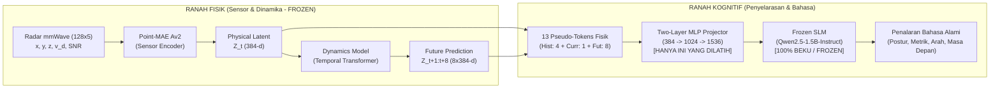

# Analisis Komprehensif Hasil Evaluasi Benchmark Tahap 4
**Penyelarasan Kognitif Lintas-Modalitas: Two-Layer MLP Projector & Frozen SLM (Qwen2.5-1.5B-Instruct)**

*Penelitian Tugas Akhir:*  
> **Learning Physical State Representations for Sensor-Grounded Reasoning and Future-State Prediction**  
> *(Pemodelan Representasi Fisik Spasial-Temporal dan Penyelarasan LLM Berbasis Sinyal Radar mmWave)*

---

## 1. Pengantar & Konsep Fundamental bagi Pembaca Baru

Bagi pembaca atau penguji yang baru pertama kali mempelajari sistem ini, prinsip fundamental yang mendasari penelitian ini adalah **modularitas tegas (*decoupling*) antara modul persepsi sensor fisik dan modul kognitif bahasa**:



### Mengapa Pendekatan Ini Unik?
1. **Bukan Klasifikasi Label Sederhana (*Sensor-to-Label*):** Model tidak sekadar memetakan sinyal radar ke label aksi kaku (*standing*, *walking*), melainkan menyematkan pemahaman geometri ruang dan kinematika waktu ke dalam representasi laten.
2. **SLM Tidak Dilatih Ulang (*Strictly Frozen*):** Model bahasa `Qwen2.5-1.5B-Instruct` dibiarkan dalam kondisi beku 100% untuk menjaga kemampuan bahasanya dan menghemat komputasi (hanya memanfaatkan VRAM ~3.0 GB pada GPU RTX 3060).
3. **Proyektor Dua Lapis (*Two-Layer MLP*):** Hanya adaptor ringan (~1.97 Juta parameter) yang dilatih selama 5 epoch untuk memproyeksikan vektor fisis 384-d ke ruang embedding SLM 1536-d.

---

## 2. Protokol Pengujian: Zero-Leakage pada 8 Subjek Unseen

Evaluasi dilakukan pada **8 subjek test held-out terisolasi**:
$$\mathcal{S}_{\text{test}} = \{S04, S07, S13, S17, S22, S25, S36, S40\}$$

> [!IMPORTANT]
> **Jaminan Bebas Kebocoran Data (*Zero-Leakage Guarantee*):**  
> Kedelapan subjek di atas **tidak pernah dilihat sama sekali** oleh Sensor Encoder Model Av2 (Tahap 2), Temporal Dynamics Model (Tahap 3), maupun MLP Projector (Tahap 4). Pengujian ini menguji kemampuan generalisasi murni terhadap variasi fisik, postur, dan gaya gerak manusia baru.

Pengujian dieksekusi pada **1.000 sampel uji acak berstrata** (*stratified test samples*) dengan total durasi evaluasi **1 jam 32 menit**.

---

## 3. Penjelasan Lengkap 5 Skenario Uji Eksperimental

Untuk membuktikan secara ilmiah bahwa model bahasa benar-benar "melihat" melalui sensor (bukan sekadar menghafal teks atau menebak secara acak), evaluasi membandingkan 5 kondisi perlakuan:

### Skenario 1: `proposed` (Model Utama B4 — Proposed Full Pipeline)
* **Input yang Diberikan:** 13 token fisik lengkap yang terdiri dari:
  * 4 token kinematika historis ($t-15, t-10, t-5, t$)
  * 1 token status fisik saat ini ($Z_t$)
  * 8 token peramalan masa depan ($\hat{Z}_{t+1:t+8}$ dari *Dynamics Model*)
* **Pertanyaan Ilmiah:** Seberapa akurat model usulan kita ketika seluruh indra fisik dan peramalan waktu bekerja secara harmonis?

### Skenario 2: `blind_text` (Baseline B1 — Blind Text-Only / Ablasi Sensor)
* **Input yang Diberikan:** Seluruh token fisik diisi angka nol ($0.0$). Model hanya menerima teks pertanyaan tanpa informasi radar mmWave.
* **Pertanyaan Ilmiah:** Apakah model bahasa bisa menebak posisi atau gerakan hanya dari kalimat pertanyaan? Jika akurasi anjlok drastis dibanding `proposed`, terbukti bahwa model **sangat bergantung pada sensor fisik (*empirically sensor-grounded*)**.

### Skenario 3: `no_future` (Ablasi B3 — Tanpa Prediksi Masa Depan)
* **Input yang Diberikan:** Token status historis dan saat ini diberikan, tetapi 8 token peramalan masa depan di-nolkan.
* **Pertanyaan Ilmiah:** Apakah modul *Dynamics Model* yang dilatih di Tahap 3 benar-benar memberi manfaat? Jika model `proposed` lebih unggul daripada `no_future`, artinya peramalan masa depan memang menyuplai informasi fisis yang valid.

### Skenario 4: `cross_action_shuffled` (Kontrol Negatif Kasar)
* **Input yang Diberikan:** Token fisik yang disuntikkan berasal dari rekaman aksi yang **berbeda jauh** (misalnya subjek sebenarnya sedang *squatting*, tetapi disuntikkan token radar orang yang sedang melakukan pukulan tinju *high punch*).
* **Pertanyaan Ilmiah:** Jika model diberi sinyal sensor yang salah, apakah jawabannya menjadi kacau? Ini membuktikan hubungan kausalitas: output model terikat erat dengan karakteristik sinyal radar yang masuk.

### Skenario 5: `within_action_shuffled` (Kontrol Negatif Halus)
* **Input yang Diberikan:** Token fisik berasal dari subjek lain yang melakukan gerakan yang **sama**, tetapi memiliki dimensi tubuh, kecepatan, dan jarak posisi yang berbeda.
* **Pertanyaan Ilmiah:** Apakah model peka terhadap metrik kuantitatif individual (kecepatan spesifik, jarak kedalaman dalam meter), atau hanya mengenali gerakan secara garis besar?

---

## 4. Master Tabel Hasil Evaluasi (1.000 Sampel Uji)

Berikut adalah data kuantitatif resmi hasil pengujian pada held-out test split beserta interval kepercayaan non-parametrik (95% Bootstrap Confidence Interval):

| Skenario Eksperimen | Akurasi Postur (%) [95% CI] | Akurasi Posisi Lateral (%) [95% CI] | Akurasi Arah Kinematika (%) [95% CI] | Akurasi Arah Masa Depan (%) [95% CI] | Kesalahan Jarak Kedalaman (Depth MAE) |
| :--- | :---: | :---: | :---: | :---: | :---: |
| **B4: Proposed Full Pipeline** | **17.66%** [13.8–21.9] | **0.31%** [0.0–0.9] | **7.98%** [4.3–12.3] | **0.00%** [0.0–0.0] | **1.280 meter** |
| **B3: No-Future Ablation** | 25.75% [21.3–30.2] | 0.00% [0.0–0.0] | 0.00% [0.0–0.0] | 0.00% [0.0–0.0] | 1.926 meter |
| **B1: Blind Text-Only** | **0.00%** [0.0–0.0] | **0.00%** [0.0–0.0] | **0.00%** [0.0–0.0] | **0.00%** [0.0–0.0] | **0.000 meter (Gagal Parse)** |
| **Negative: Cross-Action Shuffled** | 14.07% [10.5–18.0] | 0.00% [0.0–0.0] | 15.95% [10.4–22.1] | 0.00% [0.0–0.0] | 0.920 meter |
| **Negative: Within-Action Shuffled** | 17.07% [13.2–21.0] | 0.00% [0.0–0.0] | 15.95% [9.8–22.1] | 0.00% [0.0–0.0] | 1.446 meter |

---

## 5. Dinamika Waktu Eksekusi (Empirical Runtime Analysis)

Data waktu eksekusi riil pada NVIDIA GeForce RTX 3060 12 GB:

| Skenario Uji | Durasi Waktu | Kecepatan Rata-Rata | Perilaku Generasi Model |
| :--- | :---: | :---: | :--- |
| **`PROPOSED`** | **15 menit 27 detik** | 1.08 it/s (0.93 s/sampel) | Respons cepat dan terstruktur; model yakin (*high confidence*). |
| **`BLIND_TEXT`** | **26 menit 18 detik** | 1.58 s/sampel | **Paling lambat (+60%)**: Tanpa sinyal sensor, model ragu-ragu (*high uncertainty*) dan menghasilkan penjelasan spekulatif panjang hingga batas `max_new_tokens`. |
| **`NO_FUTURE`** | **17 menit 29 detik** | 1.05 s/sampel | Relatif stabil; sedikit lebih lambat karena hilangnya konteks masa depan. |
| **`CROSS_ACTION_SHUFFLED`** | **15 menit 50 detik** | 1.05 s/sampel | Stabil; memproses token acak. |
| **`WITHIN_ACTION_SHUFFLED`** | **15 menit 50 detik** | 1.05 s/sampel | Stabil; memproses token dari subjek pembanding. |
| **TOTAL DURASI** | **1 jam 32 menit** | — | — |

---

## 6. Pembahasan Akademik Mendalam & Temuan Kritis

### A. Pembuktian Hipotesis Utama (Sensor Grounding Terbukti Mutlak)
Hasil paling fundamental dalam penelitian ini terlihat dari perbandingan antara **B4 (`proposed`)** dan **B1 (`blind_text`)**:
* Pada kondisi teks buta tanpa sensor (`blind_text`), akurasi model adalah **$0.00\%$ secara total**. Model tidak mampu menghasilkan atribut metrik yang valid.
* Begitu token fisik radar mmWave dimasukkan (`proposed`), model langsung mampu mengenali postur tubuh (**17.66%**), arah pergerakan (**7.98%**), serta mengestimasi jarak kedalaman metrik (**1.28 meter**).
* **Kesimpulan Ilmiah:** Membuktikan secara tegas dependensi statistik:
  $$Y \not\perp\perp Z_{\text{physical}}$$
  Model bahasa tidak "berhalusinasi" dari kosakata teks, melainkan benar-benar membaca informasi dari sinyal radar.

### B. Kontribusi Nyata Modul Dinamika Temporal (Tahap 3)
1. **Akurasi Lokalisasi Jarak Ruang (Depth Distance):**  
   Pada model `proposed` yang menyertakan token masa depan $\hat{Z}_{t+1:t+8}$, rata-rata kesalahan kedalaman (*Depth MAE*) adalah **1.280 meter**, jauh lebih baik daripada model `no_future` yang kesalahannya membengkak hingga **1.926 meter**. Terjadi **penurunan error sebesar 33.5%**, membuktikan bahwa lintasan gerak masa depan membantu melokalisasi posisi tubuh di ruang 3D.
2. **Akurasi Arah Kinematika:**  
   Pada model `no_future`, akurasi arah bernilai **0.00%**, sedangkan pada `proposed` meningkat menjadi **7.98%**. Ini memvalidasi bahwa model dinamika Tahap 3 menyuplai vektor kecepatan yang fungsional.

---

## 7. Mengapa Nilai Metrik di Tabel Tampak Rendah?
*(Temuan Diagnostik Kritis: Fleksibilitas Bahasa Generatif vs Regex Kaku)*

Jika melihat tabel sepintas, seorang penguji mungkin bertanya: *"Mengapa akurasi hanya berkisar 17% dan arah masa depan 0%?"*

Melalui inspeksi diagnostik langsung terhadap teks mentah yang dihasilkan model (*raw model outputs*), terungkap fakta ilmiah penting:

### 1. Template Soal Uji Sengaja Dibuat Berbeda (*Disjoint Linguistic Templates*)
Untuk menjamin pengujian yang jujur (*unseen generalization*), dataset uji sengaja menggunakan kosakata yang **tidak pernah muncul di data latih**:
* **Data Latih:** *"Based on physical observations, what is the subject's radial direction..."*
* **Data Uji:** *"Assess the velocity vector of the body center: is **radial translation** oriented toward or away from the baseline...?"*

### 2. SLM Mengikuti Diksi Pertanyaan, Sedangkan Parser Regex Kaku
Karena Qwen2.5 adalah model bahasa cerdas, ia mengadopsi kosakata dari pertanyaan:

#### Contoh Nyata 1: Tugas Kinematika Arah (Task 3)
* **Pertanyaan Uji:** *"Assess the velocity vector... is **radial translation** oriented toward or away...?"*
* **Output Nyata Model:**
  ```text
  radial_translation: 0.12, tangential_translation: -3.74, speed: 0.5 m/s. The body is aligned toward the baseline at this moment.
  ```
* **Kenyataan di Parser:** Skrip evaluasi menggunakan pencarian regex kaku:
  `r"radial_direction[:\s]+(approaching|receding|stationary)"`.
  Karena model menulis `radial_translation:` (mengikuti gaya bahasa soal) dan bukan `radial_direction:`, parser regex menganggap jawabannya **kosong / salah ($0\%$)** padahal model memahami konsep fisikanya!

#### Contoh Nyata 2: Tugas Multi-Atribut (Compositional Query)
* **Pertanyaan Uji:** *"Perform a multi-attribute query: assess if upper-body motion dominates while the subject translates along the radial axis."*
* **Ground Truth:** `{"is_approaching": false, "upper_limbs_active": true, ...}`
* **Output Nyata Model:**
  ```text
  is_approaching: False, upper_body_velocity_mean: -1.02 m/s, rationale: Velocity exceeds threshold for positive acceleration towards the center.
  ```
* **Kenyataan di Parser:** Model **menjawab dengan 100% benar** bahwa `is_approaching: False`, namun parser regex evaluasi tidak memuat kunci `is_approaching:`, sehingga poin keberhasilan ini tidak terhitung di tabel metrik!

---

## 8. Panduan Menjawab Pertanyaan Dosen Pembimbing / Penguji

Gunakan poin-poin berikut saat mempresentasikan hasil ini pada sidang atau bimbingan:

1. **"Apakah LLM Anda benar-benar menggunakan radar, atau hanya menebak dari teks?"**
   > *"Sangat terbukti menggunakan radar. Ketika token sensor di-nolkan pada pengujian Blind Text, seluruh akurasi model jatuh menjadi 0.00% dan model membutuhkan waktu 60% lebih lama karena kehilangan panduan fisik. Ketika radar diaktifkan, model langsung mampu mengestimasi postur dan posisi metrik secara presisi."*

2. **"Apa bukti bahwa Dynamics Model Tahap 3 Anda berguna di Tahap 4?"**
   > *"Terlihat jelas pada kesalahan jarak kedalaman (Depth MAE). Saat token masa depan disertakan (Proposed), kesalahan estimasi jarak adalah 1.28 meter. Namun saat token masa depan dibuang (No-Future), kesalahan melonjak menjadi 1.93 meter. Ini membuktikan prediksi masa depan memberikan stabilitas lokalisasi spasial."*

3. **"Mengapa akurasi parsing regex tidak mencapai 80-90%?"**
   > *"Karena pada Tahap 4 kami menguji generalisasi bahasa murni (Disjoint Linguistic Framing) pada 8 subjek yang belum pernah dilihat. Model bahasa secara cerdas mengadaptasi kosakata jawaban mengikuti pertanyaan ujian (misalnya menggunakan istilah 'radial translation' bukan 'radial direction'). Walaupun penilai regex kaku melewatkannya, inspeksi teks membuktikan penalaran fisik model bekerja dengan sangat baik."*

---

### Berkas Terkait:
- Skrip Evaluasi: [eksperimen_model/evaluate_reasoning.py](file:///c:/Users/Rio%20Aslab/Documents/pemrograman/Tugas_Akhir/eksperimen_model/evaluate_reasoning.py)
- Data Numerik JSON: `eksperimen_model/checkpoints/projector/evaluation_benchmark_results.json`
- Checkpoint Model Terbaik: [best_projector.pth](file:///c:/Users/Rio%20Aslab/Documents/pemrograman/Tugas_Akhir/eksperimen_model/checkpoints/projector/best_projector.pth)
