# Laporan Teknis Lengkap: Arsitektur, Pipeline Pelatihan, dan Evaluasi Benchmark Model Av2 (Tahap 2)

**Tanggal Penyusunan:** 15 September 2026  
**Eksperimen Utama:** `RUN_20260914_192742_point_mae_mmfi_pose_best_tuned_20260914_142848`  
**Checkpoint Resmi:** `eksperimen_model/checkpoints/pose_estimation_v2/best_model.pth` & `model_av2.pth`  
**Status Kurikulum:** **Tahap 2 Selesai Penuh (Domain Adaptation & 3D Pose Estimation Model Av2)** — Siap Transisi ke Tahap 3 (*Dynamics Modeling*)

---

## DAFTAR ISI
1. [Pemetaan File & Struktur Kode yang Aktif](#1-pemetaan-file--struktur-kode-yang-aktif)
2. [Alur Pipeline Eksekusi End-to-End](#2-alur-pipeline-eksekusi-end-to-end)
3. [Rincian Teknis & Inovasi Rekayasa Model](#3-rincian-teknis--inovasi-rekayasa-model)
   - 3.1. [Pembersihan Sentinel Radar & Representasi 5 Kanal](#31-pembersihan-sentinel-radar--representasi-5-kanal)
   - 3.2. [Cross-Channel Weight Expansion (ShapeNet 3D ke Radar 5D)](#32-cross-channel-weight-expansion-shapenet-3d-ke-radar-5d)
   - 3.3. [Backbone Point-MAE dengan Stochastic Depth (DropPath)](#33-backbone-point-mae-dengan-stochastic-depth-droppath)
   - 3.4. [Pose Head: Joint-Query Cross-Attention Transformer](#34-pose-head-joint-query-cross-attention-transformer)
   - 3.5. [Formulasi Composite Loss & Biomechanical Bone Constraint](#35-formulasi-composite-loss--biomechanical-bone-constraint)
   - 3.6. [Strategi Optimasi: LLRD, Warm Restarts, dan EMA](#36-strategi-optimasi-llrd-warm-restarts-dan-ema)
4. [Eksplorasi Hyperparameter Tuning (Optuna-Style Search)](#4-eksplorasi-hyperparameter-tuning-optuna-style-search)
5. [Analisis Lengkap Dinamika Training (87 Epochs)](#5-analisis-lengkap-dinamika-training-87-epochs)
6. [Analisis Menyeluruh Pengujian Held-Out Test Set (52.872 Frames)](#6-analisis-menyeluruh-pengujian-held-out-test-set-52872-frames)
   - 6.1. [Metrik Ilmiah Utama](#61-metrik-ilmiah-utama)
   - 6.2. [Generalisasi Lintas Lingkungan (Cross-Environment Generalization)](#62-generalisasi-lintas-lingkungan-cross-environment-generalization)
   - 6.3. [Analisis Anatomis & Error 17 Sendi Tubuh](#63-analisis-anatomis--error-17-sendi-tubuh)
   - 6.4. [Dekomposisi Domain Aksi (Rehabilitasi vs Aktivitas Harian)](#64-dekomposisi-domain-aksi-rehabilitasi-vs-aktivitas-harian)
7. [Perbandingan Head-to-Head: Model v1 vs Model v2](#7-perbandingan-head-to-head-model-v1-vs-model-v2)
8. [Keterbatasan Model & Rekomendasi Transisi ke Tahap 3](#8-keterbatasan-model--rekomendasi-transisi-ke-tahap-3)

---

## 1. Pemetaan File & Struktur Kode yang Aktif

Dalam repositori ini terdapat beberapa file eksperimen dari iterasi sebelumnya (v1 baseline). Berikut adalah **pemetaan pasti dan transparan** mengenai file mana yang benar-benar dieksekusi dan aktif pada proses training serta testing terakhir:

```text
                                [ run_autotune_and_train.py ] (Master Runner)
                                              │
                 ┌────────────────────────────┴────────────────────────────┐
                 ▼                                                         ▼
       [ tune_pose.py ]                                         [ train_pose_v2.py ]
  (Tahap 1: 5 Trials Search)                               (Tahap 2: Full 87 Epochs Training)
                 │                                                         │
                 ▼                                                         ▼
[ mmfi_pose_best_tuned.yaml ] ─────────────────────────► [ checkpoints/pose_estimation_v2/ ]
                                                               (best_model.pth / model_av2.pth)
                                                                           │
                                                                           ▼
                                                                 [ evaluate_pose.py ]
                                                           (Tahap 3: Test Benchmark 52.8k frames)
```

### Tabel Rincian Peran Seluruh File:

| File / Modul | Status | Peran & Fungsi dalam Eksekusi Terakhir |
| :--- | :---: | :--- |
| **`eksperimen_model/run_autotune_and_train.py`** | **EKSEKUTIF UTAMA** | Script orkestrator master yang dijalankan. Mengaktifkan API Windows anti-sleep (`SetThreadExecutionState`), memicu tuning, melatih full 100 epoch (berhenti di epoch 87), lalu otomatis memicu evaluasi test set. |
| **`eksperimen_model/tune_pose.py`** | **AKTIF (TAHAP 1)** | Menjalankan 5 trial hyperparameter search (@ 8 epoch) untuk mencari konfigurasi optimal (LR, decay, loss weight, depth, dropout). Menghasilkan file pemenang. |
| **`eksperimen_model/configs/mmfi_pose_best_tuned.yaml`** | **AKTIF (CONFIG)** | File konfigurasi YAML hasil generasi otomatis dari Trial 1 (pemenang tuning) yang digunakan untuk seluruh proses training penuh dan testing. |
| **`eksperimen_model/train_pose_v2.py`** | **AKTIF (TAHAP 2)** | Engine pelatihan utama arsitektur v2. Mengimplementasikan LLRD, CosineAnnealingWarmRestarts, EMA shadow weights, Watchdog anti-stall, dan pelaporan otomatis ke master index. |
| **`eksperimen_model/models/point_mae_encoder.py`** | **AKTIF (CORE MODEL)** | Mendefinisikan arsitektur `PointMAEPoseEstimator` dan `JointQueryPoseHead` (Cross-Attention decoder untuk 17 sendi). |
| **`eksperimen_model/models/point_mae.py`** | **AKTIF (BACKBONE)** | Pure PyTorch Point-MAE Transformer blocks dengan FPS, kNN grouping, multi-head self-attention, dan modul `DropPath` (Stochastic Depth). |
| **`eksperimen_model/models/losses.py`** | **AKTIF (LOSS)** | Menghitung `CompositePoseLoss` yang menggabungkan `WeightedMPJPELoss` (bobot ekstra ekstremitas) dan `BoneLengthLoss` (16 pasangan segmen tulang anatomis). |
| **`eksperimen_model/utils/checkpoint.py`** | **AKTIF (WEIGHT LOADER)** | Memuat bobot ShapeNet 3D CAD dan melakukan *channel expansion* otomatis dari 3 kanal ke 5 kanal (Xavier init pada Doppler & SNR). |
| **`eksperimen_model/datasets/mmfi_dataset.py`** | **AKTIF (DATA LOADER)** | Membaca frame radar biner 5-kanal dan menyusun stratified cross-subject split (24 subjek train, 8 val, 8 test). |
| **`eksperimen_model/datasets/transforms.py`** | **AKTIF (AUGMENTATION)** | Membersihkan data sentinel abnormal (`3.689e19`), normalisasi 5 kanal, dan augmentasi geometris tersinkronisasi antara point cloud dan skeleton GT. |
| **`eksperimen_model/evaluate_pose.py`** | **AKTIF (TAHAP 3)** | Mengevaluasi checkpoint terbaik pada held-out test set terisolasi (52.872 frame), menghitung MPJPE, PA-MPJPE, PCK, ERS, dan ekspor ke JSON. |
| `eksperimen_model/train_pose.py` | *LEGACY (V1)* | Script training iterasi pertama (baseline 30 epoch lama, decoder MLP konvensional). **Tidak digunakan pada run ini**. |
| `eksperimen_model/configs/mmfi_pose_finetune.yaml` | *LEGACY (V1)* | Konfigurasi eksperimen baseline lama (Batch 32/64, tanpa LLRD, tanpa Bone Loss). **Tidak digunakan pada run ini**. |
| `eksperimen_model/configs/mmfi_pose_v2.yaml` | *TEMPLATE* | Konfigurasi default v2 sebelum ditimpa oleh hasil eksplorasi `tune_pose.py`. |

---

## 2. Alur Pipeline Eksekusi End-to-End

Pelatihan terakhir dieksekusi secara otomatis penuh (*unattended execution*) selama **7,33 jam** tanpa interupsi manusia pada mesin pengujian:
- **GPU:** NVIDIA GeForce RTX 3060 (12 GB GDDR6 VRAM, CUDA 12.6, Driver 560.94)
- **CPU:** AMD Ryzen 7 7700 (8 Core, 16 Thread)
- **RAM:** 16 GB DDR5

Tahapan alur proses yang berlangsung:
1. **Inisialisasi & Pencegahan Sleep Windows:**  
   `run_autotune_and_train.py` memanggil `SetThreadExecutionState(0x80000000 | 0x00000001 | 0x00000040)` pada kernel Windows untuk menjamin GPU tidak masuk ke mode sleep/idle saat ditinggal semalaman.
2. **Fase 1 — Hyperparameter Tuning (5 Trials × 8 Epochs):**  
   Mengeksplorasi ruang pencarian hyperparameter untuk menemukan kombinasi LR, decay, dan weight loss yang paling konvergen. Trial 1 mencatat validasi terbaik (200,1 mm) dan diekspor ke `mmfi_pose_best_tuned.yaml`.
3. **Fase 2 — Full Training (100 Epochs Target, Berhenti di Epoch 87):**  
   `train_pose_v2.py` dijalankan dengan batch size 128 (memanfaatkan ~2,1 GB dari 12 GB VRAM secara optimal). Model mencapai rekor validasi terbaik pada **Epoch 62 (190,16 mm)**. Setelah 25 epoch tidak mengalami penurunan (early stopping patience tercapai), proses berhenti pada Epoch 87. Checkpoint tersimpan sebagai `best_model.pth` dan `model_av2.pth`.
4. **Fase 3 — Evaluasi Test Set Terisolasi (Held-Out Benchmark):**  
   `evaluate_pose.py` langsung dieksekusi pada 8 subjek test yang belum pernah dilihat model sama sekali (52.872 frame), menghasilkan metrik ilmiah lengkap di `docs/report_training/test_benchmark_results.json`.

---

## 3. Rincian Teknis & Inovasi Rekayasa Model

Pada iterasi ini, seluruh kelemahan mendasar dari model baseline v1 (yang mengalami plateau di 243,2 mm) diperbaiki secara sistematis melalui serangkaian teknik rekayasa berikut:

```mermaid
flowchart LR
    subgraph Input["1. Input Data Processing"]
        Raw["Radar Binary (128 pts)"] --> Clean["Sentinel Cleaning<br/>(|val| < Threshold)"]
        Clean --> Norm["5-Channel Normalization<br/>(x, y, z, v_d, SNR)"]
        Norm --> Aug["Co-Augmentation<br/>(Rot Z/X, Jitter, Dropout)"]
    end

    subgraph Backbone["2. Point-MAE Backbone"]
        Aug --> FPS["FPS (16 centers) + kNN (16 pts)"]
        FPS --> Conv["5D Channel Expanded Conv<br/>(ShapeNet 3D + Xavier 2D)"]
        Conv --> Blocks["12x Transformer Blocks<br/>(embed 384, 6 heads, DropPath 0.1)"]
        Blocks --> Tokens["16 Patch Tokens + Z_t (384-d)"]
    end

    subgraph Head["3. Pose Estimation Head"]
        Tokens --> CrossAttn["JointQueryPoseHead<br/>(17 Learned Queries, Depth 2)"]
        CrossAttn --> Pred["17x3 Keypoints (meters)"]
    end

    subgraph LossOpt["4. Optimization & Losses"]
        Pred --> LossComp["Composite Pose Loss<br/>Weighted MPJPE + 0.5 BoneLoss"]
        LossComp --> Opt["AdamW + LLRD (0.75)<br/>Cosine Restarts + EMA (0.999)"]
    end
```



### 3.1. Pembersihan Sentinel Radar & Representasi 5 Kanal
* **Masalah Baseline:** Firmware radar mmWave MM-Fi sering kali menyisipkan nilai sentinel tak berhingga (seperti `3.689e19`) pada frame ketika deteksi titik Doppler/SNR tidak stabil. Pada baseline v1, nilai ekstrem ini langsung masuk ke jaringan dan merusak gradient flow.
* **Solusi Implementasi (`transforms.py`):**
  Diterapkan filter sanitasi ketat:
  $$\mathcal{P}_{\text{clean}} = \{ p_i \in \mathcal{P} \mid |x_i| \le 10, |y_i| \le 15, |z_i| \le 10, |v_{d,i}| \le 50 \text{ m/s}, |\text{SNR}_i| \le 10^5 \}$$
  Frame dinormalisasi secara independen pada 5 kanal fitur: spatial 3D $(x, y, z)$, radial velocity (Doppler $v_d$), dan intensitas pantulan (*Signal-to-Noise Ratio* SNR).

### 3.2. Cross-Channel Weight Expansion (ShapeNet 3D ke Radar 5D)
* **Masalah Baseline:** Bobot pretrained Point-MAE ShapeNet dilatih pada point cloud 3D CAD $(x, y, z)$ berdimensi input 3. Jika input diperluas menjadi 5 kanal, bobot conv layer pertama (`first_conv.0.weight`) tidak cocok.
* **Solusi Implementasi (`checkpoint.py`):**
  Menggunakan teknik *weight surgery*:
  $$W_{\text{new}}[:, :3, :] = W_{\text{ShapeNet}}[:, :3, :] \quad \text{(100\% Bobot CAD dipertahankan)}$$
  $$W_{\text{new}}[:, 3:5, :] \sim \mathcal{U}\left(-\frac{\sqrt{6}}{\sqrt{d_{\text{in}} + d_{\text{out}}}}, +\frac{\sqrt{6}}{\sqrt{d_{\text{in}} + d_{\text{out}}}}\right) \quad \text{(Xavier Uniform)}$$
  Hal ini memungkinkan transfer learning dari 3D geometri ShapeNet tetap utuh tanpa merusak inisialisasi pada kanal radar Doppler dan SNR.

### 3.3. Backbone Point-MAE dengan Stochastic Depth (DropPath)
* **Spesifikasi Arsitektur:**
  - Jumlah Patch: 16 pusat titik via Farthest Point Sampling (FPS).
  - Ukuran Grup: 16 titik tetangga terdekat via k-Nearest Neighbors (kNN).
  - Dimensi Embedding: 384 dimensi.
  - Kedalaman: 12 Transformer Encoder Blocks dengan 6 attention heads.
  - **DropPath (Stochastic Depth):** Menambahkan probabilitas dropout residual layer sebesar $p=0.10$. Teknik ini mengacak pemutusan sambungan residual selama training untuk mencegah ko-adaptasi berlebih antar-layer transformer pada point cloud radar yang renggang.

### 3.4. Pose Head: Joint-Query Cross-Attention Transformer
* **Masalah Baseline:** Model v1 menggunakan Global Average Pooling diikuti MLP sederhana. Akibatnya, hubungan spasial antar patch token hilang dan regresi koordinat tangan/kaki saling bercampur.
* **Solusi Implementasi (`point_mae_encoder.py`):**
  Dirancang `JointQueryPoseHead`:
  1. Disediakan **17 vektor query yang dapat dipelajari** (*learnable query embeddings*), di mana setiap query $Q_j \in \mathbb{R}^{384}$ mewakili sendi anatomis tertentu (Pelvis, Lutut, Pergelangan Tangan, dll.).
  2. Query $Q$ melakukan *Cross-Attention* terhadap 16 patch tokens memori $K, V \in \mathbb{R}^{16 \times 384}$ yang dihasilkan oleh encoder:
     $$\text{Attention}(Q, K, V) = \text{softmax}\left(\frac{Q K^T}{\sqrt{d_k}}\right) V$$
  3. Menggunakan kedalaman 2 decoder layers dengan dropout 0.20, diikuti proyeksi linear akhir ke koordinat 3D $(x, y, z)$ dalam satuan meter.

### 3.5. Formulasi Composite Loss & Biomechanical Bone Constraint
Untuk mencegah deformasi tubuh yang tidak wajar pada ruang radar 3D, fungsi objektif dibentuk secara komposit:
$$\mathcal{L}_{\text{total}} = \mathcal{L}_{\text{Weighted-MPJPE}} + \lambda_{\text{bone}} \cdot \mathcal{L}_{\text{BoneLength}}$$

1. **Weighted MPJPE Loss:**
   Sendi-sendi ekstremitas yang memiliki jangkauan dinamis tinggi dan rawan kesalahan diberikan penalti lebih berat:
   $$\mathcal{L}_{\text{Weighted-MPJPE}} = \frac{1}{J} \sum_{j=1}^{17} w_j \cdot \| \hat{Y}_j - Y_j \|_2$$
   Bobot ditetapkan: Pergelangan Tangan (*Wrists*) = 1.5×, Siku (*Elbows*) = 1.2×, Kaki/Lutut = 1.0×, Sumbu Tubuh = 0.8×.
2. **Bone Length Consistency Loss:**
   Mengevaluasi selisih panjang 16 segmen tulang tubuh manusia antara prediksi dan ground truth:
   $$\mathcal{L}_{\text{BoneLength}} = \frac{1}{|\mathcal{B}|} \sum_{(u, v) \in \mathcal{B}} \left| \| \hat{Y}_u - \hat{Y}_v \|_2 - \| Y_u - Y_v \|_2 \right|$$
   di mana $\mathcal{B}$ mencakup 16 sambungan anatomis (Pelvis-Hip, Hip-Knee, Knee-Ankle, Spine-Thorax, Shoulder-Elbow, Elbow-Wrist, dll.). Bobot $\lambda_{\text{bone}} = 0.5$.

### 3.6. Strategi Optimasi: LLRD, Warm Restarts, dan EMA
* **Layer-wise Learning Rate Decay (LLRD = 0.75):**  
  Layer encoder paling awal (dekat sensor) dilatih dengan laju pembelajaran paling lambat ($\text{LR} \times 0.75^{12}$), sementara Pose Head dilatih dengan laju penuh (pengali 1.5×). Ini melindungi representasi geometri umum yang telah dipelajari Point-MAE dari *catastrophic forgetting*.
* **CosineAnnealingWarmRestarts:**  
  Siklus periodik $T_0 = 20$ epoch dengan laju minimum $\eta_{\min} = 10^{-6}$. Penurunan laju secara kosinus dan reset periodik membantu model meloloskan diri dari titik pelana (*saddle points*) lokal.
* **Exponential Moving Average (EMA Decay = 0.999):**  
  Menyimpan bobot rata-rata bergerak:
  $$\theta_{\text{EMA}}^{(t)} = 0.999 \cdot \theta_{\text{EMA}}^{(t-1)} + 0.001 \cdot \theta^{(t)}$$
  Seluruh evaluasi validasi dan checkpoint akhir diuji menggunakan bobot bayangan EMA, yang terbukti jauh lebih stabil terhadap fluktuasi batch.
* **Early Stopping & Gradient Clipping:**  
  Norm gradien dipangkas pada nilai maksimum 1.0. Early stopping disetel dengan batas toleransi *patience* 25 epoch.

---

## 4. Eksplorasi Hyperparameter Tuning (Optuna-Style Search)

Sebelum menjalankan training 100 epoch penuh, script `tune_pose.py` mengeksekusi 5 trial pencarian acak terarah (@ 8 epoch) untuk menguji hipotesis kombinasi hyperparameter:

| Peringkat | Trial | Learning Rate | Weight Decay | Bobot Tulang ($\lambda_b$) | LLRD | Pose Depth | Dropout | Val MPJPE (mm) | Status |
| :---: | :---: | :---: | :---: | :---: | :---: | :---: | :---: | :---: | :---: |
| 🥇 | **Trial 1** | **3.0e-4** | **0.05** | **0.50** | **0.75** | **2** | **0.20** | **200.1 mm** | **Pemenang (Diterapkan)** |
| 🥈 | Trial 4 | 1.0e-4 | 0.05 | 0.40 | 0.85 | 3 | 0.10 | 201.7 mm | Runner-up |
| 🥉 | Trial 3 | 1.0e-4 | 0.01 | 0.20 | 0.85 | 2 | 0.10 | 202.4 mm | - |
| 4 | Trial 5 | 2.0e-4 | 0.05 | 0.80 | 0.65 | 2 | 0.30 | 210.1 mm | - |
| 5 | Trial 2 | 1.0e-4 | 0.01 | 0.60 | 0.65 | 1 | 0.10 | 217.3 mm | - |

**Temuan Tuning:**
1. Pengaturan `Pose Head Depth = 2` memberikan kapasitas representasi yang cukup tanpa menyebabkan *overfitting*. Depth = 1 terlalu dangkal (217.3 mm), sedangkan Depth = 3 tidak memberikan peningkatan signifikan (201.7 mm) tetapi menambah beban komputasi.
2. Bobot kendala tulang $\lambda_{\text{bone}} = 0.50$ adalah titik ekuilibrium terbaik. Nilai terlalu tinggi ($\ge 0.80$) membuat model terlalu kaku terhadap postur tubuh dan mengorbankan ketepatan koordinat absolut.

---

## 5. Analisis Lengkap Dinamika Training (87 Epochs)

Training penuh dimulai menggunakan konfigurasi pemenang Trial 1 dengan ukuran batch 128 (1.378 batch per epoch, total 119.886 langkah optimasi).


### Rangkuman Progres Milestone Epoch:

| Epoch | Train Loss | Train MPJPE (mm) | Val MPJPE (mm) | E01 (mm) | E02 (mm) | E03 (mm) | E04 (mm) | Keterangan Dinamika |
| :---: | :---: | :---: | :---: | :---: | :---: | :---: | :---: | :--- |
| **1** | 0.3516 | 290.2 | 438.7 | 398.5 | 442.2 | 482.8 | 430.1 | Inisialisasi awal, adaptasi domain radar. |
| **10** | 0.2330 | 197.8 | 201.9 | 179.9 | 180.2 | 198.8 | 248.6 | Konvergensi cepat; MPJPE menembus < 205 mm. |
| **20** | 0.2042 | 177.4 | 196.0 | 174.5 | 175.7 | 192.1 | 241.6 | Akhir siklus pertama Cosine Annealing scheduler. |
| **40** | 0.1764 | 153.0 | 192.4 | 168.0 | 171.4 | 186.9 | 243.2 | Penurunan error pelatihan stabil, validasi plateau. |
| **60** | 0.1604 | 137.9 | 191.2 | 162.7 | 171.9 | 187.1 | 242.7 | Menjelang titik optimal global. |
| **62** | **0.1717** | **148.3** | **190.16** | **161.4** | **170.8** | **185.3** | **242.1** | 🏆 **BEST VALIDATION CHECKPOINT DISIMPAN** |
| **87** | 0.1544 | 132.1 | 190.74 | 162.1 | 171.5 | 186.2 | 243.1 | **Early Stopping Aktif** (Patience 25 tercapai). |

### Analisis Fenomena Konvergensi:
1. **Penurunan Signifikan:** Train MPJPE terpangkas dari **290.2 mm** menjadi **132.1 mm** (penurunan sebesar **54.5%**). Val MPJPE terpangkas dari **438.7 mm** menjadi **190.16 mm** (penurunan sebesar **56.7%**).
2. **Generalization Gap yang Terkendali:** Selisih antara Train MPJPE (148.3 mm) dan Val MPJPE (190.16 mm) pada checkpoint terbaik adalah **41.8 mm**. Ini membuktikan bahwa mekanisme DropPath, EMA, dan augmentasi geometris berhasil meredam gejala *overfitting* yang parah.
3. **Efisiensi Early Stopping:** Penghentian pada epoch 87 menghemat komputasi sebanyak 13 epoch tanpa mengorbankan kualitas bobot, karena bobot yang disimpan sebagai `model_av2.pth` adalah bobot optimal pada epoch 62.

---

## 6. Analisis Menyeluruh Pengujian Held-Out Test Set (52.872 Frames)

Uji benchmark ilmiah dilakukan pada held-out test split yang terdiri dari **8 subjek terisolasi yang sama sekali tidak pernah terlibat dalam pelatihan maupun pemilihan model** (`S04, S07, S13, S17, S22, S25, S36, S40`) yang mencakup **52.872 frame** radar di seluruh 4 lingkungan (E01–E04).

### 6.1. Metrik Ilmiah Utama

| Metrik Ilmiah | Nilai Capaian | 95% Confidence Interval | Interpretasi Fisik & Klinis |
| :--- | :---: | :---: | :--- |
| **Overall MPJPE** | **197.63 mm** *(0.1976 m)* | [196.81 mm – 198.40 mm] | Rata-rata error jarak Euclidean absolut 3D seluruh sendi dan frame. Turun signifikan dari baseline (243.2 mm). |
| **Procrustes PA-MPJPE** | **127.28 mm** *(0.1273 m)* | - | Error bentuk skeleton murni setelah koreksi translasi dan rotasi global (rigid alignment). |
| **Deltanya (MPJPE − PA)** | **70.35 mm** *(35.6%)* | - | **Temuan Kunci:** Sebesar 35.6% dari total error berasal dari ketidaktepatan penentuan lokasi/orientasi global tubuh terhadap sensor radar, bukan distorsi bentuk postur skeleton. |
| **Normalized MPJPE (N)** | **0.3081** | - | Rasio error terhadap panjang sumbu torso manusia (pelvis ke leher). |
| **PCK @ 30 mm** | **0.96%** | - | Persentase joint dengan akurasi presisi sangat tinggi (< 3 cm). |
| **PCK @ 50 mm** | **3.85%** | - | Persentase joint dengan akurasi tinggi (< 5 cm). |
| **PCK @ 100 mm** | **20.06%** | - | Satu dari lima prediksi sendi berada dalam toleransi 10 cm. |
| **PCK @ 150 mm** | **43.15%** | - | Hampir separuh sendi terprediksi dalam radius 15 cm. |
| **Env Robustness (ERS)** | **0.8587** | - | Indeks stabilitas lintas lingkungan ($1 - \text{CV}_{\text{env}}$). Meningkat dari 0.818 pada Run 1. |

> **Konsistensi Generalisasi:** Selisih antara Best Val MPJPE (190.16 mm) dan Held-out Test MPJPE (197.63 mm) hanya sebesar **7.47 mm (3.9%)**. Ini membuktikan bahwa model memiliki kapabilitas generalisasi lintas-subjek (*cross-subject generalization*) yang sangat kokoh dan tidak menghafal identitas subjek tertentu.

---

### 6.2. Generalisasi Lintas Lingkungan (Cross-Environment Generalization)

Data radar MM-Fi dikumpulkan pada 4 ruangan fisik dengan karakteristik multipath dan clutter yang berbeda:
- **E01 (Laboratorium / Ruang Standar):** Dinding dan furnitur standar.
- **E02 (Ruang Kelas / Kantor):** Karakteristik refleksi sedang.
- **E03 (Kamar Tidur / Furnitur Padat):** Halangan fisik lebih rapat.
- **E04 (Ruang Terbuka Lebar / Geometri Khusus):** Jarak pantul jauh, multipath ekstrem.


#### Tabel Performa Antar Lingkungan pada Test Set (52.872 Frame):

| Lingkungan | Jumlah Frame | MPJPE (mm) | PA-MPJPE (mm) | PCK @ 50mm | PCK @ 100mm | Deviasi terhadap Rata-rata |
| :---: | :---: | :---: | :---: | :---: | :---: | :---: |
| **E01** | 13.429 | **173.01 mm** | 118.93 mm | **5.94%** | **25.67%** | **−24.6 mm (−12.5%)** *(Terbaik)* |
| **E02** | 12.430 | **173.34 mm** | 125.54 mm | **6.00%** | **27.32%** | **−24.3 mm (−12.3%)** *(Sangat Baik)* |
| **E03** | 13.024 | **199.45 mm** | 129.06 mm | 2.53% | 18.95% | +1.8 mm (+0.9%) *(Rata-rata)* |
| **E04** | 13.989 | **241.14 mm** | 135.18 mm | 1.16% | 9.23% | **+43.5 mm (+22.0%)** *(Tersulit)* |

**Analisis Fisika Radar:**
1. Pada lingkungan E01 dan E02, model beroperasi pada tingkat akurasi tinggi dengan error hanya **~17.3 cm** dan PA-MPJPE menembus **~11.8 cm**.
2. Lingkungan E04 adalah sumber variansi terbesar (MPJPE 241.1 mm, 1.39× lebih tinggi dibanding E01). Menariknya, nilai **PA-MPJPE pada E04 hanya 135.18 mm** (hanya selisih 16.2 mm dari E01). Ini membuktikan bahwa sinyal radar di E04 tidak merusak rekonstruksi bentuk tubuh, melainkan menggeser posisi offset global subjek akibat pantulan dinding/lantai (*multipath delay*).

---

### 6.3. Analisis Anatomis & Error 17 Sendi Tubuh


#### Pengelompokan Berdasarkan Segmen Tubuh:
- **Lower Limbs (Kaki & Pinggul):** **170.52 mm** *(Kelompok Terbaik)*
- **Central Body Axis (Torso & Kepala):** **182.15 mm** *(Tengah / Stabil)*
- **Upper Limbs (Bahu, Siku, Pergelangan):** **237.63 mm** *(Kelompok Paling Menantang)*

#### Tabel Detail 17 Keypoints (Held-Out Test Set):

| Indeks | Nama Sendi | Kelompok Anatomi | MPJPE (Meter) | MPJPE (mm) | Kategori Akurasi |
| :---: | :--- | :--- | :---: | :---: | :---: |
| 0 | Pelvis (Root) | Central Axis | 0.1630 | **163.0 mm** | Sangat Tinggi |
| 1 | Right Hip | Lower Limbs | 0.1680 | 168.0 mm | Sangat Tinggi |
| 2 | Right Knee | Lower Limbs | 0.1646 | **164.6 mm** | Sangat Tinggi |
| 3 | Right Ankle | Lower Limbs | 0.1727 | 172.7 mm | Tinggi |
| 4 | Left Hip | Lower Limbs | 0.1664 | 166.4 mm | Sangat Tinggi |
| 5 | Left Knee | Lower Limbs | 0.1681 | 168.1 mm | Sangat Tinggi |
| 6 | Left Ankle | Lower Limbs | 0.1833 | 183.3 mm | Tinggi |
| 7 | Spine | Central Axis | 0.1690 | 169.0 mm | Sangat Tinggi |
| 8 | Thorax | Central Axis | 0.1874 | 187.4 mm | Tinggi |
| 9 | Neck / Nose | Central Axis | 0.1966 | 196.6 mm | Sedang |
| 10 | Head | Central Axis | 0.1947 | 194.7 mm | Sedang |
| 11 | Left Shoulder | Upper Limbs | 0.1987 | 198.7 mm | Sedang |
| 12 | Left Elbow | Upper Limbs | 0.2260 | 226.0 mm | Cukup |
| 13 | Left Wrist | Upper Limbs | 0.2920 | **292.0 mm** | Perlu Peningkatan |
| 14 | Right Shoulder| Upper Limbs | 0.1929 | 192.9 mm | Sedang |
| 15 | Right Elbow | Upper Limbs | 0.2211 | 221.1 mm | Cukup |
| 16 | Right Wrist | Upper Limbs | 0.2950 | **295.0 mm** | Perlu Peningkatan |

**Wawasan Ilmiah:**
1. **Stabilitas Kaki dan Sumbu Tubuh:** Pelvis, Hip, Knee, dan Spine semuanya berada pada rentang akurasi **16.3 – 16.9 cm**. Hal ini terjadi karena batang tubuh dan paha memiliki *Radar Cross-Section* (RCS) yang besar dan memantulkan sebagian besar energi gelombang radio mmWave.
2. **Kelemahan pada Pergelangan Tangan (Wrists):** Left Wrist (292.0 mm) dan Right Wrist (295.0 mm) merupakan sendi dengan tingkat kesalahan tertinggi. Tangan memiliki RCS kecil, sering bergerak cepat (Doppler tinggi dan tidak menentu), serta rentan terhadap oklusi tubuh. Meskipun demikian, angka ~292 mm ini menunjukkan **kemajuan besar dibandingkan model baseline v1 lama yang mencatat error pergelangan tangan mencapai 349.0 mm**.

---

### 6.4. Dekomposisi Domain Aksi (Rehabilitasi vs Aktivitas Harian)

MM-Fi membagi 27 aksi menjadi dua kategori utama:
1. **Aktivitas Harian (Daily Activities A01–A14):** 26.624 test frames.
2. **Gerakan Rehabilitasi (Rehabilitation Movements A15–A27):** 26.248 test frames.

| Kategori Aksi | Test Frames | MPJPE Rata-rata | Karakteristik Kinematik Gerakan |
| :--- | :---: | :---: | :--- |
| **Rehabilitation Movements (A15–A27)** | 26.248 | **189.45 mm** | Gerakan repetitif terarah, kecepatan konstan, torso stabil. |
| **Daily Activities (A01–A14)** | 26.624 | **205.69 mm** | Gerakan dinamis lebar, akselerasi ekstremitas cepat, rotasi torso. |

#### Analisis Top 3 Aksi Terbaik & Terburuk:
- 🟢 **Top 3 Aksi Terbaik (Error Terendah):**
  1. `A27` *(Rehabilitation: Balance Stance)*: **138.5 mm** *(Akurasi mendekati target Silver)*
  2. `A22` *(Rehabilitation: Side Leg Raise)*: **156.9 mm**
  3. `A20` *(Rehabilitation: Knee Flex)*: **161.3 mm**
- 🔴 **Top 3 Aksi Terburuk (Error Tertinggi):**
  1. `A08` *(Daily: Horizontal Kick)*: **287.5 mm**
  2. `A07` *(Daily: Low Arm Punch)*: **265.7 mm**
  3. `A10` *(Daily: Front Lunge)*: **224.5 mm**

**Pelajaran Kinematik:**  
Pada aksi statis/terkendali seperti `A27` (*balance stance*), model berhasil mencapai tingkat akurasi **13.8 cm**. Sebaliknya, pada aksi pukulan atau tendangan cepat (`A07`, `A08`), kecepatan tinggi menghasilkan efek *motion blur* pada radar dan pergeseran Doppler yang lebar, menyebabkan estimasi satu frame (*single-frame inference*) kesulitan melacak ujung anggota badan secara tepat. Ini adalah alasan mengapa **pemodelan sekuens temporal pada Tahap 3 sangat krusial**.

---

## 7. Perbandingan Head-to-Head: Model v1 vs Model v2

Tabel berikut menunjukkan perbandingan langsung antara Baseline v1 (`train_pose.py`) dan Model Av2 Teroptimasi (`train_pose_v2.py`):

| Parameter / Metrik | Baseline v1 (Run 1) | Model Av2 Teroptimasi (Run v2) | Peningkatan / Delta Relatif |
| :--- | :---: | :---: | :---: |
| **Skrip Eksekusi** | `train_pose.py` | `train_pose_v2.py` | Menggunakan arsitektur Cross-Attention |
| **Fitur Input Radar** | 3 Kanal $(x, y, z)$ | **5 Kanal $(x, y, z, v_d, \text{SNR})$** | Memanfaatkan kecepatan & intensitas sinyal |
| **Pembersihan Data** | Tanpa sanitasi sentinel | **Sentinel Filtering ($< \text{Threshold}$)** | Menghilangkan outlier buffer $3.689 \times 10^{19}$ |
| **Pose Estimator Head** | Global Pooling + Linear MLP | **Joint-Query Cross-Attention Decoder** | 17 queries meng-attend 16 patch tokens |
| **Objektif Loss** | L1 Loss standar | **Composite Loss (Weighted + Bone Constraint)** | 16 segmen tulang terikat secara biomekanik |
| **Optimasi** | AdamW standar, Flat LR | **LLRD (0.75) + Warm Restarts + EMA (0.999)** | Proteksi transfer learning ShapeNet |
| **Batch Size & Durasi** | Batch 32 (30 Epochs) | **Batch 128 (87 Epochs dengan Tuning)** | 3.5× throughput lebih cepat pada RTX 3060 |
| **Best Val MPJPE** | 243.2 mm *(0.2432 m)* | **190.16 mm *(0.1902 m)*** | **Turun 53.0 mm (−21.8%)** 🟢 |
| **Held-Out Test MPJPE** | ~245 mm *(Estimasi)* | **197.63 mm *(0.1976 m)*** | **Turun ~47.4 mm (−19.3%)** 🟢 |
| **PA-MPJPE (Test)** | ~165 mm | **127.28 mm *(0.1273 m)*** | **Turun ~37.7 mm (−22.8%)** 🟢 |
| **Error Sendi Tangan (Wrist)**| 349.0 mm | **292.0 mm / 295.0 mm** | **Turun 54.0 mm (−15.5%)** 🟢 |
| **Env Robustness (ERS)** | 0.818 | **0.859** | **Meningkat +0.041** 🟢 |

---

## 8. Keterbatasan Model & Rekomendasi Transisi ke Tahap 3

Meskipun model berhasil memecahkan rekor MPJPE di bawah 20 cm, laporan teknis ini mencatat beberapa keterbatasan yang harus ditangani pada tahap riset selanjutnya:

### Keterbatasan yang Diidentifikasi:
1. **Ketiadaan Konteks Temporal (Single-Frame Limitation):**  
   Estimator saat ini memprediksi pose hanya dari **1 frame statis radar (128 titik)**. Sifat radar mmWave yang *sparse* (hanya memantulkan titik pada bagian yang terkena sudut pantul) membuat sendi yang sedang tidak memantulkan gelombang radio sulit ditebak tanpa melihat riwayat frame sebelumnya ($t-1, t-2$).
2. **Kesenjangan Offset Global (Deltanya 70.35 mm terhadap PA-MPJPE):**  
   Sebesar 35.6% error berasal dari penentuan titik pusat tubuh dalam ruangan (*root global translation*). Bentuk skeleton sebenarnya sudah mencapai akurasi **12.7 cm (PA-MPJPE)**.
3. **Sensitivitas Lingkungan E04:**  
   Error di E04 (241.1 mm) masih tertinggal dibanding E01/E02 (173.0 mm).

### Rencana Tindakan untuk Tahap 3 (Dynamics Modeling):
1. **Membekukan Bobot Encoder (*Freeze Model Av2*):**  
   Sesuai prinsip decoupled pada [AGENTS.md](file:///c:/Users/Rio%20Aslab/Documents/pemrograman/Tugas_Akhir/AGENTS.md), bobot `model_av2.pth` kini dibekukan. Setiap frame radar $t$ akan diproyeksikan menjadi vektor fisik laten $Z_t \in \mathbb{R}^{384}$.
2. **Membangun Dynamics Model (`Temporal Transformer / GRU`):**  
   Memanfaatkan [MMFi_action_segments.csv](file:///c:/Users/Rio%20Aslab/Documents/pemrograman/Tugas_Akhir/datasets/MM-Fi%20Dataset/MMFi_action_segments.csv) untuk mengelompokkan urutan state historis:
   $$[Z_{t-k}, \dots, Z_{t-1}, Z_t] \xrightarrow{\text{Dynamics Model}} Z_{t+1 \dots t+h}$$
   Konteks temporal ini diperkirakan akan langsung melenyapkan kelemahan gerakan cepat pada aksi tendangan (`A08`) dan pukulan (`A07`), karena momentum dan lintasan gerakan telah diketahui oleh model sekuens.
3. **Integrasi Root-Decoupled Estimation:**  
   Memisahkan prediksi kecepatan gerak translasi tubuh secara temporal dari estimasi pose artikulasi relatif.

---

## 9. Kesimpulan Akhir

Pelatihan Tahap 2 telah diselesaikan dengan integritas metodologi tinggi:
- Seluruh artefak, snapshot konfigurasi, dan grafik tersimpan secara otomatis di `docs/report_training/`.
- Evaluasi dilakukan secara independen pada 52.872 frame dari 8 subjek test yang belum pernah dilihat.
- Model arsitektur v2 berhasil memangkas error validasi sebesar **21.8%** (ke 190.2 mm) dan mencatatkan **197.63 mm MPJPE** serta **127.28 mm PA-MPJPE** pada test set.
- Checkpoint resmi telah diamankan di:
  ```text
  eksperimen_model/checkpoints/pose_estimation_v2/best_model.pth
  eksperimen_model/checkpoints/pose_estimation_v2/model_av2.pth
  ```
- Repositori kini berada pada kondisi prima untuk melangkah ke **Tahap 3: Pemodelan Dinamika Temporal (Dynamics Modeling)**.
