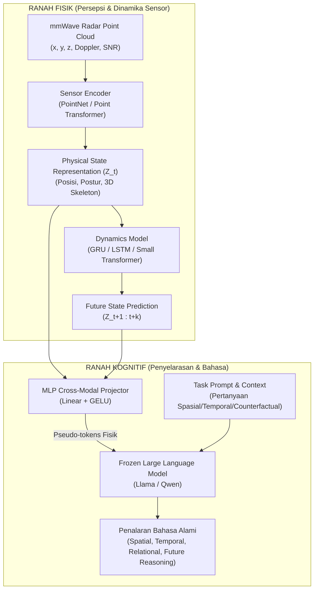

# Onboarding Guide — Tugas Akhir: Sensor-Grounded Physical World Modeling

Selamat datang di repositori penelitian Tugas Akhir! Dokumen ini dirancang sebagai panduan komprehensif bagi siapa pun (pembimbing, penguji, kolaborator, atau pengembang) yang baru pertama kali membuka proyek ini, agar dapat dengan cepat memahami tujuan, konsep fundamental, arsitektur sistem, struktur berkas, dan rencana eksekusi penelitian.

---

## 1. Ringkasan Eksekutif Penelitian

### Judul Penelitian
> **Learning Physical State Representations for Sensor-Grounded Reasoning and Future-State Prediction**  
> *(Fondasi Menuju Predictive World Modeling dan Embodied AI)*

### Inti Masalah (*The Core Problem*)
Large Language Models (LLM) memiliki kemampuan penalaran linguistik yang luar biasa, namun **tidak memiliki persepsi langsung terhadap dunia fisik**. Sebaliknya, sensor fisik seperti **mmWave radar** menangkap keadaan nyata (posisi, kecepatan Doppler, reflektansi gelombang) tanpa bias bahasa, namun menghasilkan data *sparse* dan berisik yang tidak dapat langsung dicerna oleh model bahasa.

Sebagian besar penelitian multimodal hanya berfokus pada klasifikasi aktivitas sederhana (*sensor-to-label*). Penelitian ini melangkah lebih jauh dengan membangun **fondasi representasi fisik (physical state representation)** dan **pemodelan dinamika (dynamics modeling)**, sehingga sistem mampu meramalkan keadaan di masa depan (*future-state prediction*) serta melakukan penalaran mendalam (*spatial, temporal, counterfactual reasoning*) melalui LLM.

### Formula Inti
$$\text{Sensor Observation} \longrightarrow \text{Physical State } (Z_t) \longrightarrow \text{Dynamics Modeling} \longrightarrow \text{Future State Prediction} \longrightarrow \text{Reasoning}$$

---

## 2. Peta Struktur Repositori

```text
Tugas_Akhir/
├── docs/
│   ├── onboarding.md                 <-- [Anda berada di sini] Panduan pengenalan proyek
│   ├── draft_proposal.md             <-- Draft proposal penelitian lengkap (single document)
│   ├── eksperimen_model.md           <-- Rencana teknis arsitektur & 4 tahap training curriculum
│   └── sections-proposal/                     <-- 35 section terpisah dari draft proposal untuk navigasi cepat
│       ├── 1-judul-penelitian.md
│       ├── 2-posisi-penelitian.md
│       ├── ...
│       └── 35-ringkasan-satu-kalimat.md
└── eksperimen_model/                 <-- Direktori kode implementasi PyTorch, data loader, & notebook
```

---

## 3. Arsitektur Sistem: Pemisahan Ranah Fisik & Kognitif

Prinsip utama penelitian ini adalah **modularitas (*decoupling*)**: memisahkan modul persepsi sensor dari modul kognitif bahasa agar komputasi efisien dan penalaran tetap terikat kuat pada realitas fisik (*grounded*).



### Komponen Utama:
1. **Sensor Encoder**: Mengekstrak *sparse point clouds* radar menjadi vektor representasi keadaan fisik ($Z_t$).
2. **Dynamics Model**: Mempelajari hukum gerak temporal dari $Z_{t-k \dots t}$ untuk memprediksi keadaan di masa depan ($Z_{t+1 \dots t+h}$).
3. **MLP Alignment Module**: Jembatan ringan yang memproyeksikan vektor fisik ke ruang embedding LLM sebagai *pseudo-tokens*.
4. **Frozen LLM**: Berfungsi murni sebagai mesin penalaran (*reasoning engine*), tidak dilatih ulang dari nol.

---

## 4. Rencana Kurikulum Pelatihan (4 Tahapan)

Untuk menghindari beban komputasi besar dan memastikan kestabilan representasi, proses pelatihan dilakukan secara bertahap:

| Tahap | Fokus Pelatihan | Komponen yang Dilatih | Komponen Beku (*Frozen*) | Target / Output |
|---|---|---|---|---|
| **Tahap 1** | Inisialisasi Persepsi | Sensor Encoder (dari nol) | - | Adaptasi terhadap noise dasar sensor mmWave (Model A) |
| **Tahap 2** | Pematangan Persepsi | Sensor Encoder (Fine-tuning) | - | Pemetaan akurat ke representasi fisik/3D skeleton (Model Av2) |
| **Tahap 3** | Pemodelan Dinamika | Dynamics Model | Sensor Encoder (Frozen) | Peramalan lintasan & perubahan status fisik di masa depan |
| **Tahap 4** | Penyelarasan Kognitif | MLP Projector | Encoder, Dynamics, & LLM (Semua Frozen) | LLM memahami token representasi fisik & mampu menjawab prompt QA |

> Rincian lengkap teknis kurikulum eksperimen dapat dibaca di [docs/eksperimen_model.md](file:///c:/Users/Rio%20Aslab/Documents/pemrograman/Tugas_Akhir/docs/eksperimen_model.md).

---

## 5. Indeks Berkas Proposal (`docs/sections-proposal/`)

Seluruh proposal telah dipecah menjadi 35 modul terstruktur untuk memudahkan telaah spesifik:

| No | Berkas Section | Topik Utama |
|---|---|---|
| 01 | [1-judul-penelitian.md](file:///c:/Users/Rio%20Aslab/Documents/pemrograman/Tugas_Akhir/docs/sections-proposal/1-judul-penelitian.md) | Opsi judul, alternatif, dan rekomendasi utama |
| 02 | [2-posisi-penelitian.md](file:///c:/Users/Rio%20Aslab/Documents/pemrograman/Tugas_Akhir/docs/sections-proposal/2-posisi-penelitian.md) | Persimpangan bidang studi dan diagram posisi terhadap World Model |
| 03 | [3-latar-belakang.md](file:///c:/Users/Rio%20Aslab/Documents/pemrograman/Tugas_Akhir/docs/sections-proposal/3-latar-belakang.md) | Sensor vs Bahasa, tahapan observation-to-reasoning, research gap |
| 04 | [4-konsep-utama-penelitian.md](file:///c:/Users/Rio%20Aslab/Documents/pemrograman/Tugas_Akhir/docs/sections-proposal/4-konsep-utama-penelitian.md) | Definisi Observation, State, Dynamics, Prediction, Reasoning |
| 05 | [5-pertanyaan-penelitian.md](file:///c:/Users/Rio%20Aslab/Documents/pemrograman/Tugas_Akhir/docs/sections-proposal/5-pertanyaan-penelitian.md) | Main Research Question dan rincian RQ1 s/d RQ5 |
| 06 | [6-hipotesis.md](file:///c:/Users/Rio%20Aslab/Documents/pemrograman/Tugas_Akhir/docs/sections-proposal/6-hipotesis.md) | Hipotesis H1 sampai H6 yang akan diuji secara empiris |
| 07 | [7-sensor-yang-digunakan.md](file:///c:/Users/Rio%20Aslab/Documents/pemrograman/Tugas_Akhir/docs/sections-proposal/7-sensor-yang-digunakan.md) | Karakteristik mmWave radar dan data parameternya |
| 08 | [8-dataset-dan-training.md](file:///c:/Users/Rio%20Aslab/Documents/pemrograman/Tugas_Akhir/docs/sections-proposal/8-dataset-dan-training.md) | Fase dataset (prototype, utama, lanjutan) dan integrasi model |
| 09 | [9-strategi-pemilihan-dataset.md](file:///c:/Users/Rio%20Aslab/Documents/pemrograman/Tugas_Akhir/docs/sections-proposal/9-strategi-pemilihan-dataset.md) | Pedoman pemilihan dataset tunggal yang kuat (MM-Fi) |
| 10 | [10-apakah-data-sudah-dalam-format-llm.md](file:///c:/Users/Rio%20Aslab/Documents/pemrograman/Tugas_Akhir/docs/sections-proposal/10-apakah-data-sudah-dalam-format-llm.md) | Alasan mengapa raw sensor tidak bisa langsung menjadi input LLM |
| 11 | [11-arsitektur-yang-diusulkan.md](file:///c:/Users/Rio%20Aslab/Documents/pemrograman/Tugas_Akhir/docs/sections-proposal/11-arsitektur-yang-diusulkan.md) | Diagram arsitektur lengkap sistem end-to-end |
| 12 | [12-sensor-encoder.md](file:///c:/Users/Rio%20Aslab/Documents/pemrograman/Tugas_Akhir/docs/sections-proposal/12-sensor-encoder.md) | Opsi arsitektur encoder dan formulasi matematis ($z_t$) |
| 13 | [13-physical-state-representation.md](file:///c:/Users/Rio%20Aslab/Documents/pemrograman/Tugas_Akhir/docs/sections-proposal/13-physical-state-representation.md) | Verifikasi kelengkapan informasi fisik dalam representasi |
| 14 | [14-dynamics-modeling.md](file:///c:/Users/Rio%20Aslab/Documents/pemrograman/Tugas_Akhir/docs/sections-proposal/14-dynamics-modeling.md) | Pemodelan transisi keadaan temporal $S_t \rightarrow S_{t+1}$ |
| 15 | [15-future-state-prediction.md](file:///c:/Users/Rio%20Aslab/Documents/pemrograman/Tugas_Akhir/docs/sections-proposal/15-future-state-prediction.md) | Formulasi tugas peramalan lintasan dan skeleton |
| 16 | [16-task-reasoning.md](file:///c:/Users/Rio%20Aslab/Documents/pemrograman/Tugas_Akhir/docs/sections-proposal/16-task-reasoning.md) | 5 tugas penalaran: State, Spatial, Temporal, Relational, Future-state |
| 17 | [17-counterfactual-reasoning.md](file:///c:/Users/Rio%20Aslab/Documents/pemrograman/Tugas_Akhir/docs/sections-proposal/17-counterfactual-reasoning.md) | Evaluasi grounding berbasis intervensi keadaan fisik (*What if...*) |
| 18 | [18-evaluasi.md](file:///c:/Users/Rio%20Aslab/Documents/pemrograman/Tugas_Akhir/docs/sections-proposal/18-evaluasi.md) | Metrik lengkap (MAE, Direction Acc, ADE/FDE, QA Acc, CF Consistency) |
| 19 | [19-grounding-evaluation.md](file:///c:/Users/Rio%20Aslab/Documents/pemrograman/Tugas_Akhir/docs/sections-proposal/19-grounding-evaluation.md) | Uji validitas bahwa model benar-benar menggunakan sinyal sensor |
| 20 | [20-robustness-evaluation.md](file:///c:/Users/Rio%20Aslab/Documents/pemrograman/Tugas_Akhir/docs/sections-proposal/20-robustness-evaluation.md) | Ketahanan terhadap pergantian subjek, lingkungan, dan noise |
| 21 | [21-baseline.md](file:///c:/Users/Rio%20Aslab/Documents/pemrograman/Tugas_Akhir/docs/sections-proposal/21-baseline.md) | Tingkatan model pembanding (Text-only s/d Full Proposed Pipeline) |
| 22 | [22-ablation-study.md](file:///c:/Users/Rio%20Aslab/Documents/pemrograman/Tugas_Akhir/docs/sections-proposal/22-ablation-study.md) | Eksperimen eliminasi modul untuk membuktikan kontribusi tiap komponen |
| 23 | [23-novelty.md](file:///c:/Users/Rio%20Aslab/Documents/pemrograman/Tugas_Akhir/docs/sections-proposal/23-novelty.md) | Rincian 5 klaim kebaruan penelitian |
| 24 | [24-novelty-utama.md](file:///c:/Users/Rio%20Aslab/Documents/pemrograman/Tugas_Akhir/docs/sections-proposal/24-novelty-utama.md) | Ringkasan satu paragraf inti kebaruan |
| 25 | [25-hubungan-dengan-world-modeling.md](file:///c:/Users/Rio%20Aslab/Documents/pemrograman/Tugas_Akhir/docs/sections-proposal/25-hubungan-dengan-world-modeling.md) | Hubungan metodologi ini dengan konsep World Model |
| 26 | [26-scope-penelitian.md](file:///c:/Users/Rio%20Aslab/Documents/pemrograman/Tugas_Akhir/docs/sections-proposal/26-scope-penelitian.md) | Batasan ruang lingkup agar realistis dan feasible untuk Tugas Akhir |
| 27 | [27-workflow-penelitian.md](file:///c:/Users/Rio%20Aslab/Documents/pemrograman/Tugas_Akhir/docs/sections-proposal/27-workflow-penelitian.md) | Diagram alur kerja penelitian dari awal hingga akhir |
| 28 | [28-tahapan-eksekusi-yang-disarankan.md](file:///c:/Users/Rio%20Aslab/Documents/pemrograman/Tugas_Akhir/docs/sections-proposal/28-tahapan-eksekusi-yang-disarankan.md) | Milestone pengerjaan (Fase 1 sampai Fase 5) |
| 29 | [29-risiko-penelitian.md](file:///c:/Users/Rio%20Aslab/Documents/pemrograman/Tugas_Akhir/docs/sections-proposal/29-risiko-penelitian.md) | Analisis potensi kegagalan teknis beserta strategi mitigasinya |
| 30 | [30-resource-requirement.md](file:///c:/Users/Rio%20Aslab/Documents/pemrograman/Tugas_Akhir/docs/sections-proposal/30-resource-requirement.md) | Kebutuhan komputasi (GPU, RAM, storage) |
| 31 | [31-expected-result.md](file:///c:/Users/Rio%20Aslab/Documents/pemrograman/Tugas_Akhir/docs/sections-proposal/31-expected-result.md) | Analisis ragam kemungkinan hasil eksperimen (Hasil A s/d E) |
| 32 | [32-batas-antara-ta-dan-world-model.md](file:///c:/Users/Rio%20Aslab/Documents/pemrograman/Tugas_Akhir/docs/sections-proposal/32-batas-antara-ta-dan-world-model.md) | Demarkasi tegas: apa yang dikerjakan di TA vs domain World Model penuh |
| 33 | [33-posisi-final-penelitian.md](file:///c:/Users/Rio%20Aslab/Documents/pemrograman/Tugas_Akhir/docs/sections-proposal/33-posisi-final-penelitian.md) | Ringkasan lembar fakta parameter penelitian |
| 34 | [34-kesimpulan-proposal.md](file:///c:/Users/Rio%20Aslab/Documents/pemrograman/Tugas_Akhir/docs/sections-proposal/34-kesimpulan-proposal.md) | Sintesis narasi menyeluruh draft proposal |
| 35 | [35-ringkasan-satu-kalimat.md](file:///c:/Users/Rio%20Aslab/Documents/pemrograman/Tugas_Akhir/docs/sections-proposal/35-ringkasan-satu-kalimat.md) | Penjelasan singkat ("Elevator Pitch") untuk dosen penguji |

---

## 6. Pertanyaan Umum (FAQ)

### Mengapa menggunakan mmWave Radar, bukan Kamera (RGB)?
Radar mmWave tidak terpengaruh oleh kondisi pencahayaan, asap, atau bayangan, serta menjamin privasi pengguna (sangat ideal untuk pemantauan dalam ruangan). Selain itu, radar secara alami mengukur kecepatan radial (Doppler) yang sangat krusial untuk pemodelan dinamika fisik.

### Apakah kita melatih LLM dari awal?
**Tidak.** LLM dibiarkan dalam kondisi *frozen*. Kita hanya melatih modul encoder persepsi, model dinamika, dan proyektor linear/MLP untuk memetakan ruang fitur radar ke ruang token LLM. Pendekatan ini hemat sumber daya dan mencegah *catastrophic forgetting* pada model bahasa.

### Apakah sistem ini sudah merupakan sebuah World Model utuh?
**Bukan.** Sistem ini adalah penelitian fondasi (*foundational research*). Fokus utamanya adalah membuktikan bahwa representasi dari sensor fisik dapat mempertahankan sifat dinamika yang cukup kuat untuk prediksi masa depan dan penalaran berbasis realitas fisik.

---

## 7. Langkah Memulai Pengembangan (*Next Steps*)

1. **Pahami Argumen Proposal**: Buka [docs/sections-proposal/35-ringkasan-satu-kalimat.md](file:///c:/Users/Rio%20Aslab/Documents/pemrograman/Tugas_Akhir/docs/sections-proposal/35-ringkasan-satu-kalimat.md) dan [docs/sections-proposal/11-arsitektur-yang-diusulkan.md](file:///c:/Users/Rio%20Aslab/Documents/pemrograman/Tugas_Akhir/docs/sections-proposal/11-arsitektur-yang-diusulkan.md).
2. **Setup Dataset**: Siapkan pipeline unduhan dan ekstraksi dataset radar (rekomendasi utama: MM-Fi).
3. **Implementasi Model**: Mulai penulisan modul encoder di folder [eksperimen_model/](file:///c:/Users/Rio%20Aslab/Documents/pemrograman/Tugas_Akhir/eksperimen_model).
