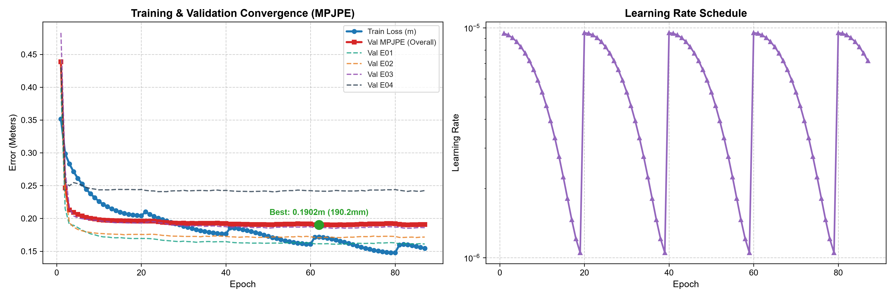
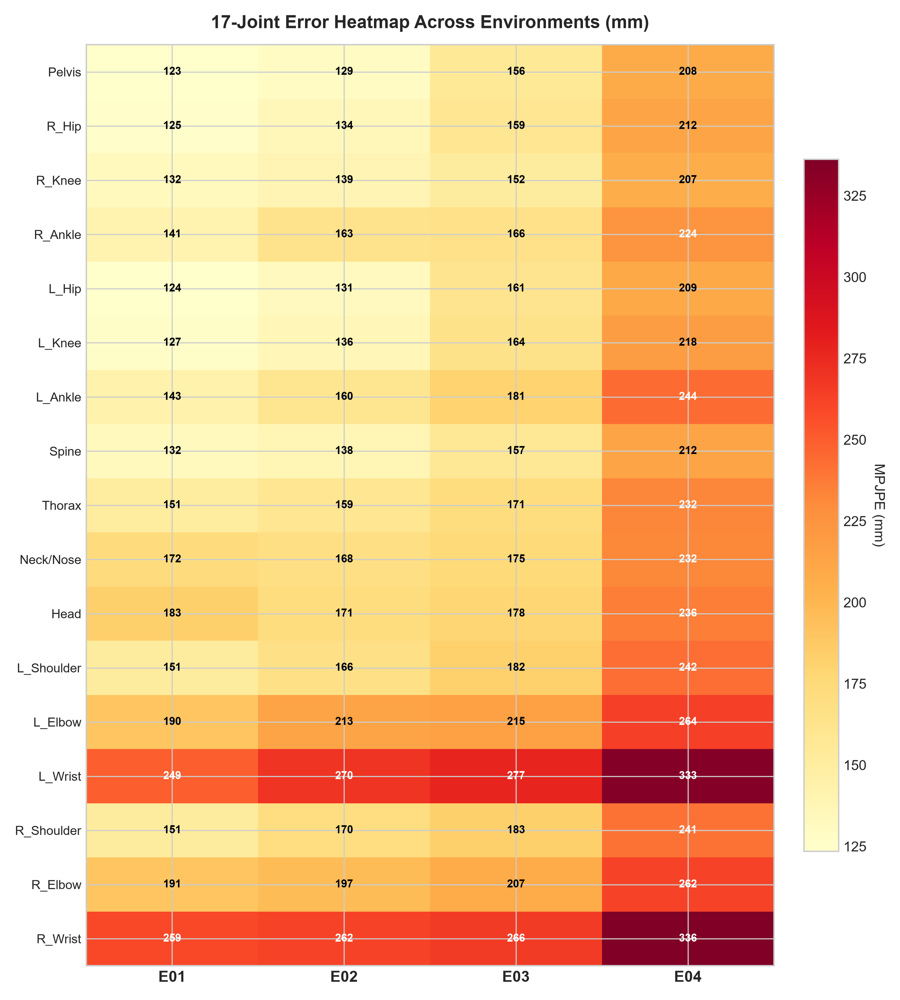
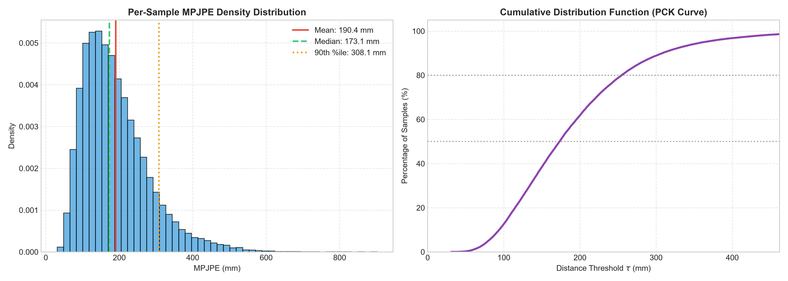
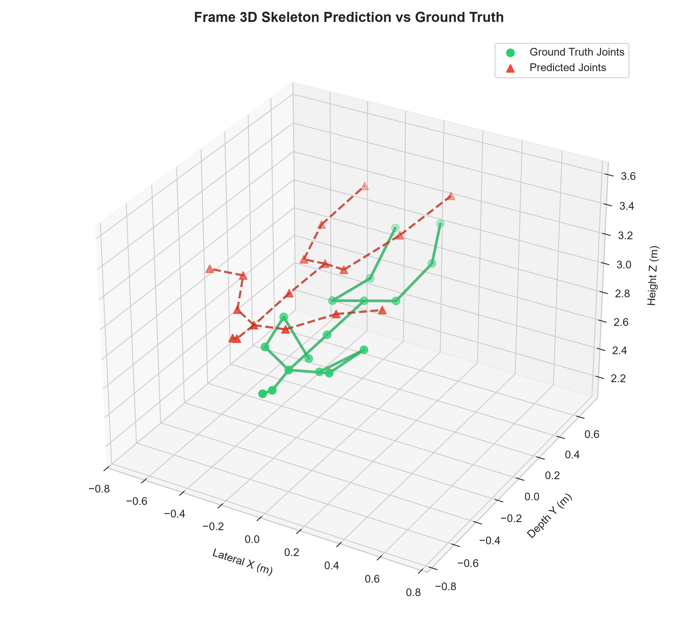

# Laporan Lengkap Pelatihan dan Pengujian Tahap 1

## Estimasi Pose 3D dari Point Cloud mmWave dengan Point-MAE

**Tanggal laporan:** 14 September 2026  
**Eksperimen utama:** `RUN_20260914_192742_point_mae_mmfi_pose_best_tuned_20260914_142848`  
**Commit bukti:** `97bbb4daea8d0833be08a88b95199a3803427c29` — `full training and testing phase 1`  
**Status:** pelatihan, pemilihan model, dan evaluasi pada test set telah selesai; interpretasi di bawah dibatasi pada artefak yang tersimpan di commit.

> **Catatan nomenklatur.** Permintaan ini menyebut pekerjaan sebagai *Tahap 1*. Dalam kurikulum pada `AGENTS.md`, eksperimen ini secara fungsional adalah **Tahap 2: adaptasi domain radar dan estimasi pose 3D**, karena menggunakan bobot Point-MAE pretrained ShapeNet dan melatih estimator 17 joint pada MM-Fi. Istilah “Tahap 1” dalam dokumen ini berarti paket eksperimen penuh yang selesai pada 14 September 2026, bukan pretraining ShapeNet.

---

## 1. Ringkasan eksekutif

Model Point-MAE yang di-*fine-tune* pada radar mmWave mencapai **MPJPE test 197,63 mm (19,76 cm)** pada **52.872 frame** dari delapan subjek yang tidak digunakan pada pelatihan. Nilai validasi terbaik adalah **190,16 mm** pada epoch 62; sehingga selisih test–validasi hanya **7,47 mm (3,9%)**. Ini merupakan indikasi yang baik bahwa pemilihan checkpoint berdasarkan validasi tidak mengalami kegagalan generalisasi besar ke subjek test.

Namun, performa tersebut belum dapat disebut akurasi presisi-sentimeter: rata-rata kesalahan posisi absolut masih sekitar 20 cm, PCK@100 mm hanya 20,1%, dan ekstremitas atas—terutama pergelangan tangan—masih menjadi titik lemah utama. Lingkungan E04 juga konsisten paling sulit, dengan MPJPE 241,14 mm, 68,14 mm lebih buruk daripada E01.

Secara eksperimen, run ini jelas lebih baik daripada run 30 epoch sebelumnya pada **validasi** (190,16 versus 243,2 mm; perbaikan 53,0 mm atau 21,8%). Secara ilmiah, hasilnya adalah baseline yang layak dan kandidat Model Av2, tetapi belum cukup kuat untuk mengunci encoder sebagai representasi fisik final untuk Tahap 3 tanpa investigasi tambahan terhadap domain E04, tangan, dan evaluasi antar-subjek yang lebih rinci.

---

## 2. Jejak bukti dan batas audit

| Artefak | Peran dalam laporan | Status audit |
|---|---|---|
| `config_snapshot.yaml` | Konfigurasi final, split, arsitektur, dan hiperparameter | Dibaca langsung |
| `metrics.json` | Riwayat 87 epoch dan evaluasi validasi akhir | Dibaca langsung |
| `tuning_results_20260914_142848.md/json` | Hasil lima trial hyperparameter | Dibaca langsung |
| `test_benchmark_results.json` | Metrik test agregat, lingkungan, kelompok anatomi, dan joint | Dibaca langsung |
| `report.md` dan enam PNG run | Konfirmasi kurva/visualisasi validasi | Diperiksa secara visual |
| Transkrip evaluasi test pada permintaan pengguna | Tiga aksi terbaik/terburuk yang tidak tersimpan dalam JSON | Dicatat sebagai hasil yang dilaporkan |
| `best_model.pth` / `model_av2.pth` | Diperlukan untuk menjalankan ulang inferensi | **Tidak ada di commit maupun workspace saat audit** |

Semua file `.pth` diabaikan oleh `.gitignore`. Dengan demikian, laporan ini tidak mengklaim telah menjalankan ulang evaluasi; angka test adalah hasil yang tercatat dalam artefak dan transkrip. `config_snapshot.yaml`, `metrics.json`, dan JSON benchmark membuat analisis numeriknya dapat ditelusuri, tetapi reproduksi numerik penuh membutuhkan checkpoint asli.

---

## 3. Tujuan eksperimen dan desain evaluasi

Tujuannya adalah memetakan satu frame point cloud radar mmWave menjadi skeleton 3D 17 joint dalam koordinat meter, sambil menghasilkan vektor state fisik global `Z_t` berdimensi 384 untuk tahap dinamika berikutnya.

### 3.1 Protokol data

| Komponen | Nilai |
|---|---|
| Dataset | MM-Fi, point cloud radar terfilter |
| Input per frame | 128 titik radar, 5 kanal: `x, y, z, Doppler, SNR` |
| Target | 17 joint 3D dari `ground_truth.npy`, dalam meter |
| Lingkungan | E01, E02, E03, E04 |
| Split | stratified random cross-subject, seed 42, rasio subjek 6:2:2 |
| Training | 24 subjek: S01, S02, S03, S06, S08, S09, S11, S12, S14, S15, S16, S19, S21, S23, S26, S27, S29, S30, S31, S32, S33, S37, S38, S39 |
| Validasi | 8 subjek: S05, S10, S18, S20, S24, S28, S34, S35 |
| Test | 8 subjek: S04, S07, S13, S17, S22, S25, S36, S40 |
| Frame test | 52.872 frame: E01 13.429; E02 12.430; E03 13.024; E04 13.989 |

Karena subjek training, validasi, dan test saling terpisah, pengujian ini mengukur generalisasi lintas-subjek, bukan sekadar kemampuan mengingat frame dari orang yang sama. Keempat lingkungan muncul di setiap split; maka metrik per-lingkungan mengukur robustnes kondisi dalam protokol ini, bukan generalisasi ke lingkungan yang sepenuhnya tidak pernah terlihat saat training.

### 3.2 Alur data dan model

```text
Radar frame (128 × [x,y,z,Doppler,SNR])
        → FPS 16 pusat + kNN 16 titik per patch
        → patch embedding + positional embedding
        → Point-MAE Transformer 12 blok, 384 dimensi, 6 head
        → 16 token lokal dan mean-pool state fisik Z_t (384-d)
        → pose head joint-query cross-attention (kedalaman 2)
        → 17 × 3 koordinat joint (meter)
```

Backbone dimulai dari `models/Point-MAE/pretrain.pth` dan **tidak dibekukan** selama fine-tuning (`freeze_encoder: false`). Artinya, hasil ini adalah adaptasi penuh encoder + head pose, bukan evaluasi encoder frozen. `Z_t` telah tersedia secara arsitektural, tetapi kualitasnya belum diuji secara temporal dalam eksperimen ini.

### 3.3 Konfigurasi final yang berpengaruh

| Kelompok | Konfigurasi |
|---|---|
| Backbone | 16 grup × 16 titik; embed 384; depth 12; 6 attention heads; drop path 0,1 |
| Pose head | joint-query cross-attention, depth 2, dropout 0,2 |
| Optimizer | AdamW; base LR 3e-4; weight decay 0,05; layer-wise LR decay 0,75; head LR multiplier 1,5 |
| Scheduler | cosine warm restarts, periode 20 epoch, minimum LR 1e-6 |
| Loss | composite pose loss: MPJPE + prior panjang tulang, bobot tulang 0,5 |
| Stabilitas | gradient clipping 1,0; EMA decay 0,999; early stopping patience 25 |
| Augmentasi training | rotasi Z ±30°, rotasi X ±5°, jitter σ 0,015 (clip 0,04), skala 0,92–1,08 termasuk anisotropik, point dropout 15% |
| Eksekusi | batch 128, 4 worker, RTX 3060 12 GB; 7,33 jam total untuk tuning + full training |

Normalisasi dan augmentasi hanya diterapkan pada input point cloud sesuai loader; target skeleton tetap berupa koordinat ground truth dalam meter. Augmentasi transformasi geometris diterapkan secara konsisten pada input dan skeleton dalam training loader.

---

## 4. Pemilihan hiperparameter

Lima trial masing-masing berjalan 8 epoch (total 140,2 menit). Trial terbaik dipilih berdasarkan MPJPE validasi.

| Peringkat | Trial | Val MPJPE | LR | Bobot tulang | LLRD | Depth head | Dropout | Drop path |
|---:|---:|---:|---:|---:|---:|---:|---:|---:|
| 1 | 1 | **200,1 mm** | 3e-4 | 0,5 | 0,75 | 2 | 0,2 | 0,10 |
| 2 | 4 | 201,7 mm | 1e-4 | 0,4 | 0,85 | 3 | 0,1 | 0,15 |
| 3 | 3 | 202,4 mm | 1e-4 | 0,2 | 0,85 | 2 | 0,1 | 0,05 |
| 4 | 5 | 210,1 mm | 2e-4 | 0,8 | 0,65 | 2 | 0,3 | 0,10 |
| 5 | 2 | 217,3 mm | 1e-4 | 0,6 | 0,65 | 1 | 0,1 | 0,15 |

Konfigurasi trial 1 digunakan untuk training penuh. Setelah 62 epoch, validasi mencapai 190,16 mm—**9,95 mm (5,0%)** lebih baik daripada hasil trial pendeknya. Karena selisih trial 1 dan trial 4 hanya 1,6 mm, ruang pencarian lima trial ini cukup untuk memilih kandidat awal, tetapi belum cukup luas untuk menyatakan hiperparameter global-optimal.

---

## 5. Dinamika pelatihan dan konvergensi

| Titik | Train loss komposit | Train MPJPE | Val MPJPE | Interpretasi |
|---|---:|---:|---:|---|
| Epoch 1 | 0,3516 | 290,2 mm | 438,7 mm | Model masih beradaptasi dari pretrained point-cloud umum ke radar dan pose. |
| Epoch 20 | 0,2042 | 177,4 mm | 196,0 mm | Penurunan besar sudah tercapai; E04 mulai tampak sebagai domain tersulit. |
| Epoch 40 | 0,1764 | 153,0 mm | 192,4 mm | Validasi mulai plateau meski training masih membaik. |
| **Epoch 62** | 0,1717 | 148,3 mm | **190,16 mm** | Checkpoint terbaik dipilih. |
| Epoch 87 | 0,1544 | 132,1 mm | 190,74 mm | Berhenti dini setelah 25 epoch tanpa perbaikan validasi. |



### Pembacaan kurva

1. Train loss turun dari 0,3516 menjadi 0,1544 (penurunan 56,1%). Angka **train loss** ini adalah *composite loss*, sehingga tidak boleh disamakan langsung dengan MPJPE; MPJPE training dicatat terpisah.
2. MPJPE validasi turun dari 438,7 menjadi minimum 190,16 mm (penurunan 56,7%), kemudian sangat datar pada kisaran 190–193 mm. Tambahan training setelah epoch 62 memperbaiki training error, tetapi tidak memperbaiki validasi secara material.
3. Early stopping pada epoch 87 tepat secara prosedural: 25 epoch setelah checkpoint terbaik di epoch 62 tidak menghasilkan validasi yang lebih rendah. Menggunakan checkpoint epoch 62, bukan bobot epoch terakhir, adalah keputusan yang benar untuk test.
4. Pola scheduler restart setiap sekitar 20 epoch terlihat pada kurva learning rate. Ia tidak menyebabkan divergensi, tetapi tidak memecahkan plateau validasi akhir.
5. Kesenjangan train MPJPE 132,1 mm versus validasi akhir 190,7 mm adalah 58,7 mm. Ini menunjukkan generalization gap moderat pada akhir training, sehingga fokus berikutnya sebaiknya regulasi/domain robustness, bukan sekadar menambah epoch.

Perbandingan dengan run historis 30 epoch (`RUN_20260911_172432...`) menunjukkan validasi terbaik turun dari 243,2 ke 190,16 mm (**−53,0 mm; −21,8%**). Perbandingan ini sah sebagai indikator kemajuan validasi internal, tetapi bukan klaim peningkatan test-to-test karena run lama tidak mempunyai benchmark test tersimpan yang ekuivalen.

---

## 6. Hasil benchmark pada held-out test set

### 6.1 Metrik primer

| Metrik | Hasil test | Makna |
|---|---:|---|
| MPJPE | **197,63 mm / 0,1976 m** | Rata-rata jarak Euclidean prediksi–GT pada semua joint dan frame. Lebih kecil lebih baik. |
| 95% bootstrap CI MPJPE | 196,81–198,40 mm | Ketidakpastian rata-rata dalam resampling frame. |
| PA-MPJPE | **127,28 mm / 0,1273 m** | MPJPE setelah translasi dan rotasi Procrustes per frame. |
| N-MPJPE | 0,3081 | MPJPE relatif terhadap panjang pelvis–neck (dengan minimum denominator 0,2 m). |
| PCK@30 mm | 1,0% | Proporsi joint dengan error <30 mm. |
| PCK@50 mm | 3,8% | Proporsi joint dengan error <50 mm. |
| PCK@100 mm | 20,1% | Proporsi joint dengan error <100 mm. |
| PCK@150 mm | 43,1% | Proporsi joint dengan error <150 mm. |
| ERS | 0,859 | `1 − std(MPJPE_env)/mean(MPJPE_env)`; semakin dekat 1 berarti variasi antarl ingkungan lebih kecil. |

Perbedaan antara MPJPE dan PA-MPJPE adalah **70,35 mm (35,6%)**. Karena implementasi Procrustes hanya mengizinkan translasi dan rotasi—bukan scale—selisih ini menunjukkan bahwa bagian besar error absolut berasal dari pose global/orientasi/posisi, sedangkan struktur relatif skeleton lebih baik. Ini peluang jelas untuk memperbaiki *root localization*, orientasi tubuh, atau objective yang memisahkan global dan articulated pose.

> Interval bootstrap sangat sempit karena sampelnya 52.872 frame. Interval ini **bukan** interval generalisasi antar-subjek yang independen: frame dalam satu aksi/sekuens bersifat berkorelasi temporal, dan resampling dilakukan per-frame. Untuk klaim statistik yang lebih kuat, laporkan bootstrap atau agregasi per-subjek/per-sekuens, bukan hanya per-frame.

### 6.2 Konsistensi validasi–test

| Split | MPJPE | ERS |
|---|---:|---:|
| Validasi terbaik, epoch 62 | 190,16 mm | 0,835 |
| Held-out test | 197,63 mm | 0,859 |
| Selisih test − validasi | +7,47 mm (+3,9%) | +0,023 |

Kenaikan test yang kecil mendukung kesimpulan bahwa hasil validasi cukup representatif dalam split ini. Meski demikian, test hanya satu split/seed; ia belum mengukur variasi performa apabila subjek yang ditahan atau seed split diubah.

---

## 7. Generalisasi lintas-lingkungan

| Lingkungan | Frame | MPJPE | PA-MPJPE | PCK@50 | PCK@100 | Selisih dari MPJPE total |
|---|---:|---:|---:|---:|---:|---:|
| E01 | 13.429 | **173,01 mm** | 118,93 mm | 5,94% | 25,67% | −24,62 mm (−12,5%) |
| E02 | 12.430 | **173,34 mm** | 125,54 mm | 6,00% | 27,32% | −24,28 mm (−12,3%) |
| E03 | 13.024 | 199,45 mm | 129,06 mm | 2,53% | 18,95% | +1,82 mm (+0,9%) |
| E04 | 13.989 | **241,14 mm** | 135,18 mm | 1,16% | 9,23% | +43,52 mm (+22,0%) |

Rentang E01–E04 adalah **68,14 mm**, dan error E04 adalah **1,39×** E01. ERS 0,859 perlu dibaca bersama rentang ini: skor tersebut mengukur koefisien variasi relatif, bukan jaminan bahwa seluruh lingkungan sudah baik. Untuk aplikasi yang harus konsisten di semua kondisi, E04 adalah risiko dominan.



Heatmap validasi memperlihatkan pola yang sama dengan test: E04 menaikkan error pada seluruh joint, bukan hanya satu bagian tubuh. Ini lebih konsisten dengan masalah domain/akuisisi lingkungan—misalnya densitas titik, noise, multipath, atau distribusi gerak—daripada kegagalan satu joint khusus. Penyebab fisiknya masih hipotesis; artefak yang ada tidak memuat analisis point count, SNR, Doppler, jarak, atau metadata geometri ruangan untuk membuktikannya.

---

## 8. Analisis anatomi dan per-joint

### 8.1 Kelompok anatomi

| Kelompok | Joint | MPJPE test | Perbandingan |
|---|---|---:|---|
| Lower limbs | hip, knee, ankle | **170,52 mm** | Terbaik |
| Central body axis | pelvis, spine, thorax, neck, head | 182,15 mm | +11,63 mm dari kaki |
| Upper limbs | shoulder, elbow, wrist | **237,63 mm** | +67,11 mm / +39,4% dari kaki |

Kaki merupakan kelompok terbaik; tangan adalah kelompok paling sulit. Perbedaan ini masuk akal secara kualitatif untuk radar: bagian distal lengan bergerak cepat, memiliki refleksi lebih kecil, dan lebih mudah terdampak oklusi/multipath. Namun, eksperimen ini tidak mengukur RCS atau tingkat oklusi, sehingga penjelasan tersebut harus dipandang sebagai hipotesis, bukan temuan kausal.

### 8.2 Tabel lengkap 17 joint (test)

| Idx | Joint | Kelompok | MPJPE (mm) |
|---:|---|---|---:|
| 0 | Pelvis | Central | 163,00 |
| 1 | R_Hip | Lower limb | 168,03 |
| 2 | R_Knee | Lower limb | **164,60** |
| 3 | R_Ankle | Lower limb | 172,73 |
| 4 | L_Hip | Lower limb | 166,37 |
| 5 | L_Knee | Lower limb | 168,06 |
| 6 | L_Ankle | Lower limb | 183,35 |
| 7 | Spine | Central | 169,02 |
| 8 | Thorax | Central | 187,37 |
| 9 | Neck/Nose | Central | 196,63 |
| 10 | Head | Central | 194,72 |
| 11 | L_Shoulder | Upper limb | 198,69 |
| 12 | L_Elbow | Upper limb | 226,05 |
| 13 | L_Wrist | Upper limb | 292,00 |
| 14 | R_Shoulder | Upper limb | 192,92 |
| 15 | R_Elbow | Upper limb | 221,06 |
| 16 | R_Wrist | Upper limb | **295,03** |

Joint terbaik adalah R_Knee (164,60 mm); terburuk R_Wrist (295,03 mm), dengan rentang **130,44 mm**. Rata-rata kedua wrist adalah 293,52 mm, sekitar 1,78× error R_Knee. Asimetri kanan–kiri kecil untuk pergelangan (3,03 mm) dan elbow (4,99 mm); masalahnya adalah tingkat kesulitan distal lengan secara umum, bukan kegagalan unilateral yang besar.

### 8.3 Visualisasi sampel dan distribusi



Plot distribusi tersebut adalah **validasi**, bukan test. Ia menunjukkan mean 190,4 mm, median 173,1 mm, dan persentil-90 308,1 mm. Mean yang lebih tinggi daripada median serta ekor hingga ratusan milimeter mengindikasikan sebagian kecil frame gagal cukup besar. Plot skeleton satu frame juga memperlihatkan pola yang konsisten: bentuk tubuh kasar terbentuk, tetapi offset global dan posisi tangan/lengan masih cukup jauh.



Contoh tunggal hanya berfungsi sebagai inspeksi kualitatif; ia tidak boleh dipakai sebagai bukti kuantitatif performa keseluruhan.

---

## 9. Analisis domain aksi

| Kategori aksi | Frame | MPJPE | Temuan |
|---|---:|---:|---|
| Aktivitas harian A01–A14 | 26.624 | 205,69 mm | Lebih sulit |
| Gerakan rehabilitasi A15–A27 | 26.248 | **189,45 mm** | 16,24 mm / 7,9% lebih baik |

Hasil yang dicetak evaluator mencatat tiga aksi terbaik: A27 *balance stance* (138,5 mm), A22 *side leg raise* (156,9 mm), dan A20 *knee flex* (161,3 mm). Tiga terburuk adalah A08 *horizontal kick* (287,5 mm), A07 *low arm punch* (265,7 mm), dan A10 *front lunge* (224,5 mm). Polanya konsisten dengan analisis joint: aksi dengan tangan cepat atau pose dinamis lebar lebih berat, sedangkan pose lebih stabil/terstruktur lebih mudah.

Angka PA-MPJPE kategori yang tersimpan pada `test_benchmark_results.json` (**12,36** dan **13,10**) tidak dicantumkan sebagai milimeter karena ada bug satuan pada evaluator: nilai meter dikalikan `100.0`, sedangkan kolomnya diberi label `_mm` dan seharusnya dikalikan `1000.0`. Akibatnya kedua angka itu berfaktor 10 terlalu kecil. Metrik kategori yang valid dalam laporan ini adalah MPJPE; PA-MPJPE kategori perlu dihitung ulang setelah perbaikan kode.

---

## 10. Kualitas metodologi, keterbatasan, dan risiko reproduksibilitas

### Kekuatan

- Test menggunakan delapan subjek held-out dan seluruh empat lingkungan, dengan ukuran 52.872 frame.
- Checkpoint dipilih memakai validasi, kemudian dievaluasi pada test terpisah.
- Pelaporan meliputi MPJPE, PA-MPJPE, N-MPJPE, PCK, CI, lingkungan, anatomi, dan domain aksi; jauh lebih informatif daripada satu angka MPJPE.
- Konfigurasi final, riwayat epoch, grafik, serta hasil tuning tersimpan sehingga keputusan model dapat diaudit.

### Keterbatasan yang perlu dicantumkan pada naskah ilmiah

1. **Checkpoint tidak terarsip di commit.** `best_model.pth` dan `model_av2.pth` dicakup pola ignore `*.pth` dan tidak ada di workspace saat audit. Ini menghambat reproduksi inferensi, verifikasi checksum, serta penggunaan Model Av2 pada Tahap 3. Simpan checkpoint pada penyimpanan artefak yang terkendali, sertakan SHA-256, ukuran file, epoch, dan konfigurasi.
2. **CI per-frame terlalu optimistis untuk generalisasi.** Frame dari sekuens yang sama berkorelasi, sementara bootstrap dilakukan dengan resampling frame. Laporkan juga mean ± standar deviasi atau CI per-subjek/per-sekuens.
3. **Hanya satu split dan seed.** Split seed 42 adalah tetap; tidak ada cross-validation atau repeated split. Variasi antar-subjek mungkin lebih besar daripada CI per-frame yang dilaporkan.
4. **Metrik PA kategori memiliki bug skala.** Jangan gunakan angka PA kategori yang tersimpan sampai evaluator diperbaiki dan benchmark dijalankan ulang.
5. **Tidak ada rincian per-subjek pada test.** Rata-rata 52.872 frame dapat menutupi satu atau dua subjek yang gagal. Evaluasi berikutnya perlu tabel MPJPE, PA-MPJPE, dan PCK per subjek × lingkungan.
6. **Tidak ada baseline test yang setara.** Peningkatan atas run lama hanya dapat disimpulkan untuk validasi, bukan test. Evaluasi checkpoint baseline dengan protokol test yang sama diperlukan untuk klaim perbaikan end-to-end.
7. **ERS bukan metrik standar universal.** Definisi ERS di implementasi adalah `1 − CV(MPJPE lingkungan)`. Ia berguna sebagai ringkasan internal, tetapi harus selalu disertai MPJPE per-lingkungan karena dua model dengan error absolut berbeda dapat memiliki ERS serupa.
8. **N-MPJPE memakai denominator yang di-clamp minimal 0,2 m.** Nilainya harus diinterpretasikan sebagai metrik internal implementasi ini; ia tidak langsung identik dengan semua definisi normalisasi di literatur.

---

## 11. Implikasi terhadap tahapan riset berikutnya

Hasil ini sudah menunjukkan bahwa encoder dapat menghasilkan state `Z_t` dan pose yang bermakna lintas-subjek, sehingga ia merupakan kandidat praktis untuk eksperimen lanjutan. Akan tetapi, jika encoder dibekukan sekarang, error absolut sekitar 20 cm—khususnya 24 cm di E04 dan sekitar 29 cm pada wrist—akan menjadi batas atas informasi pose yang tersedia untuk dynamics model dan penyelarasan LLM.

Prioritas teknis berbasis bukti adalah:

1. Pulihkan dan arsipkan checkpoint Model Av2 terlebih dahulu; tanpa itu Tahap 3 tidak dapat direproduksi dari hasil ini.
2. Audit E04 memakai statistik point count, SNR, Doppler, jarak, dan aksi untuk membedakan *domain shift* dari ketidakseimbangan sampel.
3. Tambahkan evaluasi per-subjek dan per-sekuens, lalu lakukan repeated cross-subject split sebelum mendeklarasikan performa final.
4. Evaluasi objective yang memisahkan pose global dan pose relatif/root-aligned, karena PA-MPJPE 127,28 mm jauh lebih baik daripada MPJPE 197,63 mm.
5. Targetkan perbaikan khusus lengan distal dan aksi dinamis melalui sampling berbobot, augmentasi radar yang terukur, atau head/loss berbasis struktur kinematik; nilai efektivitasnya dengan test protocol yang sama.

Ini adalah rekomendasi analitis, bukan perubahan eksperimen yang telah dilakukan dalam laporan ini.

---

## 12. Kesimpulan akhir

Eksperimen training penuh dan benchmark test selesai dengan hasil utama **197,63 mm MPJPE** pada 52.872 frame held-out. Perbedaan kecil terhadap validasi terbaik (7,47 mm) memberikan sinyal generalisasi lintas-subjek yang cukup sehat pada split saat ini. Fine-tuning + tuning juga menurunkan validasi dibanding run 30 epoch sebelumnya sebesar 21,8%.

Kekuatan model ada pada lower limb dan struktur relatif pose; kelemahannya berada pada global localization/orientation, upper limb distal, aksi dinamis, dan khususnya environment E04. Dengan demikian, hasil ini layak dijadikan baseline Model Av2 dan bukti kemajuan Tahap 2, tetapi belum layak diposisikan sebagai pose estimator presisi-sentimeter atau encoder final yang dibekukan tanpa pengujian lanjutan dan perbaikan reproduksibilitas checkpoint.

---

## 13. Artefak terkait

- [Laporan run otomatis](RUN_20260914_192742_point_mae_mmfi_pose_best_tuned_20260914_142848/report.md)
- [Konfigurasi final](RUN_20260914_192742_point_mae_mmfi_pose_best_tuned_20260914_142848/config_snapshot.yaml)
- [Riwayat metrik 87 epoch](RUN_20260914_192742_point_mae_mmfi_pose_best_tuned_20260914_142848/metrics.json)
- [Hasil hyperparameter tuning](tuning_results_20260914_142848.md)
- [Benchmark test mentah](test_benchmark_results.json)
- [Indeks seluruh eksperimen](INDEX.md)
