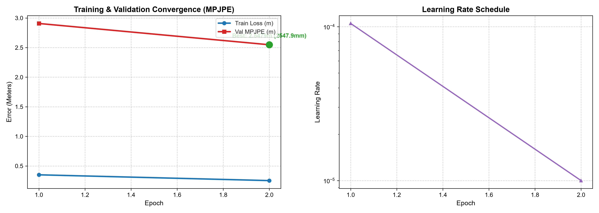
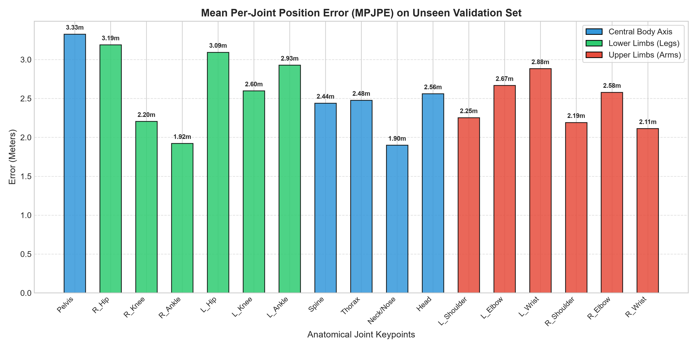
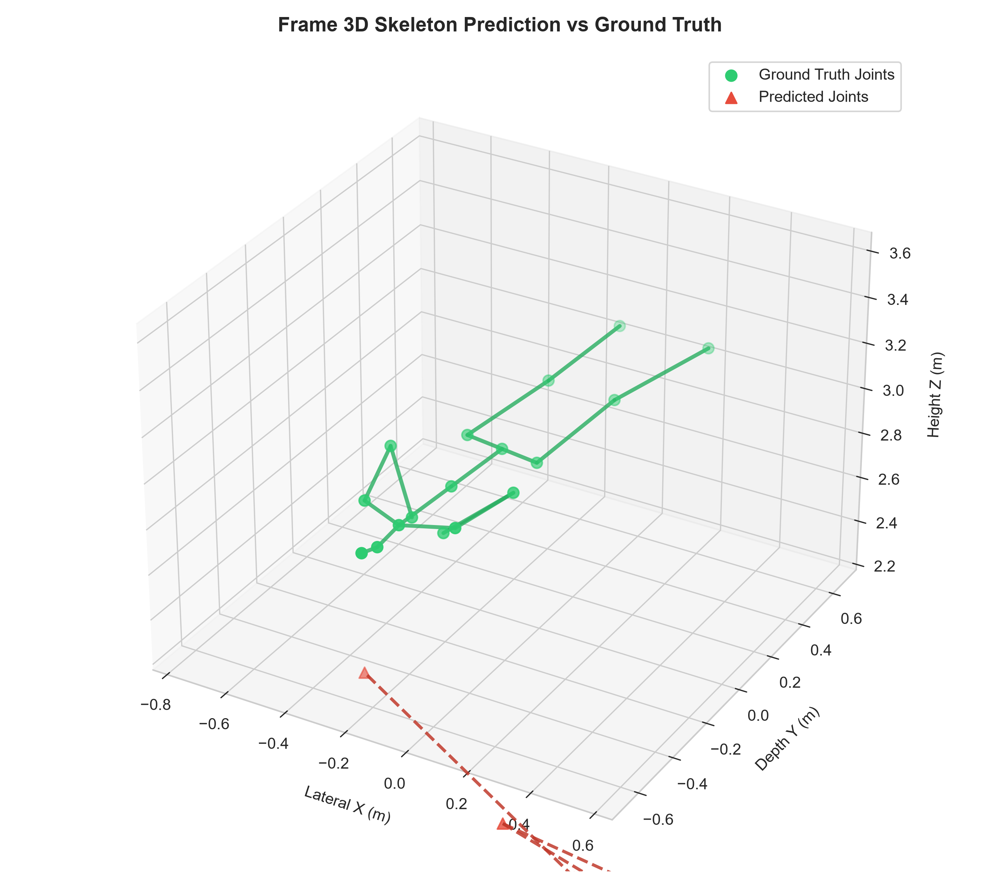

# Training Evaluation Report: `RUN_20260911_140859_point_mae_mmfi_pose_estimation`

- **Experiment Name:** point_mae_mmfi_pose_estimation
- **Run ID:** `RUN_20260911_140859_point_mae_mmfi_pose_estimation`
- **Execution Date:** 11 September 2026, 14:09:09
- **Hardware Profile:** NVIDIA GeForce RTX 3060 | AMD Ryzen 7 7700 8-Core Processor
- **Best Validation MPJPE:** **2.5479 meters (2547.9 mm / 254.8 cm)** at Epoch 2

---

## 1. Executive Summary & Convergence

The training and validation convergence over epochs is summarized below:

| Metric | Initial State | Final State | Best Value |
| :--- | :--- | :--- | :--- |
| **Train Loss (MPJPE)** | 0.3506 m | 0.2529 m | **0.2529 m** |
| **Val MPJPE** | 2.9072 m | 2.5479 m | **2.5479 m (2547.9 mm)** |
| **Epochs Completed** | 1 | 2 | Best at Epoch 2 |

---

## 2. Training Curves

---

## 3. Detailed 17-Joint Error Breakdown (Validation Set)

### Tabulasi Nilai Error per Sendi:

| Index | Joint Name | Error (Meters) | Error (mm) | Error (cm) |
| :---: | :--- | :---: | :---: | :---: |
| 0 | **Pelvis** | 3.3260 m | 3326.0 mm | 332.60 cm |
| 1 | **R_Hip** | 3.1888 m | 3188.8 mm | 318.88 cm |
| 2 | **R_Knee** | 2.2041 m | 2204.1 mm | 220.41 cm |
| 3 | **R_Ankle** | 1.9212 m | 1921.2 mm | 192.12 cm |
| 4 | **L_Hip** | 3.0934 m | 3093.4 mm | 309.34 cm |
| 5 | **L_Knee** | 2.5970 m | 2597.0 mm | 259.70 cm |
| 6 | **L_Ankle** | 2.9278 m | 2927.8 mm | 292.78 cm |
| 7 | **Spine** | 2.4391 m | 2439.1 mm | 243.91 cm |
| 8 | **Thorax** | 2.4759 m | 2475.9 mm | 247.59 cm |
| 9 | **Neck/Nose** | 1.8983 m | 1898.3 mm | 189.83 cm |
| 10 | **Head** | 2.5597 m | 2559.7 mm | 255.97 cm |
| 11 | **L_Shoulder** | 2.2525 m | 2252.5 mm | 225.25 cm |
| 12 | **L_Elbow** | 2.6665 m | 2666.5 mm | 266.65 cm |
| 13 | **L_Wrist** | 2.8825 m | 2882.5 mm | 288.25 cm |
| 14 | **R_Shoulder** | 2.1911 m | 2191.1 mm | 219.11 cm |
| 15 | **R_Elbow** | 2.5782 m | 2578.2 mm | 257.82 cm |
| 16 | **R_Wrist** | 2.1124 m | 2112.4 mm | 211.24 cm |

---

## 4. 3D Skeleton Prediction vs Ground Truth

Visualisasi perbandingan prediksi pose 3D terhadap ground truth target pada frame validasi:

---

## 5. Artifacts Generated in this Run

- [Configuration Snapshot](config_snapshot.yaml)
- [Raw Metrics Data (JSON)](metrics.json)
- [Loss Curves Graph](loss_curve.png)
- [Per-Joint Error Breakdown Graph](per_joint_error.png)
- [3D Skeleton Comparison Plot](skeleton_3d_comparison.png)
