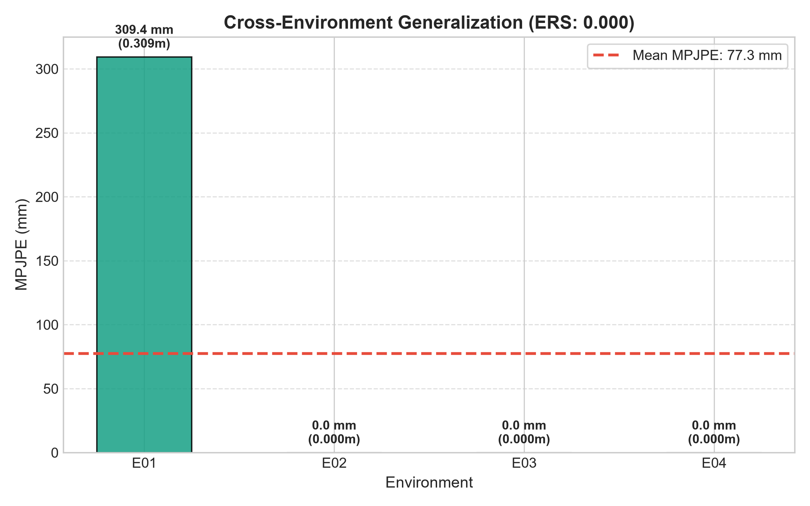
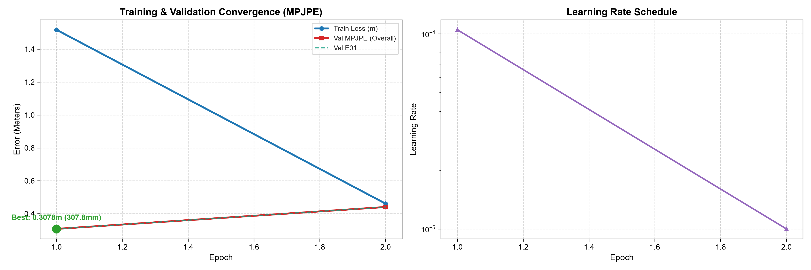
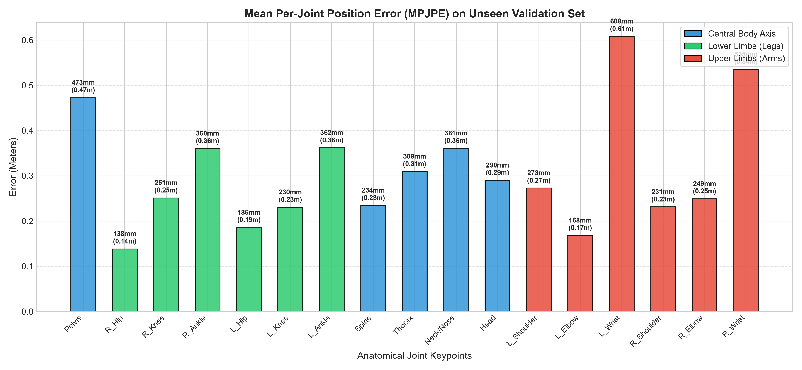
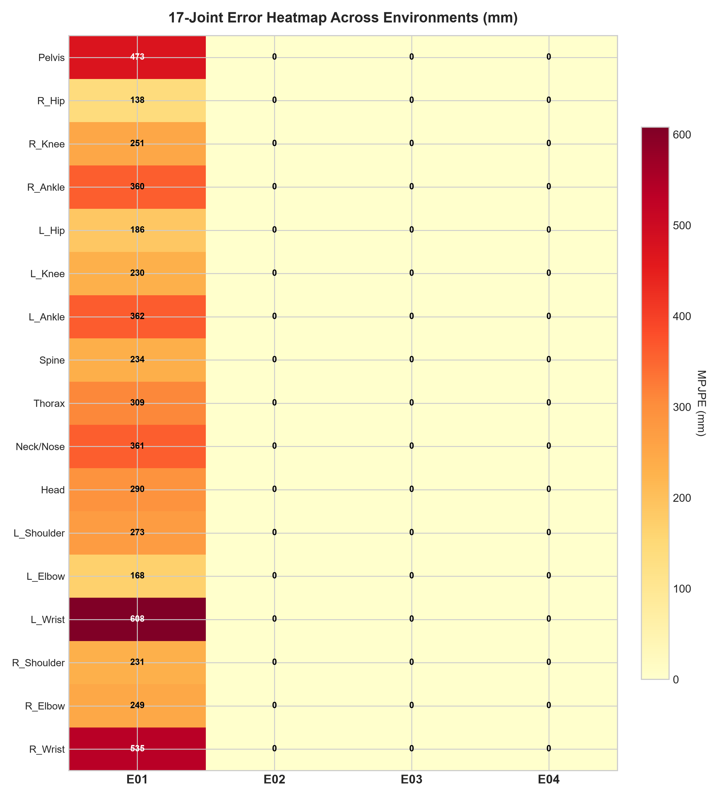
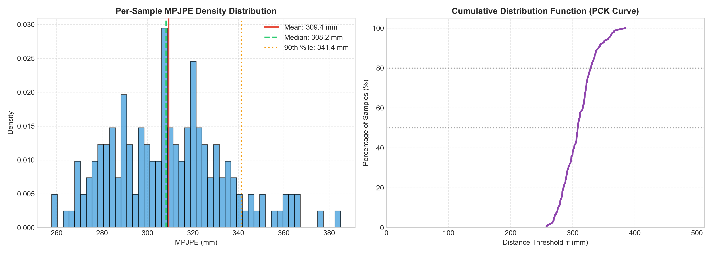
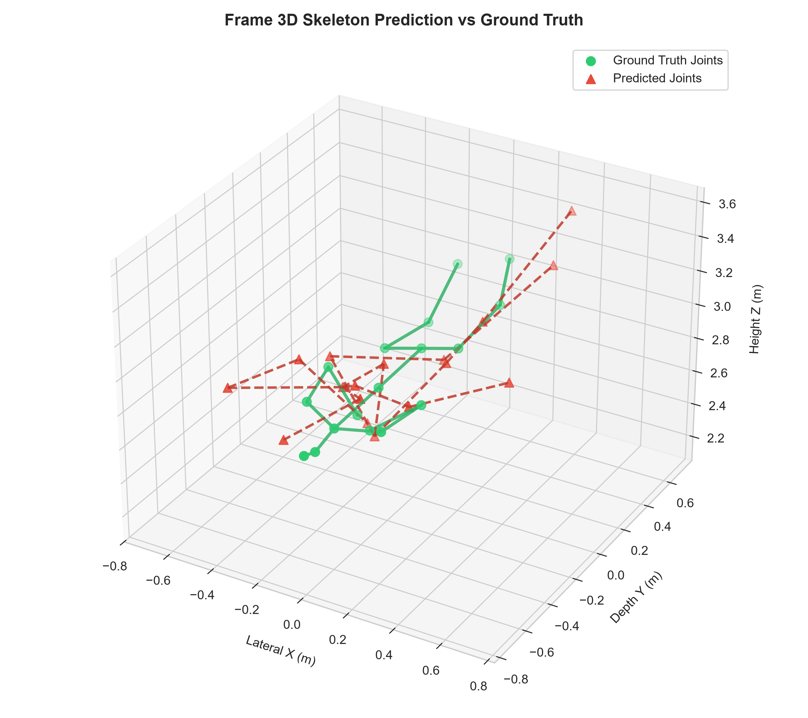

# Training Evaluation Report: `RUN_20260911_154721_point_mae_mmfi_pose_estimation`

- **Experiment Name:** point_mae_mmfi_pose_estimation
- **Run ID:** `RUN_20260911_154721_point_mae_mmfi_pose_estimation`
- **Execution Date:** 11 September 2026, 15:47:31
- **Hardware Profile:** NVIDIA GeForce RTX 3060 | AMD Ryzen 7 7700 8-Core Processor
- **Dataset Split:** Stratified Random Cross-Subject (Seed: 42, 6:2:2 ratio across E01-E04)
- **Best Validation MPJPE:** **0.3078 meters (307.8 mm / 30.8 cm)** at Epoch 1
- **Environment Robustness Score (ERS):** **1.000** (1.0 = perfect generalization across all environments)

---

## 1. Executive Summary & Convergence

| Metric | Initial State | Final State | Best Value |
| :--- | :--- | :--- | :--- |
| **Train Loss (MPJPE)** | 1.5173 m | 0.4615 m | **0.4615 m** |
| **Val MPJPE (Overall)** | 0.3078 m | 0.4408 m | **0.3078 m (307.8 mm)** |
| **Epochs Completed** | 1 | 2 | Best at Epoch 1 |
| **Env Robustness Score** | - | - | **1.000** |

---

## 2. Multi-Environment Generalization Analysis (E01 - E04)

Tabel evaluasi performa per environment pada data validasi unseen subjects:

| Environment | Subjek Uji Validasi | MPJPE (Meters) | MPJPE (mm) | MPJPE (cm) | Relatif terhadap Rerata |
| :---: | :--- | :---: | :---: | :---: | :---: |
| **E01** | S-split | 0.3094 m | 309.4 mm | 30.94 cm | +300.0% |
| **E02** | S-split | 0.0000 m | 0.0 mm | 0.00 cm | -100.0% |
| **E03** | S-split | 0.0000 m | 0.0 mm | 0.00 cm | -100.0% |
| **E04** | S-split | 0.0000 m | 0.0 mm | 0.00 cm | -100.0% |

---

## 3. Training & Validation Curves

---

## 4. Anatomical Group Analysis & 17-Joint Breakdown

### Ringkasan Error Berdasarkan Bagian Tubuh:

| Kelompok Anatomi | Sendi yang Termasuk | MPJPE (mm) | MPJPE (m) | Karakteristik Radar |
| :--- | :--- | :---: | :---: | :--- |
| **Central Body Axis** | Pelvis, Spine, Thorax, Neck, Head | 333.4 mm | 0.3334 m | Penampang RCS radar terbesar & paling stabil |
| **Lower Limbs (Kaki)** | Hips, Knees, Ankles | 254.6 mm | 0.2546 m | Doppler tinggi saat melangkah / berjalan |
| **Upper Limbs (Tangan)** | Shoulders, Elbows, Wrists | 344.1 mm | 0.3441 m | Ekstremitas paling rentan multipath & oklusi |

### Tabulasi Nilai Error 17 Sendi Lengkap:

| Index | Joint Name | Anatomical Group | Error (Meters) | Error (mm) | Error (cm) |
| :---: | :--- | :--- | :---: | :---: | :---: |
| 0 | **Pelvis** | Central Axis | 0.4727 m | 472.7 mm | 47.27 cm |
| 1 | **R_Hip** | Lower Limbs | 0.1383 m | 138.3 mm | 13.83 cm |
| 2 | **R_Knee** | Lower Limbs | 0.2511 m | 251.1 mm | 25.11 cm |
| 3 | **R_Ankle** | Lower Limbs | 0.3603 m | 360.3 mm | 36.03 cm |
| 4 | **L_Hip** | Lower Limbs | 0.1857 m | 185.7 mm | 18.57 cm |
| 5 | **L_Knee** | Lower Limbs | 0.2305 m | 230.5 mm | 23.05 cm |
| 6 | **L_Ankle** | Lower Limbs | 0.3618 m | 361.8 mm | 36.18 cm |
| 7 | **Spine** | Central Axis | 0.2344 m | 234.4 mm | 23.44 cm |
| 8 | **Thorax** | Central Axis | 0.3094 m | 309.4 mm | 30.94 cm |
| 9 | **Neck/Nose** | Central Axis | 0.3607 m | 360.7 mm | 36.07 cm |
| 10 | **Head** | Central Axis | 0.2899 m | 289.9 mm | 28.99 cm |
| 11 | **L_Shoulder** | Upper Limbs | 0.2728 m | 272.8 mm | 27.28 cm |
| 12 | **L_Elbow** | Upper Limbs | 0.1682 m | 168.2 mm | 16.82 cm |
| 13 | **L_Wrist** | Upper Limbs | 0.6081 m | 608.1 mm | 60.81 cm |
| 14 | **R_Shoulder** | Upper Limbs | 0.2312 m | 231.2 mm | 23.12 cm |
| 15 | **R_Elbow** | Upper Limbs | 0.2492 m | 249.2 mm | 24.92 cm |
| 16 | **R_Wrist** | Upper Limbs | 0.5351 m | 535.1 mm | 53.51 cm |

---

## 5. 17-Joint Error Heatmap Across Environments

Heatmap ini menunjukkan distribusi kesalahan per sendi di setiap kondisi lingkungan radar (E01 - E04):

---

## 6. Per-Sample Error Distribution & PCK Analysis

---

## 7. 3D Skeleton Prediction vs Ground Truth Visual Sample

Visualisasi perbandingan prediksi pose 3D (merah putus-putus) terhadap ground truth target (hijau solid):

---

## 8. Artifacts Generated in this Run

- [Configuration Snapshot](config_snapshot.yaml)
- [Raw Metrics Data (JSON)](metrics.json)
- [Loss & Multi-Env Curves Graph](loss_curve.png)
- [Per-Joint Error Breakdown Graph](per_joint_error.png)
- [Environment Comparison Bar Chart](env_comparison.png)
- [Joint x Environment Heatmap](joint_env_heatmap.png)
- [Error Distribution & PCK Curves](error_distribution.png)
- [3D Skeleton Comparison Plot](skeleton_3d_comparison.png)
