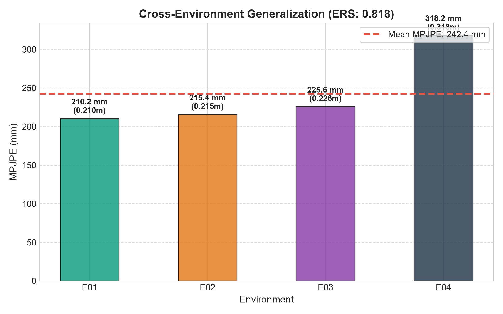
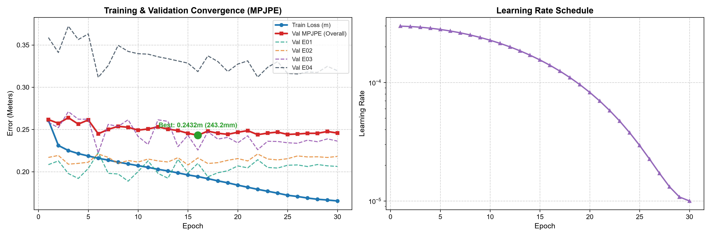
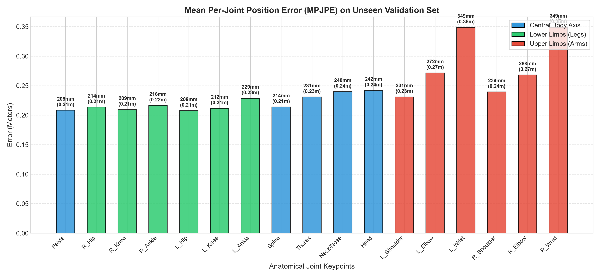
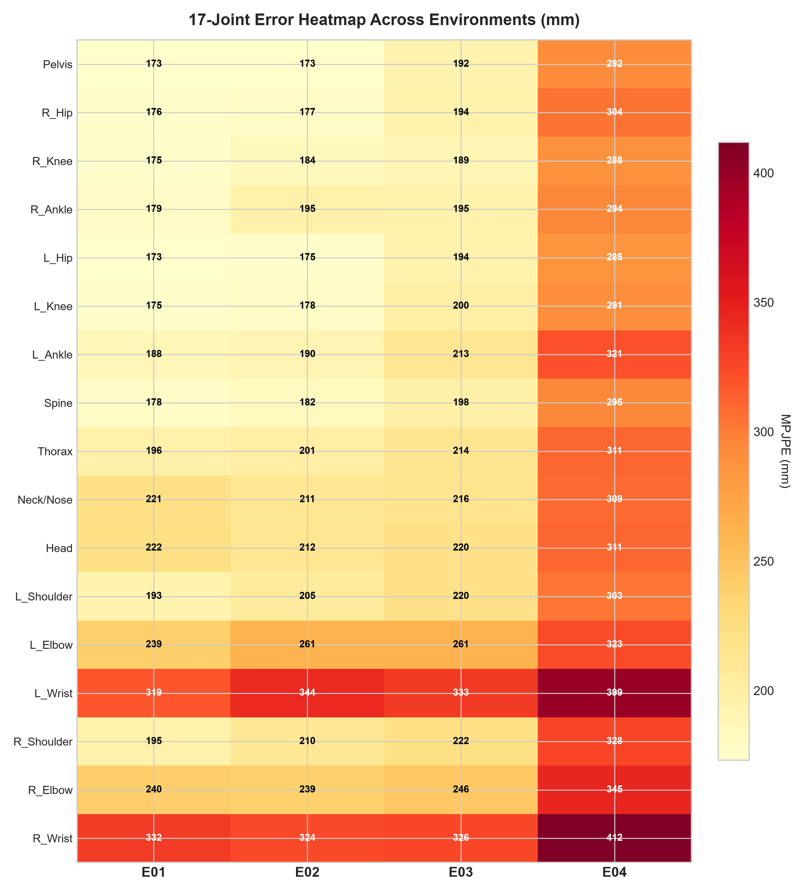
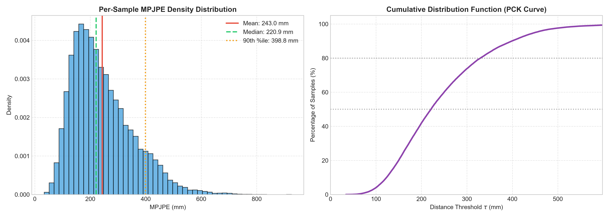
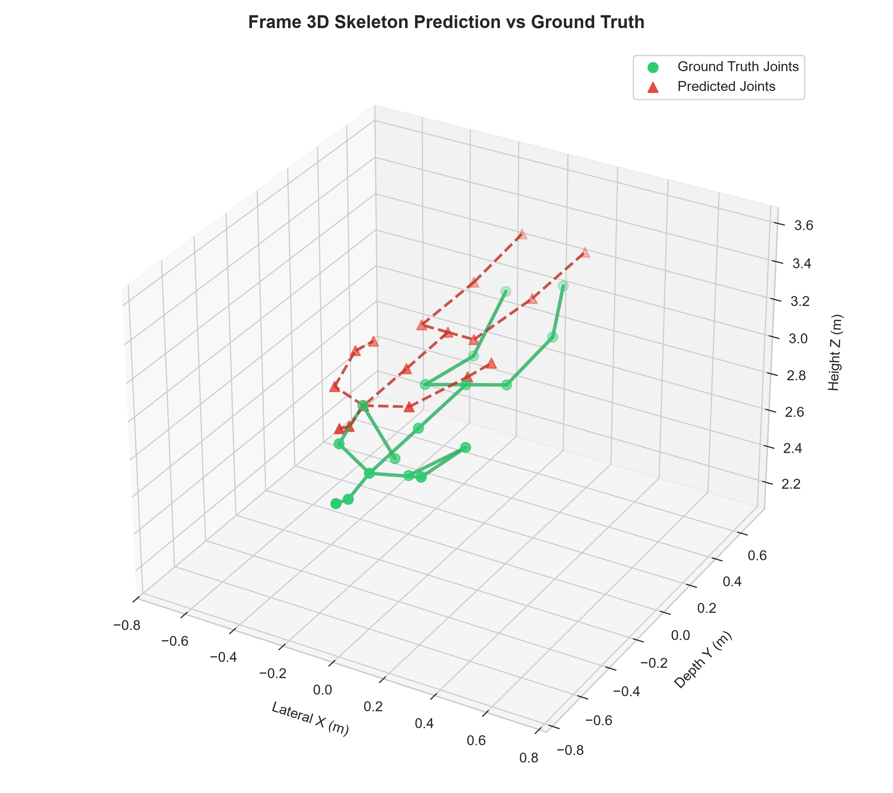

# Training Evaluation Report: `RUN_20260911_172432_point_mae_mmfi_pose_estimation`

- **Experiment Name:** point_mae_mmfi_pose_estimation
- **Run ID:** `RUN_20260911_172432_point_mae_mmfi_pose_estimation`
- **Execution Date:** 11 September 2026, 17:24:57
- **Hardware Profile:** NVIDIA GeForce RTX 3060 | AMD Ryzen 7 7700 8-Core Processor
- **Dataset Split:** Stratified Random Cross-Subject (Seed: 42, 6:2:2 ratio across E01-E04)
- **Best Validation MPJPE:** **0.2432 meters (243.2 mm / 24.3 cm)** at Epoch 16
- **Environment Robustness Score (ERS):** **0.818** (1.0 = perfect generalization across all environments)

---

## 1. Executive Summary & Convergence

| Metric | Initial State | Final State | Best Value |
| :--- | :--- | :--- | :--- |
| **Train Loss (MPJPE)** | 0.2609 m | 0.1654 m | **0.1654 m** |
| **Val MPJPE (Overall)** | 0.2617 m | 0.2457 m | **0.2432 m (243.2 mm)** |
| **Epochs Completed** | 1 | 30 | Best at Epoch 16 |
| **Env Robustness Score** | - | - | **0.818** |

---

## 2. Multi-Environment Generalization Analysis (E01 - E04)

Tabel evaluasi performa per environment pada data validasi unseen subjects:

| Environment | Subjek Uji Validasi | MPJPE (Meters) | MPJPE (mm) | MPJPE (cm) | Relatif terhadap Rerata |
| :---: | :--- | :---: | :---: | :---: | :---: |
| **E01** | S-split | 0.2102 m | 210.2 mm | 21.02 cm | -13.3% |
| **E02** | S-split | 0.2154 m | 215.4 mm | 21.54 cm | -11.1% |
| **E03** | S-split | 0.2256 m | 225.6 mm | 22.56 cm | -6.9% |
| **E04** | S-split | 0.3182 m | 318.2 mm | 31.82 cm | +31.3% |

---

## 3. Training & Validation Curves

---

## 4. Anatomical Group Analysis & 17-Joint Breakdown

### Ringkasan Error Berdasarkan Bagian Tubuh:

| Kelompok Anatomi | Sendi yang Termasuk | MPJPE (mm) | MPJPE (m) | Karakteristik Radar |
| :--- | :--- | :---: | :---: | :--- |
| **Central Body Axis** | Pelvis, Spine, Thorax, Neck, Head | 227.0 mm | 0.2270 m | Penampang RCS radar terbesar & paling stabil |
| **Lower Limbs (Kaki)** | Hips, Knees, Ankles | 214.6 mm | 0.2146 m | Doppler tinggi saat melangkah / berjalan |
| **Upper Limbs (Tangan)** | Shoulders, Elbows, Wrists | 284.7 mm | 0.2847 m | Ekstremitas paling rentan multipath & oklusi |

### Tabulasi Nilai Error 17 Sendi Lengkap:

| Index | Joint Name | Anatomical Group | Error (Meters) | Error (mm) | Error (cm) |
| :---: | :--- | :--- | :---: | :---: | :---: |
| 0 | **Pelvis** | Central Axis | 0.2083 m | 208.3 mm | 20.83 cm |
| 1 | **R_Hip** | Lower Limbs | 0.2135 m | 213.5 mm | 21.35 cm |
| 2 | **R_Knee** | Lower Limbs | 0.2095 m | 209.5 mm | 20.95 cm |
| 3 | **R_Ankle** | Lower Limbs | 0.2165 m | 216.5 mm | 21.65 cm |
| 4 | **L_Hip** | Lower Limbs | 0.2076 m | 207.6 mm | 20.76 cm |
| 5 | **L_Knee** | Lower Limbs | 0.2116 m | 211.6 mm | 21.16 cm |
| 6 | **L_Ankle** | Lower Limbs | 0.2286 m | 228.6 mm | 22.86 cm |
| 7 | **Spine** | Central Axis | 0.2139 m | 213.9 mm | 21.39 cm |
| 8 | **Thorax** | Central Axis | 0.2308 m | 230.8 mm | 23.08 cm |
| 9 | **Neck/Nose** | Central Axis | 0.2399 m | 239.9 mm | 23.99 cm |
| 10 | **Head** | Central Axis | 0.2419 m | 241.9 mm | 24.19 cm |
| 11 | **L_Shoulder** | Upper Limbs | 0.2310 m | 231.0 mm | 23.10 cm |
| 12 | **L_Elbow** | Upper Limbs | 0.2716 m | 271.6 mm | 27.16 cm |
| 13 | **L_Wrist** | Upper Limbs | 0.3488 m | 348.8 mm | 34.88 cm |
| 14 | **R_Shoulder** | Upper Limbs | 0.2394 m | 239.4 mm | 23.94 cm |
| 15 | **R_Elbow** | Upper Limbs | 0.2682 m | 268.2 mm | 26.82 cm |
| 16 | **R_Wrist** | Upper Limbs | 0.3490 m | 349.0 mm | 34.90 cm |

---

## 5. 17-Joint Error Heatmap Across Environments

Heatmap ini menunjukkan distribusi kesalahan per sendi di setiap kondisi lingkungan radar (E01 - E04):

---

## 6. Per-Sample Error Distribution & PCK Analysis

---

## 7. 3D Skeleton Prediction vs Ground Truth Visual Sample

Visualisasi perbandingan prediksi pose 3D (merah putus-putus) terhadap ground truth target (hijau solid):

---

## 8. Artifacts Generated in this Run

- [Configuration Snapshot](config_snapshot.yaml)
- [Raw Metrics Data (JSON)](metrics.json)
- [Loss & Multi-Env Curves Graph](loss_curve.png)
- [Per-Joint Error Breakdown Graph](per_joint_error.png)
- [Environment Comparison Bar Chart](env_comparison.png)
- [Joint x Environment Heatmap](joint_env_heatmap.png)
- [Error Distribution & PCK Curves](error_distribution.png)
- [3D Skeleton Comparison Plot](skeleton_3d_comparison.png)
