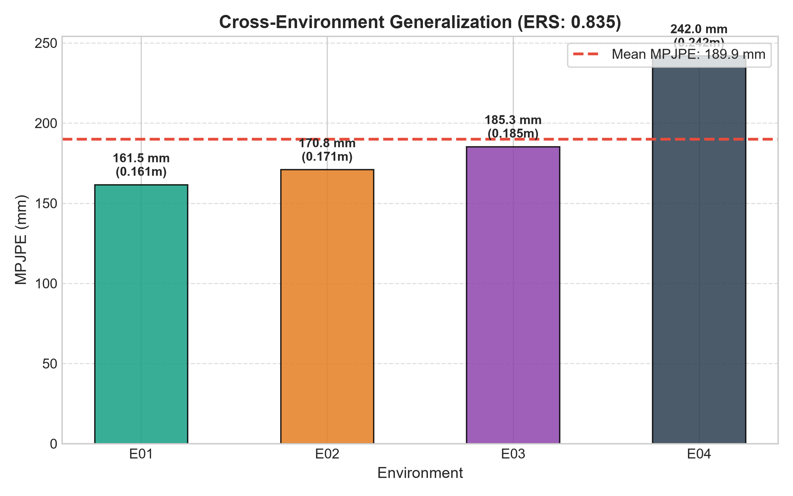
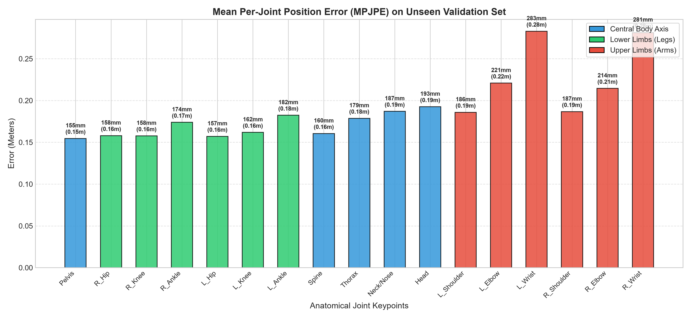

# Training Evaluation Report: `RUN_20260914_192742_point_mae_mmfi_pose_best_tuned_20260914_142848`

- **Experiment Name:** point_mae_mmfi_pose_best_tuned_20260914_142848
- **Run ID:** `RUN_20260914_192742_point_mae_mmfi_pose_best_tuned_20260914_142848`
- **Execution Date:** 14 September 2026, 19:28:06
- **Hardware Profile:** NVIDIA GeForce RTX 3060 | AMD Ryzen 7 7700 8-Core Processor
- **Dataset Split:** Stratified Random Cross-Subject (Seed: 42, 6:2:2 ratio across E01-E04)
- **Best Validation MPJPE:** **0.1902 meters (190.2 mm / 19.0 cm)** at Epoch 62
- **Environment Robustness Score (ERS):** **0.835** (1.0 = perfect generalization across all environments)

---

## 1. Executive Summary & Convergence

| Metric | Initial State | Final State | Best Value |
| :--- | :--- | :--- | :--- |
| **Train Loss (MPJPE)** | 0.3516 m | 0.1544 m | **0.1478 m** |
| **Val MPJPE (Overall)** | 0.4387 m | 0.1907 m | **0.1902 m (190.2 mm)** |
| **Epochs Completed** | 1 | 87 | Best at Epoch 62 |
| **Env Robustness Score** | - | - | **0.835** |

---

## 2. Multi-Environment Generalization Analysis (E01 - E04)

Tabel evaluasi performa per environment pada data validasi unseen subjects:

| Environment | Subjek Uji Validasi | MPJPE (Meters) | MPJPE (mm) | MPJPE (cm) | Relatif terhadap Rerata |
| :---: | :--- | :---: | :---: | :---: | :---: |
| **E01** | S-split | 0.1615 m | 161.5 mm | 16.15 cm | -15.0% |
| **E02** | S-split | 0.1708 m | 170.8 mm | 17.08 cm | -10.0% |
| **E03** | S-split | 0.1853 m | 185.3 mm | 18.53 cm | -2.4% |
| **E04** | S-split | 0.2420 m | 242.0 mm | 24.20 cm | +27.4% |

---

## 3. Training & Validation Curves

---

## 4. Anatomical Group Analysis & 17-Joint Breakdown

### Ringkasan Error Berdasarkan Bagian Tubuh:

| Kelompok Anatomi | Sendi yang Termasuk | MPJPE (mm) | MPJPE (m) | Karakteristik Radar |
| :--- | :--- | :---: | :---: | :--- |
| **Central Body Axis** | Pelvis, Spine, Thorax, Neck, Head | 174.7 mm | 0.1747 m | Penampang RCS radar terbesar & paling stabil |
| **Lower Limbs (Kaki)** | Hips, Knees, Ankles | 165.2 mm | 0.1652 m | Doppler tinggi saat melangkah / berjalan |
| **Upper Limbs (Tangan)** | Shoulders, Elbows, Wrists | 228.7 mm | 0.2287 m | Ekstremitas paling rentan multipath & oklusi |

### Tabulasi Nilai Error 17 Sendi Lengkap:

| Index | Joint Name | Anatomical Group | Error (Meters) | Error (mm) | Error (cm) |
| :---: | :--- | :--- | :---: | :---: | :---: |
| 0 | **Pelvis** | Central Axis | 0.1546 m | 154.6 mm | 15.46 cm |
| 1 | **R_Hip** | Lower Limbs | 0.1580 m | 158.0 mm | 15.80 cm |
| 2 | **R_Knee** | Lower Limbs | 0.1577 m | 157.7 mm | 15.77 cm |
| 3 | **R_Ankle** | Lower Limbs | 0.1739 m | 173.9 mm | 17.39 cm |
| 4 | **L_Hip** | Lower Limbs | 0.1571 m | 157.1 mm | 15.71 cm |
| 5 | **L_Knee** | Lower Limbs | 0.1619 m | 161.9 mm | 16.19 cm |
| 6 | **L_Ankle** | Lower Limbs | 0.1824 m | 182.4 mm | 18.24 cm |
| 7 | **Spine** | Central Axis | 0.1605 m | 160.5 mm | 16.05 cm |
| 8 | **Thorax** | Central Axis | 0.1787 m | 178.7 mm | 17.87 cm |
| 9 | **Neck/Nose** | Central Axis | 0.1871 m | 187.1 mm | 18.71 cm |
| 10 | **Head** | Central Axis | 0.1925 m | 192.5 mm | 19.25 cm |
| 11 | **L_Shoulder** | Upper Limbs | 0.1859 m | 185.9 mm | 18.59 cm |
| 12 | **L_Elbow** | Upper Limbs | 0.2208 m | 220.8 mm | 22.08 cm |
| 13 | **L_Wrist** | Upper Limbs | 0.2829 m | 282.9 mm | 28.29 cm |
| 14 | **R_Shoulder** | Upper Limbs | 0.1867 m | 186.7 mm | 18.67 cm |
| 15 | **R_Elbow** | Upper Limbs | 0.2145 m | 214.5 mm | 21.45 cm |
| 16 | **R_Wrist** | Upper Limbs | 0.2812 m | 281.2 mm | 28.12 cm |

---

## 5. 17-Joint Error Heatmap Across Environments

Heatmap ini menunjukkan distribusi kesalahan per sendi di setiap kondisi lingkungan radar (E01 - E04):

---

## 6. Per-Sample Error Distribution & PCK Analysis

---

## 7. 3D Skeleton Prediction vs Ground Truth Visual Sample

Visualisasi perbandingan prediksi pose 3D (merah putus-putus) terhadap ground truth target (hijau solid):

---

## 8. Artifacts Generated in this Run

- [Configuration Snapshot](config_snapshot.yaml)
- [Raw Metrics Data (JSON)](metrics.json)
- [Loss & Multi-Env Curves Graph](loss_curve.png)
- [Per-Joint Error Breakdown Graph](per_joint_error.png)
- [Environment Comparison Bar Chart](env_comparison.png)
- [Joint x Environment Heatmap](joint_env_heatmap.png)
- [Error Distribution & PCK Curves](error_distribution.png)
- [3D Skeleton Comparison Plot](skeleton_3d_comparison.png)
