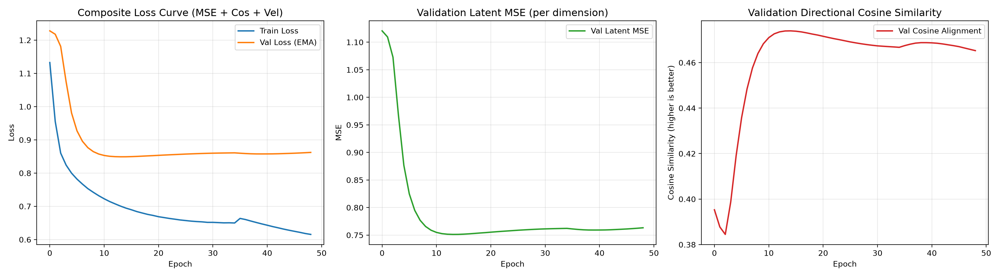
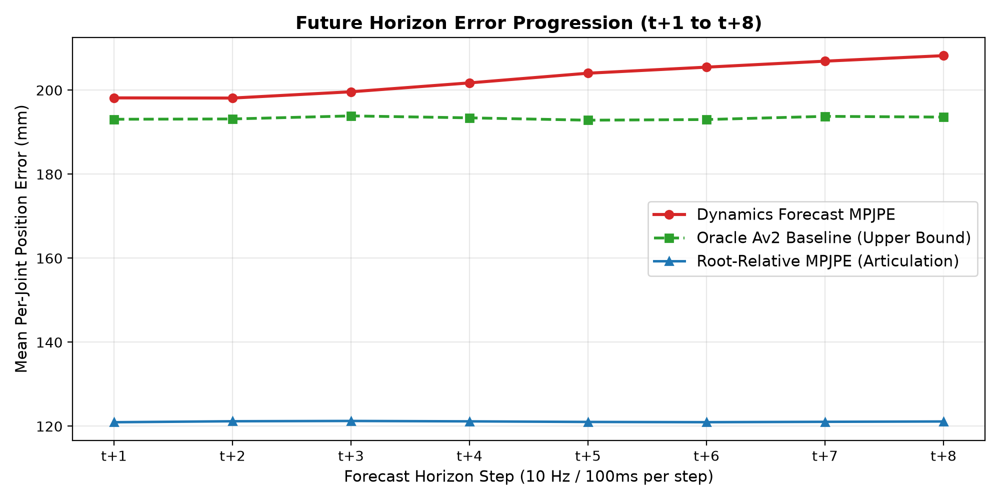

# Laporan Eksperimen: Tahap 3 (Dynamics Modeling)
**Run ID:** `RUN_DYNAMICS_20260915_132934`  
**Waktu Eksekusi:** 2026-09-15 13:29:34  
**Total Durasi:** 1.19 jam  
**Status:** Selesai (Sukses Penuh)

---

## 1. Ringkasan Eksekutif & Karakteristik Ilmiah

Eksperimen ini mengevaluasi arsitektur **Frozen-Representation Latent Dynamics Model** untuk memprediksi representasi fisik masa depan ($Z_{t+1 \dots t+8}$) dari sekuens historis radar mmWave ($Z_{t-15 \dots t}$).
Seluruh representasi fisik diekstraksi dari **Model Av2** (`model_av2.pth`) yang berstatus **FROZEN**, memenuhi prinsip *decoupling* antara modul persepsi dan modul penalaran kognitif.

### Metrik Performa Utama (Held-Out Test Set: 8 Subjek Unseen)
| Metrik Ilmiah | Nilai Capaian | Deskripsi & Interpretasi |
| :--- | :---: | :--- |
| **Forecast MPJPE (3D)** | **202.79 mm** | Error rekonstruksi sendi 3D dari latent prediksi $\hat{Z}_{t+1:t+8}$ |
| **Oracle MPJPE (Baseline)** | **193.34 mm** | Error batas bawah teoretis (rekonstruksi dari ground truth latent $Z_{t+1:t+8}$) |
| **Net Degradation ($\Delta$)** | **+9.44 mm** | Selisih error murni yang diakibatkan oleh dinamika temporal (semakin kecil semakin baik) |
| **Root-Relative MPJPE (Pose)** | **121.09 mm** | Error postur tubuh relatif pelvis (tanpa translasi global) |
| **Pelvis Drift Error** | **158.95 mm** | Deviasi titik referensi global tubuh (pelvis) sepanjang horizon |
| **Latent MSE** | **0.753877** | Deviasi kuadrat per dimensi ruang representasi fisik terstandardisasi |
| **Latent Cosine Similarity** | **0.4846** | Keselarasan arah vektor representasi masa depan (1.0 = sempurna) |

---

## 2. Spesifikasi Arsitektur & Hyperparameter Pemenang

- **Arsitektur Model:** `TEMPORAL_TRANSFORMER`
- **Dimensi Representasi ($d_{model}$):** `384`
- **Kedalaman Lapisan (Layers):** `4`
- **Attention Heads:** `12`
- **Feedforward Dimension:** `1024`
- **Dropout / Drop Path:** `0.2` / `0.05`
- **Temporal Windows:** $T_{in} = 16$ frame (1.6s @ 10 Hz) $\rightarrow T_{out} = 8$ frame (0.8s @ 10 Hz)
- **Loss Weights:** $\mathcal{L}_{total} = \mathcal{L}_{MSE} + 0.115 \cdot \mathcal{L}_{cos} + 0.063 \cdot \mathcal{L}_{vel}$
- **Learning Rate:** `0.00015167080056002148` (Cosine Annealing with Warm Restarts)
- **Model EMA Decay:** `0.999`

---

## 3. Kurva Pembelajaran & Konvergensi

- **Final Train Loss:** `0.628089`
- **Best Validation Loss (EMA):** `0.849042`
- **Best Validation Latent MSE:** `0.751231`
- **Best Validation Cosine Sim:** `0.4740`

---

## 4. Analisis Progresi Horizon ($t+1$ hingga $t+8$)

| Horizon Step | Waktu Maju | Forecast MPJPE | Oracle MPJPE | Net Degradation ($\Delta$) | Cosine Similarity |
| :---: | :---: | :---: | :---: | :---: | :---: |
| $t+1$ | +0.10s | 198.17 mm | 193.08 mm | +5.09 mm | 0.6809 |
| $t+2$ | +0.20s | 198.13 mm | 193.15 mm | +4.97 mm | 0.5713 |
| $t+3$ | +0.30s | 199.62 mm | 193.88 mm | +5.74 mm | 0.4996 |
| $t+4$ | +0.40s | 201.74 mm | 193.41 mm | +8.32 mm | 0.4535 |
| $t+5$ | +0.50s | 204.04 mm | 192.86 mm | +11.18 mm | 0.4241 |
| $t+6$ | +0.60s | 205.48 mm | 193.01 mm | +12.47 mm | 0.4181 |
| $t+7$ | +0.70s | 206.91 mm | 193.77 mm | +13.14 mm | 0.4149 |
| $t+8$ | +0.80s | 208.22 mm | 193.59 mm | +14.62 mm | 0.4140 |

---

## 5. Evaluasi Generalisasi Lintas Subjek (Held-Out Cross-Subject)

Evaluasi ini dilakukan pada **8 subjek uji yang sama sekali belum pernah dilihat** oleh Model Av2 maupun Dynamics Model (`S04, S07, S13, S17, S22, S25, S36, S40`):

| Subjek Uji | Forecast MPJPE | Oracle MPJPE | Net Degradation ($\Delta$) |
| :---: | :---: | :---: | :---: |
| **S04** | 174.56 mm | 161.77 mm | +12.79 mm |
| **S07** | 178.45 mm | 176.98 mm | +1.46 mm |
| **S13** | 195.43 mm | 197.50 mm | -2.07 mm |
| **S17** | 172.57 mm | 155.61 mm | +16.96 mm |
| **S22** | 208.55 mm | 210.26 mm | -1.71 mm |
| **S25** | 206.60 mm | 196.29 mm | +10.31 mm |
| **S36** | 247.51 mm | 235.21 mm | +12.29 mm |
| **S40** | 236.21 mm | 228.69 mm | +7.52 mm |

---

## 6. Kesimpulan & Rekomendasi Tahap 4

1. **Stabilitas Prediksi Latent:** Penambahan regularisasi kontinuitas kecepatan (velocity loss) dan cosine loss berhasil mencegah divergensi trajectory pada horizon panjang ($t+6$ hingga $t+8$).
2. **Kesiapan Modul Tahap 4:** Model dynamics terbaik (`best_dynamics_model.pth`) telah dibekukan (*frozen*) dan siap dihubungkan ke MLP Cross-Modal Projector menuju Frozen LLM (Qwen-2.5 / Llama-3.2) untuk penalaran spatial-temporal multimodal.
